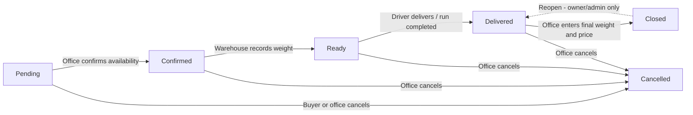

# AyamNorliza Ops — System Overview & Workflows

*Client-facing documentation — describes the system as currently implemented.*
*Last updated: 2026-08-22*

---

## 1. What the system is

AyamNorliza Ops is a web platform that runs the daily order-to-delivery operation of a poultry business. It covers the full journey of an order:

**Customer places order → Office confirms it → Warehouse weighs it → Truck is loaded and dispatched → Driver delivers it → Office settles the final price.**

It is built as a multi-tenant system: each business ("organization") has its own isolated space, its own staff accounts, its own product catalog, its own customers, and its own delivery fleet. Data is separated at the database level, so one organization can never see another organization's data.

There are three separate "front doors" into the system:

| Entry point | Who uses it | What it looks like |
|---|---|---|
| **Buyer Portal** (`/buyer_portal/...`) | Customers | An online shop: browse products, cart, checkout, order history |
| **Operations Dashboard** (`/[organization]/...`) | Office, warehouse, and admin staff | Full back-office: orders kanban, dispatch board, loading, delivery runs, settings |
| **Driver Deck** (`/drive/...`) | Delivery drivers | A phone-first, one-screen app showing only today's assigned run, stop by stop |

---

## 2. Roles

### 2.1 Customer-side

**Buyer (customer)**
- Signs up themselves on the Buyer Portal (email + password). No approval step is needed.
- Can browse the shop, place orders, view their own order history, and cancel an order **only while it is still Pending** (before the office confirms it).
- Sees only their own orders — never other customers, prices before settlement, truck assignments, or internal operations.
- The final price appears on the order once it is settled ("Priced at close"), because chicken is sold by actual weight, which is only known after weighing.

### 2.2 Staff-side (organization members)

Staff accounts are **invite-only**. An owner or admin sends an email invitation with a role attached; the invited person accepts the invite link and becomes a member. An inviter can never grant a role higher than their own.

| Role | Who it's for | What they can do |
|---|---|---|
| **Owner** | The business owner | Everything: all sales and logistics screens, all settings (users, roles, audit log), plus the owner-only Data Console (demo data seeding/reset). Cannot be locked out of their own privileges. |
| **Org Admin** | Trusted managers | Same as Owner except a few owner-only emergency functions and the Data Console. Manages users, roles, and settings. |
| **Seller** | Office / sales staff | Runs the sales operation: manage products and prices, manage customers, create and confirm orders, cancel orders, settle final prices, and operate the Dispatch and Loading boards. No access to user management. |
| **Logistics** | Warehouse / dispatch staff | Dispatch board, Loading screen, and Warehouse tasks (weighing). Cannot manage products, customers, or order confirmation/settlement. |
| **Inventory** | Warehouse staff | Warehouse tasks (weighing) only. |
| **Driver** | Delivery drivers | Sees **only the delivery run assigned to them** — the stops, the orders on those stops, and the customer's name and phone number. Nothing else in the system is visible to them. Records arrivals, deliveries (with proof), and failed attempts from their phone. |

Security notes worth telling the client:
- Every access rule is enforced in the database itself (row-level security), not just hidden in the interface.
- Sensitive admin actions require the user to re-enter their password (step-up authentication); optional two-factor authentication (TOTP) is supported.
- All important events are written to an append-only audit log that nobody — including the owner — can edit or delete.

---

## 3. The order lifecycle

Every order moves through a fixed set of statuses. Transitions only happen through controlled actions — the system blocks any shortcut or backwards move.

| Status | Meaning | Who moves it here |
|---|---|---|
| **Pending** | Order placed, awaiting office review | Buyer (portal checkout) or Seller (manual order) |
| **Confirmed** | Office has checked each line's availability and accepted the order | Seller / Admin / Owner |
| **Ready** | Warehouse has weighed the birds and the order is ready to load | Warehouse staff (weigh task) |
| **Delivered** | The order reached the customer | Driver (per-stop) or automatically when the run is completed |
| **Closed** | Final weight and price entered; order financially settled | Seller / Admin / Owner |
| **Cancelled** | Order will not be fulfilled (reason recorded) | Buyer (only while Pending) or office staff |

Two important design rules:

1. **"Ready" and "Delivered" cannot be set by hand.** Ready only comes from the warehouse actually weighing the order; Delivered only comes from the driver delivering it or the run being completed. This keeps the board honest — a card in "Ready" means birds were really weighed.
2. **Statuses never move backwards**, with one audited exception: an Owner or Org Admin can reopen a Closed order back to Delivered (for example to fix a settlement mistake). Every reopen requires a reason and is written to the audit log.

---

## 4. Flows, situation by situation

### 4.1 Buyer places an order (online)

1. Buyer visits the shop, adds products to the cart. For each line they choose:
   - **Mode**: by piece or by kg.
   - **Size range**: minimum/maximum bird weight they want.
   - **Fallback**: what should happen if that size is not available on the day — *cancel this line*, *mix sizes*, *upsize*, or *downsize*.
2. At checkout the buyer picks a **delivery zone**, an available **delivery slot** (the system only offers dates 1–14 days ahead, on the right weekday for that truck's schedule, with remaining capacity, and never on blocked dates), enters address (and optional postcode) and notes.
3. Order is created as **Pending**. The buyer can still cancel it themselves at this stage.

### 4.2 Office creates an order manually (phone / WhatsApp orders)

Sellers can register orders that come in by phone or message:

1. Seller opens **Orders → New order**, picks an existing customer or creates a new one on the spot.
2. Builds the same order lines (mode, size range, fallback) and picks zone, slot, and date — same validation rules as the portal.
3. Order is created as **Pending**, marked as source "manual".

Both paths land in one unified pipeline — from here on, portal orders and manual orders are treated identically.

### 4.3 Office confirms an order

1. On the **Orders kanban**, the seller drags a Pending card to Confirmed (or opens the order detail).
2. A confirmation dialog lists each line; the seller marks each one **Available** or **Not available**.
3. For unavailable lines, the customer's pre-chosen fallback is applied automatically (cancel the line, mix, upsize, or downsize) and recorded visibly on the order.
4. Outcomes:
   - At least one line survives → order becomes **Confirmed**, is attached to the delivery run for its truck and date, and a **weigh task** is automatically created for the warehouse.
   - Every line ends up cancelled → the whole order becomes **Cancelled**.

### 4.4 Warehouse weighs the order (Confirmed → Ready)

1. Warehouse staff open the **Tasks** screen (the weigh station).
2. For each order line, they record the actual warehouse weight (and piece count).
3. When every line has a weight, the task is done and the order automatically becomes **Ready**.
4. Every weight entry is kept in a permanent weight log.

### 4.5 Dispatch: putting orders on trucks

The **Dispatch board** shows the day's confirmed/ready orders and the truck fleet.

- **Automatic assignment**: the system suggests a truck by matching the customer's postcode → delivery zone → trucks covering that zone, respecting slot capacity.
- **Manual assignment**: staff drag an order ticket onto any truck. A manual assignment is never silently overwritten by the automatic one.
- Orders can be moved between trucks or back to the unassigned pool at any point **until the truck departs**.
- Route order within a run can be re-sequenced (stop 1, 2, 3, …).
- On the **Loading** screen, staff tick off each order as physically loaded. Moving an order to a different truck clears its "loaded" tick — it must be re-confirmed on the new truck.

### 4.6 Departure

When the truck leaves (from the Dispatch board or the Runs screen):

- The run status becomes **Departed**. **This is one-way — a run can never go back to "planned".**
- Any order on the run that is *not yet Ready* (still not weighed) is automatically taken off the truck and returned to the pool — a truck can only depart with weighed, loaded orders. Those orders keep their own status and can be dispatched on another run.

### 4.7 Driver delivers (Driver Deck)

The driver signs in on their phone and sees only their run — a stop-by-stop deck in route order, with per-stop shortcuts to **Call**, **Navigate** (maps), and **WhatsApp** the customer.

For each stop the driver can:

- **"I'm at the door"** — records the arrival time.
- **Delivered** — marks the order Delivered and records proof of delivery: receiver name, signature, photo, and cash collected (for cash-on-delivery). Double-taps and offline retries are safe — repeating the action never duplicates anything.
- **Failed** — records a failed attempt with a reason (nobody home, refused, no cash, wrong address), an optional next step (retry today / move to tomorrow / return to yard), and a note. **A failed stop does not cancel the order** — the order is still owed to the customer; only the office decides what happens next.

All delivery attempts and stop events are append-only records — they can never be edited or deleted afterwards.

### 4.8 Run completion

When the run is marked **Completed** (also one-way):

- Every order on the run still in **Ready** is automatically swept to **Delivered**.
- Edge case handled: if an order was confirmed *after* its run already completed (late phone order for the same truck/date), completing the run again after weighing sweeps it to Delivered too.

A printable **manifest** exists for every run: stop order, customer, address, items, status — for the clipboard-and-paper part of the operation.

### 4.9 Settlement (Delivered → Closed)

Because product is sold by actual weight:

1. Seller opens the delivered order and enters, per line: **final weight, piece count, and price per kg**.
2. The system computes each line total and the order total.
3. The order becomes **Closed** — and this is the moment the buyer sees the final price in their portal, along with the full per-line breakdown.

The system warns (without blocking) if a final weight deviates more than 20% from the warehouse weight, or if the average bird weight falls outside the ordered size range — a guard against typing mistakes.

### 4.10 Cancellations — who can cancel what

| Situation | Who | Allowed? |
|---|---|---|
| Order still Pending | Buyer | ✅ Yes, self-service, from the portal |
| Order Confirmed or later | Buyer | ❌ No — must contact the office |
| Any order before Closed | Seller / Admin / Owner | ✅ Yes, with a reason (recorded on the order) |
| Closed or already Cancelled order | Anyone | ❌ No — Closed orders can only be *reopened* (owner/admin), never cancelled |

A cancellation is final — there is no un-cancel.

### 4.11 Admin situations

- **Inviting staff**: Settings → Users → invite by email with a role. Invitation links expire; acceptance requires the person to sign in first.
- **Changing roles / deactivating users**: Settings → Users; protected by role rank (nobody can promote above themselves) and step-up password confirmation.
- **Audit log**: Settings → Audit log shows who did what and when (order reopens, data resets, membership changes, …). Append-only.
- **Data Console** (owner only): seeds a complete demo dataset or wipes the organization's data — used for pilot/demo environments, with type-to-confirm protection and an audit entry for every use.

---

## 5. What the system does *not* do today (honest scope notes)

Worth setting expectations with the client:

- **No payments in the system.** The final price is recorded, and drivers can log cash collected, but there is no invoicing, no payment status, and no reconciliation between cash collected and the order total.
- **No automatic notifications.** Buyers see status changes only when they open the portal; there is no email/SMS/WhatsApp push when an order is confirmed, out for delivery, or delivered. Driver-to-customer contact is manual (call/WhatsApp buttons).
- **Orders cannot be edited after creation.** Items, address, date, and slot are fixed once placed — a change means cancelling and re-creating the order.
- **Buyers don't see delivery progress.** No "out for delivery" stage or ETA is shown to the customer — the order jumps from Ready(-invisible) to Delivered from their perspective.
- **Failed deliveries are recorded but not queued.** The driver's "retry today / move tomorrow" note is saved, but no screen collects failed stops for the office to act on — follow-up is manual.
