# Chicken Coop Operations Management System

## Complete Module, Operations, Data and Technical Implementation Blueprint

**Recommended stack:** Next.js App Router, React, TypeScript, Tailwind CSS, shadcn/ui, Supabase Auth, PostgreSQL, Row Level Security, Storage, Realtime and Edge Functions
**Architecture style:** Feature-oriented modular monolith with a resilient farm edge layer
**Document version:** 2.0
**Prepared:** 24 June 2026
**Status:** Implementation baseline for discovery, backlog creation, architecture, procurement, development and acceptance

---

## Document purpose

This document combines the operational scope of the **Chicken Coop Operations Management System Blueprint** with the application architecture described in the uploaded **Supabase Backend Architecture for Next.js Applications** guide. It specifies both:

1. **What the poultry operations solution must do** across flock, house, health, production, biosecurity, inventory, maintenance, traceability and management workflows.
2. **How the software should be structured and delivered** using a Next.js modular monolith and Supabase as the managed data platform.

The document is intended for product owners, farm managers, poultry veterinarians, biosecurity and quality teams, developers, solution architects, implementation partners, testers and vendors.

> **Important operational boundary**
>
> This solution supports operational control, records, monitoring and decision support. It is not a veterinary prescription, a substitute for local law, or a replacement for certified local environmental controllers and independent life-safety alarms. Ventilation, heating, cooling, water and critical farm alarms must remain operable locally when the cloud, internet or web application is unavailable.

## Source documents combined

- `Chicken_Coop_Operations_Management_System_Blueprint.docx` / `.pdf`, version 1.0, prepared 24 June 2026.
- `Supabase_NextJS_Architecture_Guide(1).pdf`, prepared 24 June 2026.

## How to use this blueprint

- Use Sections 1-4 to approve product scope, operating model and architecture.
- Use Section 5 as the module catalog and release boundary.
- Use Sections 6-25 as module specifications for epics, stories, designs and tests.
- Use Sections 26-35 for database, security, API, offline, IoT, testing and deployment implementation.
- Use the requirement catalog and checklists in the appendices as the traceability baseline.
- Add country, production profile, breed/strain, contractual and farm-specific acceptance criteria before development begins.

---

# 1. Executive decisions

## 1.1 Product vision

Give every authorized person a trusted, current and actionable view of every flock and house so that required work is completed on time, abnormal conditions are detected early, bird welfare and biosecurity are protected, and every production lot can be explained from source through shipment.

## 1.2 Recommended architecture decision

Build the first production version as a **Next.js App Router modular monolith**. Use:

- **Server Components** for authenticated page reads.
- **Server Actions** for mutations initiated by the web application.
- **Route Handlers** for webhooks, downloads, explicit mobile/offline sync APIs and external HTTP contracts.
- **Supabase Auth** for identity and sessions.
- **Supabase PostgreSQL** as the source of truth for relational data, constraints, transactions and governed calculations.
- **Row Level Security on every exposed tenant-owned table** as the final authorization boundary.
- **Supabase Storage** for private documents, photos, certificates, reports and other files.
- **Supabase Realtime only for narrow, time-sensitive experiences**, such as active alerts, job progress and selected live house status.
- **Supabase Edge Functions selectively** for device ingestion or endpoints that should operate independently of the Next.js deployment.
- **A farm-local edge gateway and existing certified controllers** for telemetry buffering, local alarm execution and safe equipment operation.

Do not add a separate Express/NestJS API, Prisma, broad global client state, broad Realtime subscriptions or microservices by default. Extract a separate service only after a measured requirement demonstrates independent scaling, strict isolation, long-running computation, specialized networking, a different release cadence or support for multiple non-Next.js clients.

## 1.3 Non-negotiable product principles

1. **Welfare and biosecurity first.** Production optimization may never silently override approved safety limits.
2. **Local resilience.** Farm work, local controls and critical alarms continue during connectivity failure.
3. **Configurable and versioned rules.** Target curves, thresholds, schedules, forms and medicine rules are not hardcoded.
4. **One operational source of truth.** Corrections are visible and audited; parallel uncontrolled spreadsheets are retired through a managed rollout.
5. **Exception-driven workflows.** The system prioritizes abnormal conditions, missing work and unresolved risk.
6. **Traceability by design.** Important events identify organization, site, house, flock, lot, person/device, event time and source.
7. **Human-supervised high-risk decisions.** Veterinary decisions, medicine authorization, shipment release and control changes require qualified approval.
8. **Database-enforced integrity and authorization.** UI permissions improve usability, but PostgreSQL constraints and RLS enforce the rules.
9. **Feature-oriented modularity.** Business modules are separable in code before they become separate services.
10. **Portable data.** The farm must be able to export operational data and documents in documented formats.

## 1.4 Product tiers

| Tier | Purpose | Included capability |
|---|---|---|
| Essential | Digitize daily work and records | Structure, flocks, daily rounds, health, mortality, feed/water, production, tasks, inventory, maintenance, basic biosecurity, reports and audit. |
| Connected | Continuously monitor farm conditions | Device registry, telemetry, edge gateway, sensor health, environment dashboards, local/cloud alarms, power and controller visibility. |
| Automated | Safely assist selected controls | Advisory recommendations, supervised bounded commands, local interlocks, approval, expiry, rollback and control audit. |
| Enterprise | Coordinate multiple sites and partners | Multi-site benchmarks, advanced traceability, ERP/lab/government integrations, data warehouse, forecasting, supplier/customer portals and regional configuration. |

## 1.5 Recommended MVP boundary

The first release should support one primary production profile - layers or broilers - at one pilot site. It should include:

- Organization, site, house, user, role and flock master data.
- House-readiness, placement, active-flock operation, harvest/transfer, closeout and sanitation handoff.
- Offline-capable daily rounds, observations, shift handover and task generation.
- Mortality, health cases, vaccinations, treatments, medicine lots, withdrawal controls and veterinary review.
- Feed and water records, layer egg or broiler weight/harvest records, inventory and basic costing.
- Visitor/vehicle biosecurity, cleaning/disinfection, pest, litter, waste and dead-bird records.
- Assets, preventive maintenance, calibration, work orders and critical equipment tests.
- Configurable alerts, incidents, management dashboards, reports and immutable audit events.
- Read-only IoT ingestion at the pilot site; local certified controllers continue all life-support control.

Out of scope for the first release: full accounting, payroll, slaughter/processing MES, hatchery incubation control, autonomous veterinary diagnosis, cloud-only closed-loop control and unvalidated computer-vision decisions.

---

# 2. Business outcomes and success measures

| Outcome | System contribution | Example measures |
|---|---|---|
| Health and welfare | Structured inspections, early deviation detection, veterinary workflow, environmental evidence and corrective action. | Mortality, livability, morbidity, welfare findings, response time, recurrence. |
| Biosecurity | Controlled access, visitor and vehicle history, sanitation, pest control, training and audit evidence. | Audit score, overdue actions, unauthorized access, biosecurity incidents. |
| Production efficiency | Target curves, feed/water/output tracking, flock comparison and forecasting. | FCR, lay rate, egg mass, uniformity, feed per dozen, harvest variance. |
| Operational discipline | Assigned tasks, digital rounds, shift handover, alerts, maintenance and approvals. | On-time rounds, task completion, MTTA, MTTR, PM completion. |
| Traceability and assurance | Lot genealogy linked to health, feed, medicine, sanitation and shipment records. | Trace query time, record completeness, recall drill result. |
| Cost and sustainability | Input consumption, losses, energy/water use and cost allocation by flock and house. | Cost per kg/dozen, water per bird, energy per output, waste and stock variance. |
| Data trust | Versioned rules, reconciliations, quality flags and auditable corrections. | Missing records, sync failure, sensor uptime, reconciliation variance, correction rate. |
| Adoption | Field-appropriate mobile UX and removal of duplicate work. | Active use, average round duration, offline success, support tickets, user satisfaction. |

## 2.1 Pilot success gates

A pilot is successful only when all of the following are demonstrated:

- The complete selected flock lifecycle is executed in the system.
- Workers complete daily rounds faster or with no more effort than the previous process.
- Offline records synchronize without loss or duplication.
- A simulated critical environmental event triggers the independent local alarm and the configured cloud escalation.
- Treatment and withdrawal controls block or warn against an ineligible shipment.
- A shipment can be traced backward to flock, house, source, feed/medicine lots and relevant health/sanitation events within the agreed time.
- Cross-tenant and cross-site security tests pass.
- Backup restoration and edge replay are proven.
- Farm management, veterinary/quality and worker representatives approve usability and operational fit.

---

# 3. Target operating model

## 3.1 Organizational hierarchy

```text
Organization / tenant
└── Site / farm
    ├── Biosecurity zone
    │   ├── House / coop
    │   │   ├── House area / room / section
    │   │   ├── Active flock
    │   │   ├── Devices, sensors and assets
    │   │   └── Tasks, records, alerts and documents
    │   └── Controlled access point
    ├── Storage location
    ├── Waste / mortality area
    ├── Maintenance area
    └── Packing / dispatch area
```

The same model supports a single-coop farm and a multi-site commercial operation. Every tenant-owned business row contains `organization_id`; site- and house-specific rows also contain the appropriate scope identifiers.

## 3.2 Flock lifecycle

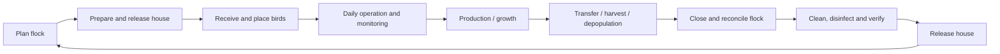

### Lifecycle stage gates

| Stage | Minimum exit criteria |
|---|---|
| Plan | Capacity, source, breed/strain, dates, supplies, target profile, health program and expected output approved. |
| Ready house | Previous flock closed; waste/litter removed; sanitation, maintenance, calibration, environment and supplies verified. |
| Place | Source documents, quantities, dead-on-arrival, transport, initial environment and acceptance observations recorded. |
| Operate | Daily inspections, environment, feed/water, health, welfare, tasks, equipment and biosecurity controlled. |
| Produce | Egg, body-weight, breeder or other production records reconciled to the flock. |
| Harvest/transfer | Welfare, withdrawal, vehicle/crew biosecurity, counts/weights, certificates and destination approved. |
| Close | Bird, inventory, output, cost, incidents and final KPIs reconciled and signed off. |
| Sanitize/release | Cleaning, disinfection, verification, downtime, maintenance and readiness approval completed. |

## 3.3 Daily operating rhythm

1. **Start shift:** review emergency/critical alerts, weather, power/generator, house restrictions, health actions, staffing and due work.
2. **Perform house round:** scan the house QR code, observe birds before disturbing them, then verify environment, feed, water, litter, equipment and production.
3. **Record exceptions immediately:** mortality/culls, health signs, leaks, equipment faults, biosecurity breaches, abnormal production or sensor problems.
4. **Respond and escalate:** follow the linked SOP/checklist, acknowledge the alert, create the required event or work order and contact qualified personnel.
5. **Reconcile inputs and outputs:** bird count, feed, water, eggs/weights, medicine, inventory and shipments.
6. **Supervisor review:** inspect missing or implausible records, unresolved alerts, overdue tasks, health trends and handover notes.
7. **Daily close:** sign off the period, lock approved records and keep offline copies until synchronization is confirmed.

## 3.4 Weekly, monthly and cycle routines

| Frequency | Required management routine |
|---|---|
| Weekly | Review flock trend vs target, mortality causes, intake/output variance, unresolved alerts, sensor quality, stock/expiry, PM completion, pest/biosecurity findings and staffing. |
| Monthly | Review access, audit log exceptions, training gaps, supplier performance, cost/sustainability, backup status, nuisance alarms, recurring work orders and configuration changes. |
| Per flock stage | Approve target-profile changes, feed phase, vaccination/treatment schedule, light program, harvest/transfer readiness and welfare checks. |
| Per flock close | Reconcile birds, feed, medicine, eggs/weight, inventory, shipments, costs, incidents and lessons learned; lock the final record. |
| Recurring drill | Test power failure, local alarm, cloud/network loss, manual control, backup water, notification escalation, data restoration and recall trace. |

## 3.5 Roles

| Role | Main responsibility |
|---|---|
| Owner / executive | Portfolio risk, cost, assurance and investment. |
| Farm manager | Daily accountability, flock performance, staffing, approvals, alerts and closeout. |
| Supervisor | Shift execution, round review, task coordination and exception escalation. |
| Caretaker / worker | Daily rounds, observations, records, first response and assigned tasks. |
| Poultry veterinarian | Health program, diagnosis, treatment authorization, withdrawal and outbreak decisions. |
| Biosecurity / quality lead | Biosecurity plan, food-safety evidence, audits and corrective action. |
| Maintenance technician | Critical equipment, preventive maintenance, calibration, repair and emergency tests. |
| Inventory / procurement | Supplier, lot, expiry, stock, purchasing, receiving and issue control. |
| Logistics / sales | Orders, harvest/collection, shipment, vehicle, customer and receipt. |
| Auditor / customer reviewer | Read-only, purpose-limited evidence and traceability packs. |
| System administrator / IT | Identity, configuration, integrations, devices, security, backup and support. |
| Data / analytics lead | KPI definitions, data quality, report governance and model controls. |

---

# 4. Solution architecture

## 4.1 System context

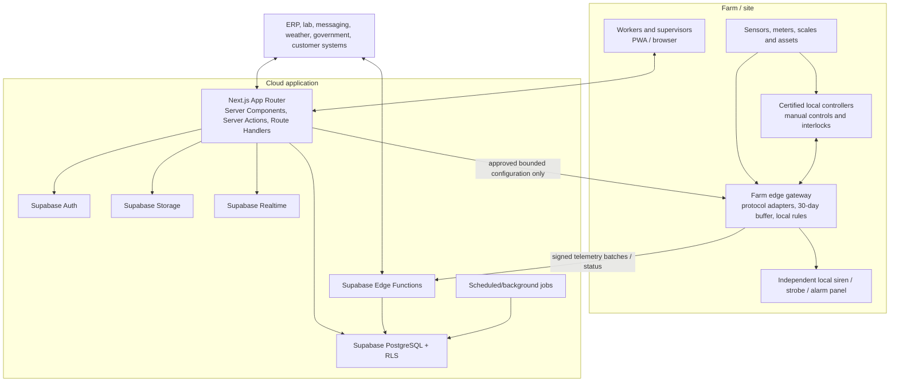

## 4.2 Responsibility boundaries

| Component | Responsibilities | Must not do |
|---|---|---|
| Browser/PWA | Server-rendered UI, interactive forms, scanning, local IndexedDB queue, narrow Realtime, direct signed Storage upload. | Store authorization decisions as the only control; contain secret keys; control life-support equipment directly. |
| Next.js App Router | Rendering, workflow orchestration, validation, authenticated reads/mutations, downloads, webhooks and public/mobile APIs. | Duplicate the database authorization model; become a cloud-only safety controller. |
| Supabase PostgreSQL | Relational source of truth, RLS, constraints, transactions, status transitions, calculated views and audit records. | Hide core business state in ungoverned JSON; accept unvalidated tenant access. |
| Supabase Storage | Private evidence, reports, images, certificates, manuals and exports with path-based policies. | Expose private farm files through permanent public URLs. |
| Supabase Realtime | Narrow active-alert, job-progress and selected live-status subscriptions. | Broadcast high-frequency raw telemetry to every dashboard. |
| Edge Function | Independent device ingress, selected webhooks or multi-client endpoints. | Become a general duplicate backend without a measured reason. |
| Farm edge gateway | Device adapters, local buffer, normalization, device health, local rule execution and store-and-forward. | Replace certified controller safety logic without formal hazard analysis and acceptance. |
| Certified controller | Local closed-loop environment control, physical interlocks, manual fallback and immediate alarms. | Depend on internet or cloud availability. |
| External worker/queue | High-volume, retry-heavy, long-running or CPU-intensive jobs when required. | Be introduced before workload evidence justifies it. |

## 4.3 Request and execution-layer selection

| Operation | Recommended layer |
|---|---|
| Render dashboard, flock, house or report page | Server Component calling a server-only query module. |
| Create/update a record from web UI | Server Action with Zod validation, identity check, RLS mutation and revalidation. |
| Receive lab/ERP/messaging webhook | Route Handler or Edge Function with signature verification and idempotency. |
| Synchronize offline mobile records | Versioned Route Handler or Edge Function using client operation IDs and conflict rules. |
| Ingest device telemetry | Edge Function or dedicated ingress service; batch validation and idempotent insert. |
| Execute transaction-heavy reconciliation | PostgreSQL function within one transaction. |
| Upload a large photo, certificate or report | Browser to private Supabase Storage using policy or signed upload. |
| Show active alert changes or export progress | Client Component with narrow private Realtime subscription. |
| Run high-volume aggregation or model scoring | Scheduled job or external worker when database/Edge Function limits are insufficient. |

### Standard authenticated read

```text
Browser request
  -> Next.js Server Component
      -> cookie-aware Supabase server client
          -> PostgreSQL query evaluated under RLS
      <- typed data or safe database error
  <- rendered HTML plus small interactive client islands
```

### Standard mutation

```text
Form submission
  -> Server Action
      1. Parse and validate input with Zod
      2. Verify authenticated identity and high-level permission
      3. Execute mutation under RLS
      4. Commit audit/event records in the same transaction where required
      5. Revalidate affected route or cache tag
      6. Return safe field or workflow result
```

### IoT telemetry flow

```text
Sensor/controller
  -> farm edge adapter
      -> normalize identifier, unit, timestamp and quality
      -> buffer locally
      -> signed batch to ingestion endpoint
          -> authenticate device/gateway
          -> validate schema, range and idempotency key
          -> insert raw telemetry/staging rows
          -> update current-state and aggregate tables
          -> evaluate non-local cloud rules
          -> create alerts/events when applicable
      <- accepted/rejected item result
  -> edge retains and retries only unaccepted items
```

## 4.4 Feature-oriented project structure

```text
chicken-coop-ops/
├── src/
│   ├── app/
│   │   ├── (auth)/
│   │   │   ├── login/page.tsx
│   │   │   └── auth/callback/route.ts
│   │   ├── (dashboard)/
│   │   │   └── [organizationSlug]/
│   │   │       ├── layout.tsx
│   │   │       ├── overview/page.tsx
│   │   │       ├── sites/[siteId]/...
│   │   │       ├── houses/[houseId]/...
│   │   │       ├── flocks/[flockId]/...
│   │   │       ├── alerts/...
│   │   │       ├── reports/...
│   │   │       └── settings/...
│   │   ├── api/
│   │   │   ├── v1/mobile/sync/route.ts
│   │   │   ├── v1/exports/[jobId]/route.ts
│   │   │   ├── webhooks/lab/route.ts
│   │   │   ├── webhooks/erp/route.ts
│   │   │   └── webhooks/messaging/route.ts
│   │   ├── globals.css
│   │   └── layout.tsx
│   ├── features/
│   │   ├── identity-access/
│   │   ├── farm-structure/
│   │   ├── flocks/
│   │   ├── daily-operations/
│   │   ├── environment-iot/
│   │   ├── alerts-incidents/
│   │   ├── feed-water/
│   │   ├── production/
│   │   ├── health-welfare/
│   │   ├── biosecurity/
│   │   ├── sanitation-waste/
│   │   ├── inventory-procurement/
│   │   ├── maintenance-utilities/
│   │   ├── workforce-knowledge/
│   │   ├── traceability-logistics/
│   │   ├── costing-sustainability/
│   │   ├── reporting-analytics/
│   │   ├── documents-media/
│   │   ├── configuration-governance/
│   │   └── integrations/
│   ├── components/
│   │   ├── ui/
│   │   ├── shared/
│   │   └── providers/
│   ├── lib/
│   │   ├── supabase/client.ts
│   │   ├── supabase/server.ts
│   │   ├── supabase/admin.ts
│   │   ├── supabase/proxy.ts
│   │   ├── auth/require-user.ts
│   │   ├── auth/permissions.ts
│   │   ├── offline/
│   │   ├── telemetry/
│   │   ├── observability/
│   │   ├── env.ts
│   │   └── utils.ts
│   └── types/database.generated.ts
├── supabase/
│   ├── migrations/
│   ├── functions/
│   ├── tests/
│   ├── seed.sql
│   └── config.toml
├── public/
├── proxy.ts
├── components.json
└── package.json
```

Each feature should normally contain:

```text
features/<module>/
├── components/
├── server/queries.ts
├── server/actions.ts
├── schema.ts
├── types.ts
├── permissions.ts
├── events.ts
└── tests/
```

**Dependency rule:** product features may import shared UI and framework adapters. Shared code must not import a product feature. Cross-module coordination should occur through explicit orchestration functions, database transactions or domain events rather than hidden circular imports.

---

# 5. Module catalog and release map

| ID | Module | MVP | Connected / Phase 2 | Advanced / Enterprise |
|---|---|---:|---:|---:|
| MOD-01 | Tenant, identity and access | Yes | SSO, automated lifecycle | Customer billing/portal roles |
| MOD-02 | Farm structure and master data | Yes | GIS/floor plans, richer profiles | Regional configuration packs |
| MOD-03 | Flock planning and lifecycle | Yes | Advanced split/merge/forecast | Cross-company transfers |
| MOD-04 | Daily operations, rounds and close | Yes | Advanced workload optimization | Voice/computer-vision assistance |
| MOD-05 | Environment, IoT and safe control | Read-only pilot | Multi-device integration, advisory | Supervised/local automatic control |
| MOD-06 | Alerts, incidents and emergency | Yes | Cross-signal rules, drills | Predictive risk and advanced correlation |
| MOD-07 | Feed, water and nutrition | Yes | Automated meters and feed planning | Supplier optimization/feed-mill integration |
| MOD-08 | Production management | One profile | Additional profiles | Advanced forecast/packing/hatchery integration |
| MOD-09 | Health, welfare and veterinary | Yes | Lab integration and outbreak packs | Validated advisory analytics |
| MOD-10 | Biosecurity and controlled access | Yes | Digital kiosk/access devices | Regional disease-network integration |
| MOD-11 | Sanitation, litter, waste and pest | Yes | Environmental verification devices | Advanced sustainability/compliance integration |
| MOD-12 | Inventory, procurement and suppliers | Yes | Purchase orders/supplier assurance | Enterprise procurement integration |
| MOD-13 | Assets, maintenance and utilities | Yes | Condition monitoring | Predictive maintenance |
| MOD-14 | Workforce, tasks, training and SOPs | Yes | Competency planning | Workforce-system integration |
| MOD-15 | Traceability, logistics and recall | Basic | Barcode/RFID and partner integrations | Customer/supplier portals and advanced genealogy |
| MOD-16 | Costing, sustainability and finance integration | Basic | ERP reconciliation | Portfolio planning and carbon accounting |
| MOD-17 | Dashboards, reports, analytics and AI | Yes, descriptive | Diagnostic/predictive | Governed advisory AI/computer vision |
| MOD-18 | Documents, media, signatures and records | Yes | External document exchange | Long-term archive/e-discovery |
| MOD-19 | Administration, configuration and data governance | Yes | Regional delegated admin | Enterprise configuration promotion |
| MOD-20 | Integrations, APIs, events and connector operations | Minimum | Lab, ERP, messaging, weather | Marketplace/partner ecosystem |

## 5.1 Module dependency map

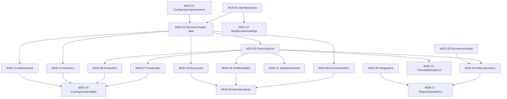

---
# 6. MOD-01 - Tenant, identity and access management

## 6.1 Purpose

Provide secure multi-tenant identity, membership, role and scope management for a single farm or many independent organizations. This module is the foundation for every other module and must enforce least privilege in both application code and PostgreSQL RLS.

## 6.2 Primary users

Organization owner, system administrator, farm manager, security administrator, auditor and approved support personnel.

## 6.3 Capabilities

- Create and maintain organizations/tenants, organization settings and tenant status.
- Invite users and assign one or more roles with organization, site, zone and house scope.
- Support named user accounts, MFA, passwordless/email/OAuth where approved, and optional enterprise OIDC/SAML SSO.
- Support temporary contractors, auditors and vendor support with explicit sponsor, start/end time and limited scope.
- Deactivate users immediately and revoke active sessions where needed.
- Perform recurring access reviews and record reviewer, decision and evidence.
- Require stronger re-authentication for treatment approval, control commands, sensitive export and privileged administration.
- Maintain emergency/break-glass access with strict expiry, reason, notification and post-use review.
- Separate normal user operations from narrow server-only administrative jobs using the Supabase secret/admin client.

## 6.4 Recommended roles and permission domains

| Role | Typical scope | Examples of allowed actions |
|---|---|---|
| `owner` | Entire organization | Manage owners/admins, portfolio reports, policy approval, export and billing/contract settings. |
| `org_admin` | Entire organization | Users, sites, configuration, integrations and audit, excluding owner-only actions. |
| `farm_manager` | Assigned sites | Approve flocks, close periods, manage work, respond to incidents and export site reports. |
| `supervisor` | Assigned houses/sites | Review rounds, assign tasks, acknowledge alerts and approve ordinary corrections. |
| `caretaker` | Assigned houses | Perform rounds, observations, production entries, mortality and first-response tasks. |
| `veterinarian` | Assigned organization/sites | Health cases, diagnosis, treatment authorization, withdrawal and outbreak decisions. |
| `biosecurity_qa` | Assigned sites | Biosecurity, sanitation, audit, corrective action, release approval and assurance reports. |
| `maintenance` | Assigned sites/assets | Assets, work orders, calibration, critical tests and bounded control execution. |
| `inventory` | Assigned sites/stores | Receive, quarantine/release, issue, count and procure inventory. |
| `logistics` | Assigned sites | Harvest/collection plans, shipments, transfers and customer receipts. |
| `auditor` | Explicit read-only scope | Time-limited evidence, selected reports and trace packs. |
| `support` | Explicit time-limited scope | Diagnostics only; no farm data access unless sponsored and logged. |

Permissions should be capability-based, such as `flock.create`, `daily_round.submit`, `treatment.authorize`, `shipment.release`, `control_command.approve` and `audit.export`. A role is a managed collection of permissions; scope determines where the permission applies.

## 6.5 Core workflows

### User invitation and activation

1. Authorized administrator enters email/identity, role, site/house scope and expiry if temporary.
2. System validates that the inviter may assign that role and scope.
3. Invitation is issued with one-time token and expiration.
4. User completes authentication and required MFA/induction.
5. Membership becomes active and an immutable audit event is written.

### Role or scope change

1. Administrator submits requested change and reason.
2. High-risk changes may require a second approver.
3. Database updates membership/scope in one transaction.
4. Existing sessions are refreshed or revoked based on risk.
5. Change is written to the audit log with before/after values.

### Deactivation

1. User is marked inactive with effective time and reason.
2. Sessions and refresh tokens are revoked where supported.
3. Assigned open work is transferred or placed in an exception queue.
4. Ownership of documents, tasks and records remains attributable to the original user.

## 6.6 Key entities

| Entity/table | Important fields |
|---|---|
| `profiles` | `user_id`, display name, locale, time zone, status, contact preferences. |
| `organizations` | Name, slug, legal name, status, region, default units/time zone. |
| `organization_members` | `organization_id`, `user_id`, role, status, joined/expired timestamps. |
| `member_scopes` | Membership, site/zone/house scope, permission override and effective dates. |
| `invitations` | Email/identity, role, scope, token hash, inviter, expiry, accepted time. |
| `access_reviews` | Review period, reviewer, membership decision, evidence and completion. |
| `support_sessions` | Sponsor, technician, purpose, permitted scope, start/end, actions and recording reference. |
| `auth_security_events` | Sign-in, MFA, reset, lockout, revocation and suspicious event metadata. |

## 6.7 Business and security rules

- No shared accounts for accountable actions.
- At least one active owner must remain for an active organization.
- A user may never grant a role or scope broader than their own delegated authority.
- Temporary access expires automatically and cannot silently become permanent.
- Privileged role changes, data exports, treatment authorization and control commands are audited.
- Browser code uses only the Supabase publishable key. `SUPABASE_SECRET_KEY` remains server-only and must never appear in logs or client bundles.
- Middleware/proxy redirects improve navigation but do not replace identity verification in each protected Server Action or Route Handler.
- Every tenant-owned table is protected by RLS, even when normal application code already checks permissions.

## 6.8 UI and routes

- `/settings/organization`
- `/settings/users`
- `/settings/roles`
- `/settings/access-reviews`
- `/settings/support-sessions`
- `/profile/security`
- `/auth/mfa`

Server Components render membership and review lists. Server Actions handle invitations, role/scope changes and deactivation. Client Components are limited to interactive dialogs, tables and MFA browser flows.

## 6.9 Events and notifications

- `identity.user_invited`
- `identity.membership_activated`
- `identity.role_changed`
- `identity.scope_changed`
- `identity.user_deactivated`
- `identity.temporary_access_expiring`
- `identity.break_glass_used`

Notify the organization owner or security contact of privileged changes, break-glass use and suspicious authentication activity.

## 6.10 Module acceptance gate

- Cross-tenant users cannot select, insert, update, delete, subscribe to or download another tenant's data.
- A site-scoped worker cannot access an unassigned site by URL manipulation, direct Data API call or Storage path.
- Privileged actions require the configured role, scope and re-authentication.
- Deactivation prevents new authenticated operations and preserves attribution of historical records.
- All role/scope changes appear in the immutable audit log.

---

# 7. MOD-02 - Farm structure, houses and master data

## 7.1 Purpose

Maintain the shared operational hierarchy and controlled master data used by every transaction, rule, report and integration.

## 7.2 Primary users

Organization administrator, farm manager, biosecurity/quality lead, veterinarian, maintenance lead and data steward.

## 7.3 Capabilities

- Maintain organization, site/farm, biosecurity zone, house/coop, room/area and storage-location hierarchy.
- Store house capacity, dimensions, housing system, production purpose, floor plan, coordinates, equipment, operational status and criticality.
- Maintain production profiles for layer, broiler, breeder and simplified smallholder workflows.
- Maintain versioned target profiles and curves by breed/strain, age/stage, season, house type and source.
- Maintain controlled lists for breeds, feed products, units, egg grades, mortality causes, observation codes, sanitation chemicals, medicine catalogs, suppliers and report categories.
- Support local terminology, multiple languages, time zones, currencies and display units while storing canonical units.
- Generate durable QR/barcode labels for houses, assets, flocks, lots, samples and shipments.
- Track master-data approval, effective dates, superseded status and impact on active operations.

## 7.4 Structure model

| Entity | Definition |
|---|---|
| Organization | Tenant and data-ownership boundary. |
| Site/farm | Operational location containing houses, stores and support areas. |
| Biosecurity zone | Access-controlled area with entry requirements and movement restrictions. |
| House/coop | Main bird housing unit and environmental/equipment context. |
| House area | Optional room, pen, tier, section or sensor zone within a house. |
| Storage location | Feed, medicine, chemical, egg, spare-part or general inventory location. |
| Production profile | Configuration selecting workflows, fields, KPIs and state rules for a production type. |
| Target profile version | Approved age/stage curves, bands, schedules and alerts effective for defined flocks/houses. |

## 7.5 Key workflows

### Create a site and house

1. Administrator creates the site with time zone, units, contacts and biosecurity layout.
2. Houses are created with capacity, production purpose and operating characteristics.
3. Biosecurity zones, stores, access points and waste/mortality areas are linked.
4. Assets, devices, inspection templates and applicable SOPs are assigned.
5. Manager/quality reviews readiness of master data before the site is activated.

### Publish a target profile version

1. Qualified owner creates or clones a draft profile.
2. Curves, bands, schedules, formulas and source documents are entered.
3. Validation checks for gaps, overlaps, unit consistency and unsupported production stages.
4. Veterinary/operations/quality approval is captured as configured.
5. Version receives an effective date; active flocks retain their assigned version unless an approved change is applied.

## 7.6 Key entities

| Entity/table | Important fields |
|---|---|
| `sites` | Organization, name, code, address/coordinates, time zone, status and contacts. |
| `biosecurity_zones` | Site, name, risk class, parent zone, entry rules and status. |
| `houses` | Site/zone, code, capacity, dimensions, housing system, purpose, status and geometry. |
| `house_areas` | House, area type, capacity, sequence and geometry. |
| `storage_locations` | Site/zone, location type, conditions, restricted flag and status. |
| `production_profiles` | Type, supported workflow options, owner and status. |
| `target_profiles` | Profile family, breed/strain, housing, region and owner. |
| `target_profile_versions` | Version, effective dates, approval, source, status and immutable definition hash. |
| `target_curve_points` | Metric, age/stage, target/min/max, unit and interpolation method. |
| `code_sets` / `code_values` | Versioned controlled vocabularies and translations. |
| `qr_identifiers` | Entity type/id, printable code, status and replacement history. |

## 7.7 Business rules

- Active houses have a unique code within a site.
- Capacity and dimensions must be non-negative and use canonical units.
- A house status transition is controlled: `draft -> active -> maintenance/restricted -> inactive/retired`.
- A target-profile version is immutable after approval; a change creates a new version.
- Historical records retain the exact profile/version applied when the event occurred.
- Deactivating a master-data value does not remove it from historical records.
- A production profile determines which production-specific screens, fields, reports and constraints are available.
- Site time zone controls display and operating-day boundaries; timestamps are stored as `timestamptz` in UTC.

## 7.8 UI and routes

- `/settings/sites`
- `/settings/sites/[siteId]`
- `/settings/houses/[houseId]`
- `/settings/zones`
- `/settings/storage-locations`
- `/settings/production-profiles`
- `/settings/target-profiles/[profileId]/versions/[versionId]`
- `/settings/master-data`
- `/settings/labels`

## 7.9 Reports and controls

- Site/house master-data completeness.
- Active/inactive/restricted houses.
- Target-profile version usage by flock.
- Master-data values with upcoming expiry or review.
- QR/barcode label inventory and replacement history.

## 7.10 Module acceptance gate

- A complete farm hierarchy can be created and used to scope users, flocks, assets, inventory and reports.
- Historical transactions continue to resolve after a master-data value is superseded.
- Target-profile versions are approved, immutable and visible on every calculation using them.
- Invalid unit, date or hierarchy combinations are blocked by database constraints and server validation.

---

# 8. MOD-03 - Flock planning and lifecycle

## 8.1 Purpose

Manage each traceable cohort of birds from plan through house readiness, placement, active production, transfer/harvest, closeout and sanitation handoff.

## 8.2 Primary users

Farm manager, supervisor, caretaker, veterinarian, biosecurity/quality, logistics and inventory/procurement.

## 8.3 Flock state model

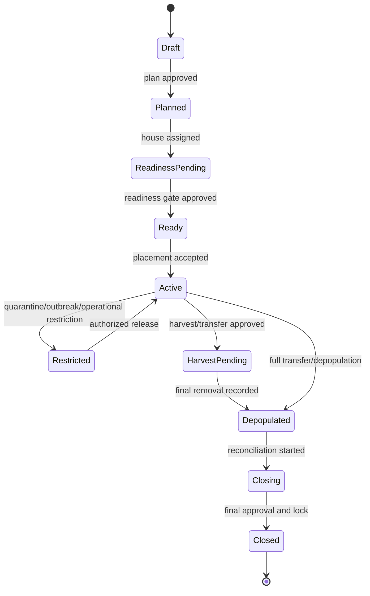

House sanitation/release is a related but separate state after depopulation.

## 8.4 Capabilities

- Plan flock source, production type, breed/strain, sex, hatch date, planned arrival, quantity, house, target profile and expected end date.
- Link source certificates, vaccination/health status, transport and supplier information.
- Execute a configurable readiness gate covering sanitation, maintenance, calibration, supplies, environment and approvals.
- Record placement quantity, dead-on-arrival, discrepancies, initial observations and acceptance signatures.
- Calculate age and stage automatically using effective operating-day rules.
- Support controlled transfer, split, merge and partial removal while preserving lineage and count reconciliation.
- Apply stage-dependent schedules, forms, targets, alert rules, feed programs and health plans.
- Plan and record harvest/depopulation/transfer, including crew/vehicle biosecurity and withdrawal readiness.
- Reconcile final bird balance, production, feed, medicine, inventory, cost and incidents at closeout.
- Lock approved periods and require reasoned correction events instead of destructive edits.

## 8.5 Key workflows

### Flock plan and approval

1. Planner selects production profile, source, breed/strain, quantity, planned house and dates.
2. System checks house capacity, schedule overlap, sanitation status, supply plan and profile compatibility.
3. Health/vaccination plan and required source documents are attached.
4. Manager approves plan; procurement and readiness tasks are generated.

### House readiness and placement

1. Sanitation release, critical maintenance, calibration, environment stabilization and supply checks must be complete.
2. Authorized approver signs the readiness gate.
3. On arrival, user records vehicle, source documents, actual quantity, DOA, condition and initial readings.
4. Discrepancies create an exception and optional supplier claim.
5. Placement activates the flock and schedules age/stage-driven work.

### Transfer/split/merge

1. User proposes movement with source flock, destination, quantity and reason.
2. System checks destination compatibility, capacity, health/biosecurity restrictions and withdrawal status.
3. Approved movement creates immutable lineage links and quantity transactions.
4. Source and destination counts reconcile; unresolved variance requires supervisor review.

### Closeout

1. Confirm final removal and no remaining live-bird count.
2. Reconcile birds, mortality/culls, feed, medicine, inventory, output, shipment and cost.
3. Review unresolved health, alert, work-order, audit and corrective-action items.
4. Generate final KPI report and lessons learned.
5. Approver closes and locks the flock; house is transferred to sanitation status.

## 8.6 Key entities

| Entity/table | Important fields |
|---|---|
| `flocks` | Organization, site, house, production type, source, breed, hatch date, target version, status. |
| `flock_plans` | Planned quantity/dates, expected output, approvals and planning notes. |
| `house_readiness_reviews` | Checklist version, results, evidence, exceptions, approvers and release time. |
| `placements` | Arrival/placement time, source, vehicle, quantity, DOA, discrepancy and sign-off. |
| `flock_movements` | Type, source/destination flock/house, quantity, reason, approval and lineage. |
| `flock_count_transactions` | Placement, mortality, cull, transfer, harvest and adjustment quantities. |
| `flock_stage_history` | Calculated stage, effective times, profile version and overrides. |
| `harvest_plans` | Planned date, destination, expected quantity/weight, crew, vehicle and readiness. |
| `flock_closeouts` | Reconciliation, final KPIs, issues, approvals and locked timestamp. |

## 8.7 Bird balance rule

For a flock and period, the system must explain:

```text
Opening live birds
+ placements received
+ transfers in
- mortality
- culls
- transfers out
- harvest/depopulation
+/- approved count adjustments
= closing live birds
```

Any adjustment requires reason, evidence where configured and supervisor approval. Closed periods may only be changed through an auditable correction version.

## 8.8 UI and routes

- `/flocks`
- `/flocks/new`
- `/flocks/[flockId]/overview`
- `/flocks/[flockId]/readiness`
- `/flocks/[flockId]/placement`
- `/flocks/[flockId]/movements`
- `/flocks/[flockId]/harvest`
- `/flocks/[flockId]/closeout`
- `/houses/[houseId]/schedule`

## 8.9 Events

- `flock.plan_approved`
- `flock.house_ready`
- `flock.placed`
- `flock.stage_changed`
- `flock.restricted`
- `flock.moved`
- `flock.harvest_started`
- `flock.depopulated`
- `flock.closed`

## 8.10 KPIs

Plan variance, placement discrepancy, DOA rate, age/stage compliance, bird-balance variance, closeout completeness, flock-cycle duration and comparison to the assigned target profile.

## 8.11 Module acceptance gate

- The selected production profile can complete the whole flock lifecycle without manual database intervention.
- A house cannot receive an incompatible or overlapping active flock unless the configured housing model explicitly permits it.
- Splits, merges and transfers preserve lineage and reconcile quantities.
- A flock cannot close while required reconciliations or critical open items remain, unless an authorized exception is recorded.

---

# 9. MOD-04 - Daily operations, rounds, shifts and period close

## 9.1 Purpose

Provide the main field workflow for daily husbandry and operational discipline, optimized for fast use in houses with poor connectivity.

## 9.2 Primary users

Caretakers, supervisors, farm managers, veterinarians, quality/biosecurity and maintenance personnel.

## 9.3 Capabilities

- Configure inspection templates by production type, age/stage, house, shift, season and risk.
- Generate due rounds and tasks from schedules and flock events.
- Start work by scanning a house QR code and loading assigned work, active alerts, unresolved findings and applicable SOPs.
- Capture observations, counts, manual environment readings, feed/water, litter, equipment, production, notes, photos and signatures.
- Create a task, health case, work order, biosecurity incident or alert acknowledgement directly from a finding.
- Support local-first offline entry, client-generated UUIDs, explicit sync status and retry.
- Support shift handover with unresolved risk, equipment state, restricted areas and next actions.
- Identify missing, late, implausible and corrected records for supervisor review.
- Perform daily/weekly period completeness checks, approval and lock.
- Preserve correction history with before/after, reason, user, time and approval.

## 9.4 Daily-round workflow

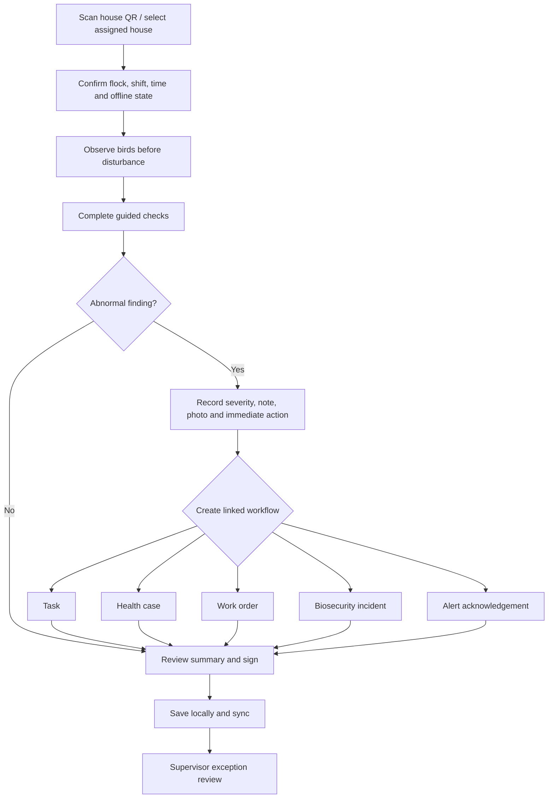

## 9.5 Offline data model

The PWA stores only assigned, necessary data in IndexedDB:

- Active sites/houses/flocks assigned to the user.
- Current and next seven days of forms, tasks and SOPs.
- Recent alerts, unresolved findings and limited trend summaries.
- Controlled master-data subsets required for entry.
- An encrypted-at-rest capability should be evaluated for managed devices; browser storage is not a substitute for device security.

Every queued operation contains:

- `client_operation_id` UUID.
- Entity ID generated on the client where appropriate.
- Entity type and mutation type.
- Local event time and local save time.
- Base server version for mutable records.
- Payload schema version.
- User/device/session identity.
- Attachment references and upload state.

The sync API returns `accepted`, `duplicate`, `conflict`, `rejected` or `retry_later` per operation.

## 9.6 Conflict policy

| Record type | Conflict behavior |
|---|---|
| Append-only observation, mortality, task comment | Accept idempotently by client operation ID; duplicates return the existing record. |
| Mutable draft owned by one user | Optimistic version check; client can review server version and retry. |
| Approved/locked record | Never overwrite; create a correction request/version. |
| Master data or rule | Server-authoritative; offline user receives current version and must reapply if still relevant. |
| Attachment | Upload separately; record may remain `attachment_pending` until confirmed. |

## 9.7 Key entities

| Entity/table | Important fields |
|---|---|
| `shifts` | Site, start/end, role requirements, status. |
| `shift_assignments` | User, shift, site/house scope and responsibility. |
| `inspection_templates` / `inspection_template_versions` | Applicability, sections, questions, validation and approval. |
| `inspections` | House/flock, shift, template version, started/completed, user/device, status and quality score. |
| `inspection_responses` | Question, typed response, unit, status, reason and source. |
| `observations` | Category, severity, description, immediate action, media and linked entity. |
| `handovers` | From/to shift, unresolved items, restrictions, acknowledgements. |
| `period_closes` | Scope, period, completeness, reviewer, approval and lock. |
| `record_corrections` | Target record/version, before/after, reason, requester and approver. |
| `sync_operations` | Client operation ID, result, conflict detail and processed time. |

## 9.8 Business rules

- The round displays the applicable template version and target profile for the event time.
- Required critical checks cannot be silently skipped; an exception reason and escalation are required.
- Abnormal numeric values prompt confirmation and may automatically create an observation/alert.
- A user cannot approve their own high-risk correction where separation of duties is configured.
- Submitted records retain event time, entry time, device time and sync time.
- The UI explicitly shows offline, unsynced, stale, rejected and conflicted states.
- A daily close cannot pass required completeness checks without an authorized exception.

## 9.9 UI and routes

- `/today`
- `/rounds`
- `/rounds/[inspectionId]`
- `/houses/[houseId]/round`
- `/handovers`
- `/exceptions/daily-records`
- `/period-close`
- `/corrections`

## 9.10 KPIs

Round completion, on-time completion, average duration, missing critical responses, offline sync success, conflict rate, supervisor review backlog, repeated observations and data-quality score.

## 9.11 Module acceptance gate

- A worker can complete a full round offline, take a photo, create linked health/maintenance work and synchronize without duplication.
- The system shows all unsynced operations and provides a safe recovery path.
- Late, missing, abnormal and corrected records are visible to the supervisor.
- Locked records cannot be destructively edited.

---

# 10. MOD-05 - Environment, IoT monitoring and safe control

## 10.1 Purpose

Continuously monitor house conditions, equipment and utility state while preserving safe local control and reliable operation during cloud or network outages.

## 10.2 Primary users

Caretakers, supervisors, farm managers, maintenance, veterinarian/quality, system administrators and approved controller integrators.

## 10.3 Scope

### Typical signals

Temperature, relative humidity, ammonia, carbon dioxide, static pressure, airflow, light, water flow/pressure, feed level/weight, body-weight platform, mains/generator/UPS, fan/heater/pump/auger/cooling status, door/access/tamper and optional validated camera-derived observations.

### Automation maturity

| Level | Mode | Description |
|---|---|---|
| 0 | Manual | Workers record values; certified controllers operate independently. |
| 1 | Monitor | Read-only device telemetry, quality checks, trends and alerts. |
| 2 | Advise | System recommends inspections or bounded set-point review; qualified user decides. |
| 3 | Supervised control | Authorized user sends approved, bounded, expiring commands to the local controller with confirmation and rollback. |
| 4 | Local automatic control | Validated local controller/edge executes closed-loop logic within approved limits; cloud configures and observes under change control. |

The MVP should stop at Level 1.

## 10.4 Capabilities

- Register gateways, controllers, devices, sensors and channels with serial number, firmware, location, accuracy, calibration and owner.
- Normalize vendor/protocol identifiers, timestamps, units and quality flags at the edge.
- Buffer at least 30 days of configured telemetry and replay idempotently.
- Ingest manual and automatic readings with source and receive timestamps.
- Validate range, duplicate, stale value, sudden jump, stuck signal, clock drift and sensor disagreement.
- Maintain current-state tables and time-bucketed aggregates for dashboards.
- Apply age/stage/house-specific target bands and alert profiles.
- Track calibration, reference checks, replacements and certificates.
- Monitor gateway health, queue depth, storage, clock, firmware, adapter state and last upload.
- Integrate existing controllers read-only before any command path is enabled.
- Log every recipe/configuration change, manual override and remote command with approver, bounds, duration, response and rollback.

## 10.5 Edge gateway requirements

- Industrial environmental tolerance, protected enclosure, stable power and UPS.
- Outbound encrypted connection only by default; no unrestricted inbound internet access.
- Unique device certificate or key and disabled default credentials.
- Protocol adapters for selected controller/sensor interfaces such as MQTT, Modbus or OPC UA.
- Store-and-forward with batch sequence, item idempotency key and replay diagnostics.
- Local rule execution for critical sensor loss or condition, independent siren/strobe and optional cellular fallback.
- Remote support only through approved, time-limited, audited access with signed update and rollback.
- Local read-only status page and manual export for extended outage.

## 10.6 Telemetry storage pattern

| Table | Purpose |
|---|---|
| `gateways` | Farm edge identity, site, firmware, certificate and health. |
| `devices` | Controller/meter/sensor equipment and ownership. |
| `sensor_channels` | Measured parameter, source unit, canonical unit, location and expected interval. |
| `telemetry_readings` | Raw/normalized reading, source/receive time, value, unit, quality and idempotency key. |
| `current_sensor_state` | Latest accepted value and quality for fast house views. |
| `telemetry_aggregates` | Governed minute/hour/day statistics and time-in-band. |
| `device_events` | Online/offline, reboot, firmware, fault and configuration changes. |
| `calibrations` | Method, reference, result, certificate, next due and status. |
| `controller_recipes` / `recipe_versions` | Approved configuration definition and applicability. |
| `control_commands` | Requested command, limits, approver, expiry, controller response and rollback. |

For high volume, use PostgreSQL time partitioning and retention/aggregation policies. Dashboards read current and aggregate tables rather than scanning raw telemetry. A separate time-series or stream-processing service should be introduced only after measured workload demonstrates the need.

## 10.7 Cloud rule and local rule boundary

- **Local controller/edge:** immediate life-support logic, interlocks, emergency set points, siren/strobe and manual control.
- **Cloud:** contextual analytics, non-critical detection, notification, workflow, historical comparison and configuration governance.
- A cloud alert may never claim equipment was controlled unless the local controller confirmed execution.
- When telemetry is stale, dashboards and rules display uncertainty and use approved fallback/manual workflows.

## 10.8 UI and routes

- `/environment`
- `/sites/[siteId]/environment`
- `/houses/[houseId]/environment`
- `/devices`
- `/devices/[deviceId]`
- `/calibrations`
- `/controller-recipes`
- `/control-commands`
- `/gateways`

Client Components render interactive charts and narrow live status. Historical reads remain server-side. Raw telemetry is not subscribed broadly through Realtime.

## 10.9 Events

- `device.provisioned`
- `device.online` / `device.offline`
- `sensor.stale`
- `sensor.quality_failed`
- `calibration.due` / `calibration.failed`
- `telemetry.target_deviation`
- `controller.recipe_changed`
- `control.command_requested`
- `control.command_confirmed` / `control.command_failed`

## 10.10 KPIs

Sensor uptime, missing intervals, calibration compliance, data-quality score, time in target band, environmental exposure duration, gateway buffer depth, telemetry latency, device fault recurrence and command success/rollback.

## 10.11 Module acceptance gate

- Device data can be buffered during a prolonged outage and replayed without duplicates.
- Sensor stale/disagreement conditions are detected and display quality clearly.
- Existing local controls and alarms continue when cloud and internet are unavailable.
- No command is enabled until read-only monitoring, role controls, bounds, confirmation, rollback and hazard acceptance are proven.

---
# 11. MOD-06 - Alerts, incidents and emergency management

## 11.1 Purpose

Turn abnormal conditions into owned, escalated and verifiably closed operational responses rather than passive notifications.

## 11.2 Primary users

Caretakers, supervisors, farm managers, maintenance, veterinarian, biosecurity/quality, IT/security and on-call responders.

## 11.3 Severity model

| Severity | Meaning | Expected behavior |
|---|---|---|
| Information | Awareness or completed automated event. | Display and retain; no acknowledgement unless configured. |
| Warning | Deviation requiring timely inspection or planned action. | Assign to shift/site role and track due time. |
| Critical | Material risk to birds, product, equipment or compliance. | Immediate notification, acknowledgement, escalation and evidence. |
| Emergency | Imminent life-support, disease, fire, power, water or major safety risk. | Independent local alarm plus immediate multi-channel escalation and emergency procedure. |

Each site may refine names and response times, but the meaning and escalation path must remain governed.

## 11.4 Capabilities

- Define versioned rules combining threshold, duration, hysteresis, rate-of-change, schedule, age/stage, house mode, weather, device quality and cross-signal context.
- Detect no-data/stale conditions for critical signals.
- Route notifications by organization, site, house, shift, role, on-call availability and severity.
- Support in-app, SMS, email, voice and approved messaging channels.
- Require acknowledgement, owner, response estimate, action notes and closure evidence.
- Escalate unacknowledged or unresolved alerts according to the rule version active at opening.
- Correlate duplicate events and group related sensor/equipment conditions.
- Support time-limited maintenance mode, suppression, cooldown and approved override with complete audit.
- Convert or link alerts to health cases, work orders, biosecurity incidents, emergency plans and corrective actions.
- Support incident command, contact lists, timeline, communications, evidence, root cause and lessons learned.
- Schedule emergency drills and track findings and corrective actions.

## 11.5 Alert lifecycle

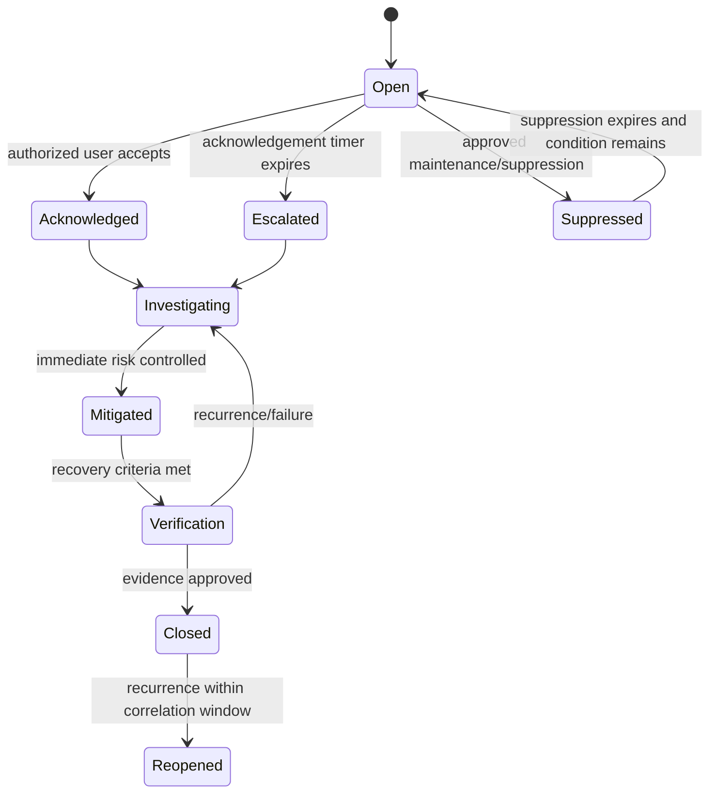

## 11.6 Rule definition requirements

Every rule version records:

- Name, description, owner and source/justification.
- Applicable organizations, sites, houses, production types, ages/stages and schedules.
- Input signals, quality prerequisites and fallback behavior.
- Open condition, duration, hysteresis/deadband and clear condition.
- Severity, response checklist, target acknowledgement/resolution and escalation tree.
- Notification channels and quiet-hour/emergency behavior.
- Suppression/maintenance permissions and maximum duration.
- Test cases, test results, approval, effective date and superseded version.

## 11.7 Sample operational conditions

| Condition | Typical severity | First response workflow |
|---|---|---|
| High/low temperature | Warning or Critical | Inspect birds and sensor; verify ventilation/heating/cooling and local controller status; escalate if not recovering. |
| High ammonia/CO2 or poor airflow | Critical | Verify sensor, ventilation, inlets/fans/heaters and litter/water; use approved emergency ventilation plan. |
| Water no-flow | Emergency | Confirm supply, valves, pump and pressure; provide alternate water and notify manager/maintenance immediately. |
| Water high-flow/leak | Critical | Locate/isolate leak safely, protect litter and create work order. |
| Feed depletion/no intake | Warning or Critical | Check stock, auger/line, flock behavior and health; reconcile meter/silo data. |
| Power loss | Emergency | Verify generator and local alarms; follow ventilation/power emergency plan. |
| Generator/UPS fault | Critical | Maintenance response, backup plan and operational restriction if resilience is inadequate. |
| Fan/heater/pump failure | Critical | Inspect, use redundant unit/interlock and create urgent work order. |
| Sensor stale/disagreement | Warning or Critical | Use alternate/manual reading; create calibration/replacement task. |
| Mortality spike | Critical | Open health case, notify veterinarian and quality; activate outbreak controls when indicated. |
| Production/intake drop | Warning | Review environment, feed, water, health and data completeness. |
| Door/access violation | Warning or Critical | Verify person/animal/predator risk and open biosecurity incident if required. |
| Cloud/gateway outage | Warning | Confirm local operation and buffer; contact IT if local monitoring is threatened. |

Thresholds must come from approved site/production profiles, not universal hardcoded values.

## 11.8 Incident and emergency workflows

The module must support at minimum:

- Extended power/generator failure and ventilation emergency.
- Heat, cold, flood, fire, storm or other natural disaster.
- Water/feed interruption or contamination.
- Suspected reportable disease, zoonotic risk, high mortality or quarantine.
- Controller, network or gateway failure requiring manual operation.
- Withdrawal violation, food-safety event, traceability failure or recall.
- Cybersecurity event affecting devices, integrity or remote access.
- Staffing/access emergency and authorized alternate contacts.

An incident record includes category, severity, commander/owner, affected scope, timeline, decisions, communications, tasks, external notifications, evidence, root cause, corrective/preventive action and closure approval.

## 11.9 Key entities

| Entity/table | Important fields |
|---|---|
| `alert_rules` / `alert_rule_versions` | Applicability, condition, severity, workflow, owner, approval and effective date. |
| `alerts` | Rule version, source, affected scope, opened/closed time, current state and correlation key. |
| `alert_events` | State changes, values, quality, user/device, notes and evidence. |
| `alert_acknowledgements` | User, channel, acknowledgement time, estimate and first action. |
| `alert_escalations` | Level, target, attempt, delivery result and response. |
| `notifications` | Channel, recipient, template, provider ID, status and delivery evidence. |
| `incidents` | Category, severity, commander, scope, status, timeline and regulatory flags. |
| `incident_actions` | Owner, due date, action, evidence, verification and recurrence control. |
| `emergency_drills` | Scenario, date, participants, result, findings and corrective actions. |

## 11.10 Realtime and background work

- Use private, narrow Realtime channels for active alerts relevant to the signed-in user's assigned scope.
- Do not use Realtime as the source of truth; reconnecting clients perform a normal server read.
- A scheduled/background process evaluates escalation timers, notification retries and overdue incident actions.
- Notification providers are treated as external integrations with idempotent message keys, delivery receipts and retry limits.

## 11.11 UI and routes

- `/alerts`
- `/alerts/[alertId]`
- `/incidents`
- `/incidents/[incidentId]`
- `/emergency-plans`
- `/emergency-drills`
- `/settings/alert-rules`
- `/settings/notification-policies`
- `/on-call`

## 11.12 KPIs

Alert count by severity/source, MTTA, MTTR, unacknowledged rate, escalation success, nuisance/duplicate rate, recurrence, suppression time, incident closure age and drill corrective-action completion.

## 11.13 Module acceptance gate

- Simulated critical and emergency conditions follow the approved local and cloud pathways.
- An unacknowledged alert escalates to the configured alternate and records delivery evidence.
- Suppression expires automatically and cannot hide an active condition indefinitely.
- Closure requires recovery criteria and evidence; alert history is immutable.

---

# 12. MOD-07 - Feed, water and nutrition operations

## 12.1 Purpose

Control feed and water availability, quality, consumption, inventory and variance because these are major drivers of welfare, health, production and cost.

## 12.2 Primary users

Caretakers, supervisors, farm managers, nutrition/procurement, inventory, veterinarian/quality and maintenance.

## 12.3 Capabilities

### Feed

- Maintain feed products/formulations, phases, supplier approvals and nutrient/quality documents.
- Assign a versioned feed program to a flock with age/stage transition criteria.
- Receive deliveries by supplier, vehicle, product, lot, quantity, certificate and storage destination.
- Record silo/bin readings, line status, manual issues and automated consumption.
- Calculate daily/cumulative feed intake and compare to target and recent baseline.
- Forecast depletion and generate replenishment tasks or requisitions.
- Reconcile opening stock, receipts, issues/consumption, transfers, adjustments and closing stock.
- Track contamination, quality exception, recall and blocked/quarantined feed lots.

### Water

- Register water source, treatment system, meter, pressure sensor and distribution point.
- Record flow, pressure, manual meter reading, treatment/chemical use, flushing and sanitation.
- Record sampling plan, test result, laboratory certificate and corrective action.
- Detect no-flow, high-flow/leak, unusual consumption and water-to-feed ratio deviation.
- Support alternate-water emergency plans and verification.

## 12.4 Core workflows

### Feed receiving

1. Match delivery to purchase order/requisition when used.
2. Verify supplier, product, lot, seal/vehicle, quantity and certificates.
3. Record sample/inspection and decide `quarantine`, `released` or `rejected`.
4. Transfer accepted quantity into a silo/location with traceable stock transaction.
5. Update depletion forecast and notify exceptions.

### Daily feed consumption

1. Read automatic meter/silo value or enter verified manual reading.
2. System calculates consumption from movement and stock data.
3. Compare against target, rolling baseline, bird count and production/temperature context.
4. Abnormal result requires confirmation and may create a feed/health/equipment observation.
5. Supervisor resolves unexplained variance.

### Water quality exception

1. Record failed test or contamination observation.
2. Block source/line or activate restriction as configured.
3. Open incident, assign alternate supply, flushing/treatment and resampling actions.
4. Qualified approver verifies acceptable result and releases the source.

## 12.5 Key entities

| Entity/table | Important fields |
|---|---|
| `feed_products` | Product/formulation, supplier, canonical unit, status and documentation. |
| `feed_programs` / `feed_program_versions` | Stage schedule, target intake, transition and approval. |
| `feed_deliveries` | Supplier, vehicle, lot, product, quantity, certificate, result and destination. |
| `silo_balances` | Silo, measured/calculated quantity, time, method and quality. |
| `feed_consumption` | Flock/house/day, quantity, source, target and variance. |
| `feed_movements` | Receipt, transfer, issue, adjustment, loss and destination. |
| `water_sources` | Source type, treatment, status, restrictions and owner. |
| `water_readings` | Meter/flow/pressure, source/receive time, value and quality. |
| `water_tests` | Sample, parameter, result, method, lab, limit profile and disposition. |
| `water_treatment_events` | Product/lot, concentration, method, start/end and verifier. |
| `line_flush_events` | House/line, method, duration, result and evidence. |

## 12.6 Business rules

- Feed/water quantities use canonical units with explicit conversion and source unit retained.
- Consumption cannot be negative; meter resets or replacements use an explicit event.
- A quarantined/rejected lot cannot be issued to a flock.
- Feed phase changes follow the assigned program unless a qualified user records an approved override.
- Water test limits and response rules are versioned by source/site/profile.
- Reconciliations show measured, calculated and unexplained variance separately.
- Inventory lot lineage links each flock's consumption to received feed lots where operational detail permits.

## 12.7 UI and routes

- `/feed-water/overview`
- `/feed/deliveries`
- `/feed/silos`
- `/feed/programs`
- `/feed/consumption`
- `/water/sources`
- `/water/readings`
- `/water/tests`
- `/water/sanitation`

## 12.8 Alerts and events

- `feed.delivery_received`
- `feed.lot_quarantined`
- `feed.stock_low`
- `feed.consumption_deviation`
- `water.no_flow`
- `water.high_flow`
- `water.quality_failed`
- `water.source_released`

## 12.9 KPIs

Feed intake per bird, cumulative feed, stock days, feed variance, water per bird, water-to-feed ratio, water availability, test compliance, leak volume, feed wastage and supplier quality exception rate.

## 12.10 Module acceptance gate

- Feed and water balances can be reconciled by flock/house and date.
- Quarantined or blocked lots cannot be consumed without authorized release.
- No-flow/high-flow and quality exceptions create the configured operational response.
- Feed and water deviations show target, baseline, data quality and contributing context.

---

# 13. MOD-08 - Production management

## 13.1 Purpose

Record and optimize production using a shared flock/house core with profile-specific workflows for layers, broilers and breeders.

## 13.2 Common capabilities

- Apply approved production target curves by flock age/stage and profile version.
- Record outputs by house, flock, date/time, shift, collection/harvest event and operator.
- Reconcile gross output, defects/losses, packed/transferred/shipped output and closing inventory.
- Show target, previous flock and site benchmark with clear formula/version.
- Capture cause codes and linked observations for abnormal production.
- Generate production lots and trace links to source flock/house and time window.
- Forecast short-term output and operational needs when data quality is adequate.

## 13.3 Layer extension

### Capabilities

- Schedule and record egg collection rounds.
- Capture total count/weight and grade categories such as saleable, dirty, cracked, floor, rejected and other configured categories.
- Record average egg weight, egg mass, nest/floor distribution and storage/packing lot.
- Reconcile collected eggs to packing, stock, transfer, loss and shipment.
- Track nest, conveyor, grading and storage equipment exceptions.

### Principal KPIs

- Hen-day production percent.
- Hen-housed production percent.
- Eggs per hen and cumulative eggs.
- Average egg weight and egg mass.
- Grade yield, dirty percent, cracked percent and floor-egg percent.
- Feed per dozen eggs or per unit egg mass.

Formula definitions must be versioned and show denominator rules.

## 13.4 Broiler extension

### Capabilities

- Define sampling plan, scale and sample method.
- Record individual/group weight samples, sample count and selection method.
- Calculate average weight, daily gain, uniformity and coefficient of variation.
- Compare growth and feed conversion against the assigned target profile.
- Create harvest plan by date, target weight, destination, catch crew, vehicle and expected quantity.
- Record catch/harvest counts, live weight, rejects, transport and processor receipt.

### Principal KPIs

- Average live weight.
- Average daily gain.
- Uniformity and coefficient of variation.
- Feed conversion ratio using an approved formula.
- Livability/mortality.
- Harvest count/weight variance and processor reconciliation.

## 13.5 Breeder extension

### Capabilities

- Record hatching eggs, floor/dirty/cracked categories and storage conditions.
- Maintain sex ratio/mating-related operational inputs where used.
- Transfer lots to hatchery and integrate fertility, hatchability and chick results.
- Trace hatchery results back to flock, house and collection period.

### Principal KPIs

Hatching eggs, saleable hatching eggs, floor eggs, fertility, hatchability, saleable chicks and breeder mortality.

## 13.6 Production workflow

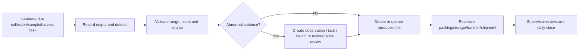

## 13.7 Key entities

| Entity/table | Important fields |
|---|---|
| `production_targets` | Target profile version, metric, period and value/band. |
| `egg_collections` | Flock/house, round, count/weight, operator and source. |
| `egg_collection_grades` | Collection, grade/category, quantity/weight and reason. |
| `production_lots` | Lot code, source flock/house/time window, quantity, status and destination. |
| `packing_runs` | Input lots, output lots, grades, loss and equipment. |
| `weight_samples` | Flock/house, sample plan, scale, count, values and statistics. |
| `harvest_plans` | Target, schedule, crew, vehicle, destination and readiness. |
| `harvest_events` | Actual quantity/weight, rejects, times, welfare checks and receipt. |
| `hatchery_transfers` | Hatching-egg lot, hatchery, quantity, storage/transport and receipt. |
| `hatchery_results` | Fertility, hatchability, chicks, losses and returned result time. |

## 13.8 Business rules

- The active production profile controls available fields, formulas and validations.
- Production entries cannot reference a flock outside the event time or house assignment without approved exception.
- A production lot has immutable source links after release.
- Adjustments never erase the original collection/sample/harvest record.
- Formula variants are named, owned and effective-dated.
- Reports expose missing data and quality flags rather than treating absent values as zero.

## 13.9 UI and routes

- `/production/overview`
- `/production/eggs`
- `/production/egg-collections/[id]`
- `/production/packing`
- `/production/weights`
- `/production/harvests`
- `/production/breeder`
- `/production/lots`

## 13.10 Events

- `production.collection_recorded`
- `production.weight_sample_recorded`
- `production.target_deviation`
- `production.lot_created`
- `production.harvest_approved`
- `production.harvest_completed`
- `production.hatchery_result_received`

## 13.11 Module acceptance gate

- One selected production profile can be operated end to end with target comparison and output reconciliation.
- Profile-specific formulas are traceable to their version and source fields.
- Production lots preserve source flock/house/time genealogy.
- Abnormal output can be converted to health, feed/water, environment or maintenance action without re-entry.

---

# 14. MOD-09 - Health, welfare, mortality and veterinary management

## 14.1 Purpose

Provide a controlled, auditable pathway from observation through veterinary assessment, sampling, diagnosis, treatment, withdrawal, monitoring and closure while preserving bird welfare and food-chain restrictions.

## 14.2 Primary users

Caretakers, supervisors, farm manager, poultry veterinarian, biosecurity/quality, inventory/medicine custodian, laboratory integration and authorized auditors.

## 14.3 Capabilities

- Record clinical/welfare observations with species/production context, severity, affected count, signs, photos and immediate action.
- Open health cases from daily rounds, alerts, mortality trends, lab results or manual reporting.
- Support triage, restrictions, isolation/quarantine, veterinarian review and outbreak mode.
- Maintain diagnoses/differentials using controlled codes while allowing qualified narrative.
- Create sample requests, chain of custody, laboratory submission and result review.
- Maintain vaccination plans and administration records by product lot, dose, route, crew and response.
- Maintain medicine products, authorization class, storage, expiry, approved use and withdrawal rules.
- Create veterinarian-authorized treatment orders and record each administration.
- Calculate and enforce egg/meat withdrawal holds from approved rule versions and actual administration.
- Record mortality and culls by time, count, cause, disposal path and post-mortem/lab link.
- Perform welfare assessments and corrective actions appropriate to the production profile.
- Produce case summaries, medicine registers, mortality reports, withdrawal status and outbreak evidence.

## 14.4 Health-case state model

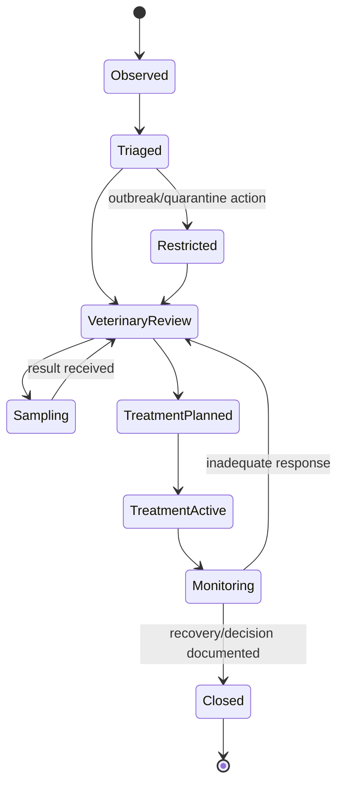

## 14.5 Treatment and withdrawal workflow

1. Authorized veterinarian/role selects case, product, indication, dose, route, frequency, duration and flock/house scope.
2. System validates product status, stock lot, expiry, authorization, dose/unit and applicable restriction rules.
3. Treatment order is approved and cannot be changed silently.
4. Authorized worker records each administration with actual product lot, quantity, time and signer.
5. System creates/updates withdrawal holds for affected eggs/birds and downstream lots.
6. Shipment/transfer/release workflows check active holds.
7. Qualified user records completion, response and release decision according to local rules.
8. Corrections create an auditable version; they do not delete the original administration.

## 14.6 Mortality workflow

- Record mortality/cull count as soon as discovered with event time, discovery time, house area and preliminary cause.
- Link carcass examination, sample, photo, disposal and health case when required.
- Update flock bird balance transactionally.
- Compare hourly/daily/cumulative rate to target and recent baseline.
- Trigger critical health/biosecurity workflow on configured spike or unusual pattern.
- Supervisor reconciles unexplained count variance and late entries.

## 14.7 Key entities

| Entity/table | Important fields |
|---|---|
| `health_observations` | Flock/house, signs, severity, affected count, media, immediate action and reporter. |
| `health_cases` | Category, status, owner/veterinarian, restrictions, summary and outcome. |
| `diagnoses` | Case, code, confidence/status, veterinarian, effective time and notes. |
| `lab_samples` | Sample type, flock/house, collection, collector, seal, chain of custody and lab. |
| `lab_results` | Sample, test, result, unit, interpretation, file, received/reviewed time. |
| `medication_products` | Active ingredient/product, authorization, storage, unit and withdrawal-rule reference. |
| `treatment_orders` | Case, product, indication, dose, route, schedule, scope, authorizer and status. |
| `treatment_administrations` | Order, product lot, actual dose/quantity, time, administrator and exceptions. |
| `vaccination_plans` / `vaccinations` | Schedule, product lot, route, crew, quantity, response and certificate. |
| `withdrawal_holds` | Scope, product/administration source, restriction type, start/end, status and releaser. |
| `mortality_events` | Flock/house, count, category/cause, discovery/event time, disposal and case link. |
| `welfare_assessments` | Template/version, measures, score, findings, action and approver. |

## 14.8 Permission and RLS requirements

- Workers may create observations, mortality and authorized administration entries within assigned scope.
- Only authorized veterinary/quality roles may diagnose, authorize/cancel treatment, change withdrawal rules or release certain restrictions.
- Medicine inventory details may be visible only to approved roles.
- Auditor access is purpose-limited and may redact worker personal data or unrelated health narratives.
- High-risk changes require re-authentication and immutable audit events.
- The normal server client operates under user RLS; an admin client is not used to bypass veterinary permissions.

## 14.9 Safety rules

- The system must not autonomously diagnose disease or prescribe medication.
- Decision support may show evidence, confidence and approved guidance but a qualified person remains responsible.
- A treatment cannot use an expired, quarantined, depleted or unauthorized product lot.
- Dose and unit validation occurs in browser for usability and again on the server/database.
- Active withdrawal holds are checked in production-lot, packing, transfer, shipment and flock-close workflows.
- Reportable disease logic, contacts and forms are configured for each jurisdiction and reviewed by qualified personnel.

## 14.10 UI and routes

- `/health/overview`
- `/health/observations`
- `/health/cases/[caseId]`
- `/health/samples`
- `/health/lab-results`
- `/health/treatments`
- `/health/vaccinations`
- `/health/withdrawals`
- `/health/mortality`
- `/health/welfare`
- `/health/outbreak-mode`

## 14.11 Events and alerts

- `health.case_opened`
- `health.restriction_applied`
- `health.sample_collected`
- `health.lab_result_received`
- `treatment.authorized`
- `treatment.administration_missed`
- `withdrawal.hold_started`
- `withdrawal.hold_released`
- `mortality.spike_detected`
- `welfare.critical_finding`

## 14.12 KPIs

Mortality, culls, livability, cause distribution, health-case incidence, time to veterinary review, treatment response, vaccination completion, missed administrations, active withdrawal, welfare findings and recurring health issues.

## 14.13 Module acceptance gate

- A health case can progress from observation through lab/treatment/monitoring to closure with full audit.
- A worker cannot create an unauthorized treatment order or release a withdrawal hold.
- Active withdrawal prevents or clearly blocks affected shipment/lot release.
- Mortality updates bird balance and triggers configured escalation on abnormal rate.

---

# 15. MOD-10 - Biosecurity, visitors, vehicles and outbreak control

## 15.1 Purpose

Control entry, movement and evidence across farm biosecurity zones, and provide rapid restriction and contact tracing during a suspected disease or contamination event.

## 15.2 Primary users

Biosecurity/quality lead, farm manager, security/gate personnel, supervisors, workers, veterinarian, visitors, drivers, contractors and auditors.

## 15.3 Capabilities

- Maintain a versioned site biosecurity plan, zones, access points, entry requirements and movement rules.
- Pre-register visitors, drivers, contractors and vehicles.
- Capture configurable risk questions about recent poultry/farm/wild-bird/market/processing exposure, illness and own-bird contact.
- Route approval/denial/restriction decisions to authorized roles.
- Record identity, sponsor, purpose, vehicle, arrival/departure, PPE, clothing/footwear, shower/change and disinfection steps.
- Record actual zones/houses visited, escort, items/equipment brought or removed and incidents.
- Control contractors through induction, temporary scope and expiry.
- Record vehicle/equipment cleaning/disinfection and product/time where required.
- Record access events from manual, QR, badge or supported physical access integration.
- Perform biosecurity inspections/audits, findings and corrective/preventive actions.
- Activate outbreak mode that freezes non-essential entry, applies zone restrictions, displays emergency procedures and supports contact tracing.
- Produce exposure/contact lists by visitor, vehicle, site, zone, house, flock and time window.

## 15.4 Visitor entry workflow

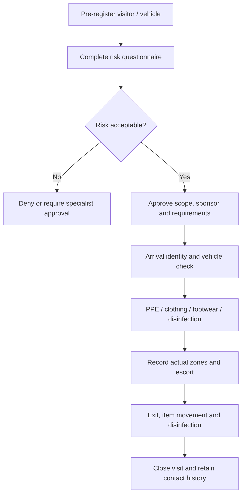

## 15.5 Outbreak mode

When activated by an authorized manager/veterinarian/quality role, the system can:

- Mark affected organization/site/zone/house/flock with a visible restriction banner.
- Cancel or suspend non-essential visits and deliveries.
- Require additional approvals and PPE steps.
- Freeze selected bird, egg, feed, equipment and vehicle movements.
- Create contact/exposure lists for a configurable time window.
- Link health cases, mortality, lab results, visitors, vehicles, staff shifts and shipments.
- Generate daily situation reports and required authority/customer communication packs.
- Preserve legal/incident hold on relevant records and files.
- Require authorized release with reason, evidence and effective time.

## 15.6 Key entities

| Entity/table | Important fields |
|---|---|
| `biosecurity_plans` / `biosecurity_plan_versions` | Scope, rules, owner, approval, effective date and source. |
| `access_points` | Site/zone, type, requirements, device and status. |
| `visit_requests` | Visitor/driver, sponsor, purpose, planned scope/time and risk answers. |
| `visitors` | Identity/contact, organization and privacy/retention metadata. |
| `vehicles` | Registration, owner/operator, type and status. |
| `visit_events` | Arrival/departure, actual scope, PPE, escort, disinfection and incidents. |
| `vehicle_visits` | Vehicle, driver, load/equipment, cleaning/disinfection and access. |
| `access_events` | Person/credential, access point, result, reason and source device. |
| `biosecurity_audits` | Template/version, scope, score, findings and approval. |
| `biosecurity_incidents` | Breach type, affected scope, immediate control, owner and outcome. |
| `outbreak_controls` | Restriction type, scope, start/end, authority and release. |

## 15.7 Business and privacy rules

- Access is denied by default where no approved scope/visit exists.
- Risk questions, decisions and retention are configurable to local policy and privacy law.
- A visitor may only access approved zones during the approved window and with required escort.
- Temporary worker/contractor app access aligns with the visit/contract period.
- Outbreak restrictions are checked by flock movement, inventory movement, maintenance access and shipment workflows.
- Visitor and worker personal data is minimized, access-controlled and retained only as required.
- Physical access integration is advisory only unless the site has validated fail-safe entry procedures.

## 15.8 UI and routes

- `/biosecurity/overview`
- `/biosecurity/visitors`
- `/biosecurity/check-in`
- `/biosecurity/vehicles`
- `/biosecurity/access-events`
- `/biosecurity/audits`
- `/biosecurity/incidents`
- `/biosecurity/outbreak`
- `/settings/biosecurity-plans`

A public or kiosk check-in surface should expose only the minimum fields required and never use a secret/admin client in browser code.

## 15.9 Events and alerts

- `biosecurity.visit_requested`
- `biosecurity.visit_denied`
- `biosecurity.visitor_checked_in`
- `biosecurity.visitor_overdue_exit`
- `biosecurity.access_denied`
- `biosecurity.breach_reported`
- `biosecurity.outbreak_activated`
- `biosecurity.restriction_released`

## 15.10 KPIs

Visitor/vehicle count, denied/high-risk visits, overdue exits, unauthorized access attempts, audit score, repeat findings, corrective-action completion, outbreak contact-query time and training/induction compliance.

## 15.11 Module acceptance gate

- A visitor cannot be recorded as entering a restricted zone without the configured approval and entry controls.
- Actual entry/exit, zones, vehicle and disinfection evidence are traceable.
- Outbreak mode immediately affects visits, movements and shipments according to configured policy.
- Contact tracing can identify people/vehicles associated with an affected house/flock and time window.

---
# 16. MOD-11 - Sanitation, litter, waste, mortality disposal and pest control

## 16.1 Purpose

Control cleaning, disinfection, downtime, litter, waste, carcass disposal and pest activity so that house release is evidence-based and the next flock cannot be placed before critical sanitation requirements are complete.

## 16.2 Primary users

Biosecurity/quality, farm manager, supervisors, sanitation crews, caretakers, veterinarian, maintenance, waste contractors and auditors.

## 16.3 Capabilities

- Define sanitation plans and checklists by house type, production profile, risk level and event.
- Generate cleaning/disinfection work after depopulation or contamination.
- Record dry cleaning, washing, rinsing, approved disinfectant product/lot, concentration, coverage, contact time, drying and downtime.
- Record staff/contractor, equipment, weather/temperature and evidence photos.
- Record verification inspection, swab/sample, laboratory result, failures and rework.
- Require maintenance, sensor calibration and supply-restocking checks before release.
- Track litter condition during a flock and litter removal, storage, treatment, reuse or disposal.
- Record mortality/carcass disposal method, quantity, container/location, pickup/processing and certificate.
- Record waste streams, quantities, storage, transport, destination and contractor.
- Maintain pest monitoring points, inspection results, activity, product/device use and corrective action.
- Link sanitation failures, waste incidents and pest findings to incidents, work orders and biosecurity corrective action.

## 16.4 House sanitation and release workflow

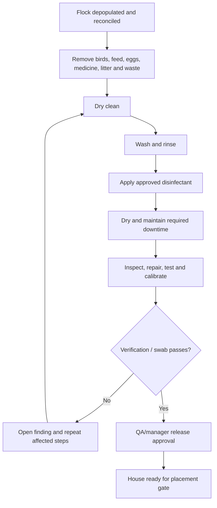

## 16.5 Key entities

| Entity/table | Important fields |
|---|---|
| `sanitation_plans` / `sanitation_plan_versions` | Applicability, steps, chemical requirements, verification and approval. |
| `sanitation_events` | House/site, trigger, crew, status, start/end, plan version and notes. |
| `sanitation_step_results` | Step, completion, product/lot, concentration, contact time, evidence and exception. |
| `sanitation_verifications` | Inspector, checklist, result, sample/lab links and release recommendation. |
| `house_release_approvals` | House, event, approver, release time, conditions and expiration if applicable. |
| `litter_events` | House/flock, condition, treatment, removal/reuse/disposal quantity and destination. |
| `waste_events` | Waste type, quantity, storage, transporter, destination, certificate and incident link. |
| `carcass_disposal_events` | Flock, count/weight, method, location, contractor, document and time. |
| `pest_monitoring_points` | Site/zone/house, point code, type, map location and status. |
| `pest_inspections` / `pest_actions` | Findings, activity level, product/device lot, action, follow-up and verifier. |

## 16.6 Business rules

- Only approved sanitation products and active inventory lots may be selected.
- Concentration, unit and contact-time values are validated against the plan version but allow an approved exception with reason.
- Placement readiness cannot pass without a valid house release when required.
- A failed verification automatically prevents release and creates corrective work.
- Waste and mortality disposal records preserve contractor, destination and certificate links.
- Pest-control chemical use is tied to inventory lot, authorized user and applicable restrictions.
- Records are append-only after approval; changes use correction workflow.

## 16.7 UI and routes

- `/sanitation/overview`
- `/sanitation/events/[eventId]`
- `/sanitation/house-release`
- `/litter`
- `/waste`
- `/mortality-disposal`
- `/pest-control`
- `/settings/sanitation-plans`

## 16.8 Events and alerts

- `sanitation.started`
- `sanitation.verification_failed`
- `sanitation.house_released`
- `sanitation.release_expiring`
- `waste.collection_overdue`
- `waste.incident_reported`
- `pest.activity_high`
- `pest.follow_up_overdue`

## 16.9 KPIs

Turnaround/downtime, sanitation completion, first-pass verification, repeat failure, release lead time, litter condition trend, waste per flock/output, mortality-disposal timeliness, pest activity and corrective-action completion.

## 16.10 Module acceptance gate

- A house cannot be marked ready while required sanitation, verification or release steps are incomplete.
- Products, lots, concentration, contact time and evidence are traceable.
- Failed verification creates rework and blocks release.
- Waste, litter and carcass movements can be traced to method, transporter/destination and documentation.

---

# 17. MOD-12 - Inventory, procurement and supplier management

## 17.1 Purpose

Maintain accurate, lot-controlled stock for feed, medicines, vaccines, chemicals, PPE, spare parts and general supplies, with receiving, quarantine/release, FEFO issue, counting, expiry and supplier assurance.

## 17.2 Primary users

Inventory/store personnel, procurement, farm manager, veterinarian/quality, maintenance, supervisors and finance integration.

## 17.3 Capabilities

- Maintain item catalog, category, canonical unit, storage requirements, controlled-item status and approved substitutes.
- Maintain suppliers, approval status, certificates, product scope and review dates.
- Create purchase requisitions, approvals and purchase orders where included.
- Receive goods against order or approved ad hoc receipt with supplier, lot/batch, expiry, quantity, certificate and inspection.
- Assign disposition: `quarantine`, `released`, `blocked`, `rejected` or `returned`.
- Move stock between controlled locations and record every stock transaction.
- Issue stock by FEFO, scan lot/barcode and link use to flock, treatment, sanitation, maintenance or task.
- Maintain reserved stock for scheduled vaccination, treatment, maintenance or emergency needs.
- Perform cycle counts/full counts, investigate variance and approve adjustments.
- Identify low stock, reorder point, upcoming expiry, cold-chain/storage exception and recalled lots.
- Record disposal/return with reason, method, authorization and evidence.
- Exchange purchase/invoice/payment data with ERP rather than recreating full accounting.

## 17.4 Stock state and transaction model

```text
Inventory lot status:
quarantine -> released -> blocked -> released
quarantine -> rejected/returned
released -> depleted
released/blocked -> expired -> disposed/returned
```

Stock quantity is derived from immutable transactions:

```text
Opening quantity
+ receipt
+ transfer in
+ positive adjustment
- issue/use
- transfer out
- return/disposal
- negative adjustment
= available physical quantity
```

Reservations are tracked separately from physical quantity.

## 17.5 Receiving workflow

1. Select supplier/order and capture delivery details.
2. Scan/create product lot, expiry and quantity.
3. Attach certificate, temperature/log or quality evidence when required.
4. Inspect and choose disposition.
5. Create stock transaction and storage assignment.
6. Notify responsible roles of rejected/quarantined/short delivery.
7. Update replenishment and scheduled-work availability.

## 17.6 Key entities

| Entity/table | Important fields |
|---|---|
| `inventory_items` | Code, category, description, base unit, controlled flag, storage and status. |
| `item_suppliers` | Item, supplier, approved status, lead time, supplier product code and documents. |
| `inventory_lots` | Item, lot/batch, supplier, manufacture/expiry, disposition, location and quality status. |
| `stock_transactions` | Lot, location, type, quantity, source/destination entity, user and event time. |
| `stock_reservations` | Lot/item, planned use, quantity, start/end and status. |
| `purchase_requisitions` | Requester, site, items, need date, justification, status and approvals. |
| `purchase_orders` | Supplier, order lines, currency/minor units, status and external ERP reference. |
| `goods_receipts` | PO/delivery, vehicle, receiver, result and documents. |
| `inventory_counts` / `inventory_count_lines` | Scope, counted quantity, expected quantity, variance and approval. |
| `supplier_approvals` | Scope, certificates, audit, risk, approval and next review. |
| `inventory_disposals` | Lot, quantity, reason, method, approver and evidence. |

## 17.7 Business rules

- Quantity, unit and money fields use canonical database representation; money is integer minor units or explicitly precise numeric.
- Expired, blocked, rejected, depleted or quarantined lots cannot be issued.
- Controlled medicine/vaccine/chemical issue requires the applicable role and source workflow.
- FEFO is the default suggestion; override requires reason and may require approval.
- A negative physical balance is prohibited unless a controlled correction process temporarily permits investigation.
- The same supplier/item lot receipt is protected by idempotency and duplicate detection.
- Inventory adjustments require a reason; large or controlled-item variance requires independent approval.

## 17.8 UI and routes

- `/inventory/overview`
- `/inventory/items`
- `/inventory/lots`
- `/inventory/receiving`
- `/inventory/issues`
- `/inventory/transfers`
- `/inventory/counts`
- `/inventory/expiry`
- `/procurement/requisitions`
- `/procurement/purchase-orders`
- `/suppliers`

## 17.9 Events and alerts

- `inventory.receipt_created`
- `inventory.lot_quarantined`
- `inventory.lot_released`
- `inventory.low_stock`
- `inventory.expiry_approaching`
- `inventory.storage_exception`
- `inventory.count_variance`
- `supplier.approval_expiring`

## 17.10 KPIs

Stock accuracy, count variance, stockout events, expiry loss, FEFO compliance, order lead time, supplier rejection rate, emergency purchase rate and inventory value by category/site.

## 17.11 Module acceptance gate

- Every issue can be traced to an item lot, location, user, purpose and flock/task where applicable.
- Blocked/quarantined/expired stock cannot be selected by normal workflows.
- Physical quantity reconciles from transactions and count adjustments are audited.
- Medicine, vaccine, feed and chemical lots link to downstream operational records.

---

# 18. MOD-13 - Assets, maintenance, calibration and utilities

## 18.1 Purpose

Keep critical farm equipment available, calibrated and safe through an asset registry, preventive maintenance, work orders, spare parts, utility tracking and emergency tests.

## 18.2 Primary users

Maintenance technicians, farm manager, supervisors, caretakers, quality, inventory and approved service vendors.

## 18.3 Capabilities

- Maintain assets and components with site/house location, criticality, manufacturer/model, serial, commissioning, warranty, manuals and current status.
- Classify life-support/critical assets such as fans, heaters, cooling, pumps, controllers, generators, UPS and alarms.
- Define time-, meter-, stage- or event-based preventive maintenance plans.
- Generate work orders automatically from schedules, inspections, device faults, alerts and observations.
- Plan priority, required skill, lockout/safety steps, parts, downtime and target completion.
- Record diagnosis, labor, parts, readings, photos, service vendor and repair outcome.
- Require functional verification before critical work order closure.
- Manage calibration schedules and certificates for sensors, scales, meters and dosing equipment.
- Track spare parts and automatically issue them from inventory to a work order.
- Record utility meters and abnormal use for electricity, fuel/generator, gas and water.
- Schedule and evidence generator, UPS, alarm, failover and emergency ventilation tests.
- Calculate downtime, recurrence, maintenance compliance and lifecycle cost.

## 18.4 Asset criticality

| Class | Definition | Minimum control |
|---|---|---|
| Critical A | Failure may immediately threaten birds, water, ventilation, fire safety or critical alarm. | Redundancy/fallback, urgent response, routine proof test, stricter change control. |
| Critical B | Failure materially affects welfare, production, biosecurity or traceability. | Priority response, PM, spare strategy and verification. |
| Operational C | Failure has a workaround or limited impact. | Normal work-order and maintenance process. |
| General D | Non-operational support asset. | Basic inventory and repair history. |

## 18.5 Work-order state model

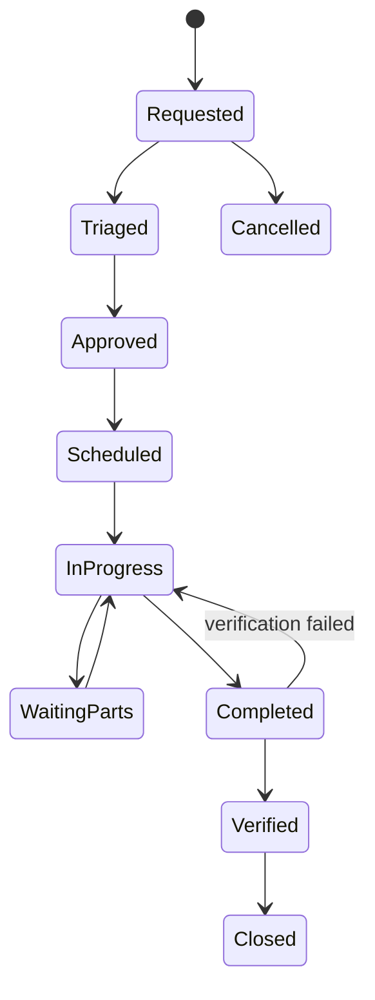

## 18.6 Core workflows

### Fault from alert or round

1. Alert/observation creates a prefilled work request with asset, house, symptom, severity and evidence.
2. Maintenance triages risk and determines immediate safe workaround.
3. Work order is approved/scheduled or marked emergency.
4. Technician records lockout/safety, diagnosis, parts, repair and readings.
5. Critical asset is function-tested; related alert is verified, not merely closed by repair entry.
6. Recurring failures trigger root-cause/capital-review workflow.

### Preventive maintenance

1. Scheduled job generates due work based on plan version and trigger.
2. Planner assigns technician and required parts/skills.
3. Technician completes checklist and records measured results.
4. Out-of-tolerance result creates corrective work/calibration failure.
5. Next due date/meter is calculated from approved rule.

## 18.7 Key entities

| Entity/table | Important fields |
|---|---|
| `assets` | Site/house, asset class/type, manufacturer/model/serial, criticality, status and dates. |
| `asset_components` | Parent asset, component, serial/version, status and replacement history. |
| `maintenance_plans` / `maintenance_plan_versions` | Trigger, tasks, frequency, skills, parts, approval and applicability. |
| `work_orders` | Asset, source, priority, status, owner, due time, downtime and verification. |
| `work_order_tasks` | Checklist step, result, reading, evidence, exception and completion. |
| `maintenance_logs` | Diagnosis, action, labor, vendor, measurements and outcome. |
| `asset_parts_usage` | Work order, inventory lot, quantity and return/waste. |
| `calibration_plans` / `calibrations` | Instrument, method, reference, result, next due and certificate. |
| `utility_meters` / `utility_readings` | Utility, site/house, reading, source, interval and quality. |
| `emergency_equipment_tests` | Generator/UPS/alarm/failover test, load, result, finding and approval. |

## 18.8 Business rules

- Critical assets cannot be returned to service without configured verification.
- Work order source links remain intact to alert, observation, audit or PM schedule.
- Calibration failure marks affected device/data quality and may invalidate or flag readings from the review window.
- Parts issue is transactional and cannot use blocked/expired inventory.
- Critical PM overdue status appears on site/house readiness and management dashboards.
- Manual overrides and controller/asset configuration changes require role, reason, duration and audit.
- Work orders and asset history are retained after asset retirement.

## 18.9 UI and routes

- `/maintenance/overview`
- `/assets`
- `/assets/[assetId]`
- `/maintenance/work-orders`
- `/maintenance/preventive`
- `/maintenance/calibrations`
- `/maintenance/critical-tests`
- `/maintenance/spares`
- `/utilities`

## 18.10 Events and alerts

- `asset.fault_reported`
- `asset.status_changed`
- `work_order.created`
- `work_order.overdue`
- `work_order.completed`
- `work_order.verification_failed`
- `maintenance.pm_due`
- `calibration.due`
- `calibration.failed`
- `generator.test_failed`

## 18.11 KPIs

PM completion, critical PM overdue, mean time between failure, mean time to repair, downtime, repeat failure, work-order age, first-time fix, calibration compliance, spare stockout, maintenance cost and utility use per bird/output.

## 18.12 Module acceptance gate

- A fault from a round or alert creates a linked work order without re-entry.
- Critical work cannot close before functional verification.
- Calibration status changes sensor/data quality and appears in affected workflows.
- Parts usage updates inventory and asset/work-order cost.

---

# 19. MOD-14 - Workforce, tasks, training, SOPs and communication

## 19.1 Purpose

Coordinate people, recurring and exception work, competencies, training and current procedures so that every task has an accountable owner and workers can access the correct instructions at the point of work.

## 19.2 Primary users

All operational users, supervisors, managers, HR/training administrators, quality and contractors.

## 19.3 Capabilities

- Define task templates with trigger, checklist, priority, skill, SLA, evidence and escalation.
- Create tasks manually or from flock stage, alert, observation, health case, audit, inventory, maintenance or schedule.
- Assign by named user, role, team, shift, house/site and on-call rule.
- Support due date/time, recurrence, dependency, reassignment, delegation and escalation.
- Capture status, notes, checklist responses, time, materials, photos and sign-off.
- Create shift rosters/assignments or integrate with an external workforce system.
- Maintain competency/authorization requirements for treatment, vaccination, machinery, electrical, biosecurity and controller actions.
- Maintain training courses, required audience, renewal period, completion and evidence.
- Maintain controlled SOP/document acknowledgements and link procedures to modules, assets, houses and tasks.
- Provide shift handover, announcements and targeted operational communication.
- Support contractors/temporary workers with induction and time/location-limited access.

## 19.4 Task state model

```text
planned -> assigned -> accepted -> in_progress -> completed -> verified -> closed
                     \-> blocked / waiting -> in_progress
planned/assigned -> cancelled (authorized reason)
```

High-risk tasks may require a separate verifier.

## 19.5 Core workflows

### Task from finding

1. Source module creates task with context, severity, house/flock/asset and evidence.
2. Assignment engine selects responsible role/user based on site, shift and availability.
3. User accepts or supervisor reassigns.
4. User completes checklist and records result/evidence.
5. Required verifier approves; source finding/alert is updated with linked outcome.

### Training authorization

1. Administrator defines a competency and required course/assessment.
2. Role/action mapping states which competency is required.
3. Training completion and expiry are recorded.
4. Server Action checks active authorization before high-risk action.
5. Expiring competency creates notification and future task; expired competency removes action permission even if the user retains a general role.

## 19.6 Key entities

| Entity/table | Important fields |
|---|---|
| `task_templates` / `task_template_versions` | Trigger, checklist, skill, priority, SLA, evidence and approval. |
| `tasks` | Source, scope, assignee/team, status, priority, due, completion and verification. |
| `task_dependencies` | Predecessor/successor, dependency type and status. |
| `task_comments` / `task_evidence` | User, time, note, file and visibility. |
| `teams` / `team_members` | Site/role membership, on-call schedule and status. |
| `shifts` / `shift_assignments` | Schedule, site/house, responsibility and attendance reference. |
| `competencies` | Name, scope, issuing authority, validity and status. |
| `user_competencies` | User, evidence, assessed date, expiry and restriction. |
| `training_courses` / `training_requirements` | Content, audience, recurrence and assessment. |
| `training_records` | User, completion, score, evidence, expiry and approver. |
| `announcements` | Audience, priority, valid period, acknowledgement and attachment. |
| `handovers` | Shift/site scope, unresolved items and receiving acknowledgement. |

## 19.7 Business rules

- The source of an automatically created task is immutable and traceable.
- Task completion does not automatically close the source alert/incident unless verification criteria are met.
- Users cannot perform configured high-risk actions with expired/missing competency.
- Recurring task generation is idempotent for the same schedule occurrence.
- Overdue/escalation timers use the site's time zone and approved calendar.
- Superseded SOPs are unavailable for new work but remain linked to historical events.
- Contractor access and training expire automatically.

## 19.8 UI and routes

- `/today/tasks`
- `/tasks`
- `/tasks/[taskId]`
- `/schedule`
- `/teams`
- `/training`
- `/competencies`
- `/sops`
- `/handovers`
- `/announcements`

## 19.9 Events and alerts

- `task.created`
- `task.assigned`
- `task.overdue`
- `task.completed`
- `task.verification_failed`
- `training.required`
- `training.expiring`
- `competency.expired`
- `announcement.critical`

## 19.10 KPIs

Task completion/on-time rate, overdue age, reassignment, repeat finding, workload by role/site, verification failure, training compliance, competency gaps and handover acknowledgement.

## 19.11 Module acceptance gate

- Tasks from multiple modules retain source context and can be completed offline where appropriate.
- High-risk actions are blocked when competency or authorization is absent/expired.
- Current SOP version is available at the point of work and the used version is retained historically.
- Overdue tasks escalate according to site/role policy.

---

# 20. MOD-15 - Traceability, logistics, shipments and recall

## 20.1 Purpose

Preserve bidirectional genealogy from source birds and input lots through flock, production lot and destination, and coordinate transfers/shipments with health, withdrawal, biosecurity and document controls.

## 20.2 Primary users

Farm manager, logistics/sales, quality, veterinarian, inventory, packing/production, customer service and auditors.

## 20.3 Capabilities

- Create durable flock, production, packing, sample, inventory and shipment lot identifiers.
- Preserve source-to-destination links for birds, feed, medicines, eggs/products, equipment or other tracked inputs.
- Plan and approve flock transfer, egg/product dispatch, harvest shipment or other movement.
- Record vehicle, driver/crew, destination, times, quantity, grade/weight, seals, certificates and receipt.
- Check active withdrawal, disease, biosecurity, quality, inventory and customer restrictions before release.
- Support barcode/RFID scanning and printable labels where operationally required.
- Reconcile dispatched and received quantity/weight and record claims/variance.
- Run backward and forward trace queries across a selected lot, flock, house and time window.
- Identify relevant feed/medicine lots, health cases, visitors, alerts, sanitation, equipment and shipments.
- Create recall/withdrawal cases, affected-lot list, destination list, communications, returned quantity and closure evidence.
- Produce controlled customer/auditor packs with redaction of unrelated information.

## 20.4 Shipment state model

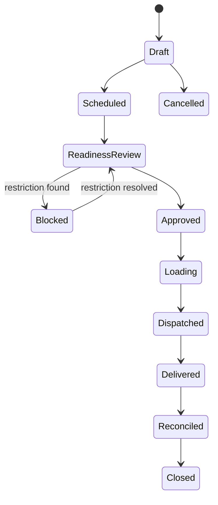

## 20.5 Release checks

Before approval, the system evaluates:

- Source lot/flock status and available quantity.
- Active withdrawal hold or veterinary restriction.
- Biosecurity/outbreak movement restriction.
- Required welfare/harvest readiness and vehicle/crew controls.
- Required certificate, test result or customer specification.
- Packaging/storage/temperature requirement where applicable.
- Lot label and destination/customer authorization.
- No unresolved duplicate or reconciliation issue.

A warning may be overridable only if the rule explicitly permits it and records qualified approval. A hard block cannot be bypassed by ordinary users.

## 20.6 Trace and recall workflow

1. Select shipment, production lot, flock, inventory lot or date window.
2. Query immutable trace links in both directions.
3. Present source flock/house/time, inputs, health/withdrawal, sanitation, alerts, visitors/vehicles and all destinations.
4. Mark potentially affected lots/shipments and document the rationale.
5. Open recall/withdrawal case and assign communications/actions.
6. Track acknowledgement, return/hold/destruction and reconciliation.
7. Close only after scope, effectiveness and corrective action are approved.

## 20.7 Key entities

| Entity/table | Important fields |
|---|---|
| `trace_lots` | Lot code/type, source scope/time, quantity, status and label data. |
| `trace_links` | Parent lot/entity, child lot/entity, relationship type, quantity and event. |
| `customers` / `destinations` | Organization, address, approval/status, requirements and contacts. |
| `shipment_plans` | Source, destination, planned quantity/time, vehicle/crew and requirements. |
| `shipments` | Shipment code, status, dispatch/delivery, vehicle, destination and documents. |
| `shipment_lines` | Lot, quantity/weight, grade, unit and disposition. |
| `shipment_checks` | Rule/version, result, blocker/warning, reviewer and evidence. |
| `shipment_receipts` | Receiver, quantity/weight, temperature/condition, variance and signature. |
| `certificates` | Type, issuer, number, validity, scope and private file reference. |
| `recall_cases` | Trigger, scope, severity, status, owner, authority/customer refs and outcome. |
| `recall_actions` | Destination/lot, communication, hold/return/destruction, result and evidence. |

## 20.8 Business rules

- Released trace-lot genealogy is immutable; corrections append a superseding link/event.
- Shipment line quantity cannot exceed available released quantity without approved adjustment.
- Active hard restrictions block approval transactionally.
- The trace query displays data gaps and quality flags, not a false complete result.
- Export packs are generated server-side, access-controlled and logged.
- Private certificates use short-lived signed URLs.
- Recall actions and communications are retained under incident/legal hold rules.

## 20.9 UI and routes

- `/traceability/search`
- `/lots`
- `/shipments`
- `/shipments/[shipmentId]`
- `/transfers`
- `/recalls`
- `/recalls/[recallId]`
- `/customers`
- `/certificates`

## 20.10 Events and alerts

- `trace.lot_created`
- `shipment.blocked`
- `shipment.approved`
- `shipment.dispatched`
- `shipment.delivered`
- `shipment.variance_reported`
- `recall.opened`
- `recall.destination_notified`
- `recall.closed`

## 20.11 KPIs

Trace query time, genealogy completeness, shipment readiness failures, dispatch/receipt variance, on-time delivery, certificate completeness, recall notification completion and recall reconciliation.

## 20.12 Module acceptance gate

- A shipment can be traced backward to flock/house/time and relevant input/health/sanitation history.
- A source lot can be traced forward to every downstream shipment/destination.
- Withdrawal or outbreak hard restrictions block shipment approval.
- Recall drill produces affected-lot and destination lists within the agreed target and records all actions.

---
# 21. MOD-16 - Operational costing, sustainability and finance integration

## 21.1 Purpose

Allocate operational inputs and losses to houses/flocks, provide actionable cost and resource-intensity reporting, and exchange reconciled financial references with ERP/accounting without recreating a full general ledger.

## 21.2 Primary users

Farm manager, owner/executive, finance/procurement, inventory, maintenance, sustainability/data analysts and auditors.

## 21.3 Capabilities

- Maintain cost categories for birds/chicks/pullets, feed, medicine/vaccine, labor, energy, water, maintenance, sanitation, transport, loss and other configured categories.
- Create cost entries from inventory issue, purchase receipt, work order, utility reading, labor/task time, mortality/loss and external ERP import.
- Allocate cost by flock, house, site, period, production lot or output using transparent methods.
- Store external invoice, purchase order, cost-center and ledger references for reconciliation.
- Calculate operational cost per bird placed, live bird, kg live weight, dozen eggs, egg mass or other selected output.
- Report water, feed, energy, fuel, waste and mortality intensity by flock/site/output.
- Maintain budget/target profiles and compare actual, committed and forecast values.
- Export approved journals or cost summaries to ERP and reconcile import/export status.
- Preserve source detail and never present operational estimates as audited financial statements unless reconciled and approved.

## 21.4 Cost source hierarchy

| Source | Example | Reliability label |
|---|---|---|
| Direct transaction | Inventory lot issued to a treatment or work order. | Direct actual |
| Metered consumption | Electricity/water/fuel meter assigned to house/flock period. | Metered actual |
| Time capture | Worker or contractor time recorded against task/work order. | Recorded actual |
| Allocated shared cost | Site utility or labor distributed by bird-days, area, output or approved driver. | Allocated actual |
| External finance import | Approved invoice/journal from ERP. | Reconciled actual |
| Plan/forecast | Expected feed, output, utility or maintenance. | Forecast |

Reports must show source and allocation method.

## 21.5 Key entities

| Entity/table | Important fields |
|---|---|
| `cost_categories` | Code, description, unit/type, direct/allocated and status. |
| `cost_entries` | Source module/entity, amount in minor units, currency, quantity, event/accounting date and status. |
| `cost_allocations` | Cost entry, target flock/house/site/lot, method, driver, share and result. |
| `allocation_rules` / `allocation_rule_versions` | Applicability, driver, priority, owner, approval and effective dates. |
| `budgets` / `budget_lines` | Scope, period, category, amount/quantity and version. |
| `resource_metrics` | Feed/water/energy/fuel/waste quantity, scope, period, source and quality. |
| `finance_sync_records` | Direction, external system/reference, payload hash, result and reconciliation. |

## 21.6 Business rules

- Currency values use integer minor units or explicitly precise numeric; floating point is prohibited.
- Every cost entry has one source and an immutable source reference.
- Allocations must total 100 percent or the source amount, subject to rounding rule.
- Shared-cost methods are versioned and visible in reports.
- A changed allocation creates a new version/reversal, not a silent overwrite.
- Operational cost reports label unreconciled estimates and missing sources.
- ERP webhooks/imports are signature-verified and idempotent.

## 21.7 UI and routes

- `/costing/overview`
- `/costing/flocks/[flockId]`
- `/costing/allocations`
- `/sustainability`
- `/budgets`
- `/integrations/finance`

## 21.8 KPIs

Cost per kg/dozen/egg mass, feed cost share, medicine cost, maintenance cost, mortality/loss cost, labor per output, water/energy per bird/output, budget variance and unreconciled finance transactions.

## 21.9 Module acceptance gate

- A flock cost statement can be traced to source inventory, work-order, utility, labor or ERP records.
- Allocation method and version are visible.
- Operational and reconciled financial values are clearly distinguished.
- Corrections preserve reversals/version history.

---

# 22. MOD-17 - Dashboards, reporting, analytics and governed AI

## 22.1 Purpose

Provide role-specific operational awareness, governed KPI definitions, scheduled reports, comparative analysis and carefully controlled advanced analytics.

## 22.2 Primary users

All roles, with content scoped to permission and operational responsibility.

## 22.3 Dashboard hierarchy

| Dashboard | Audience | Primary content |
|---|---|---|
| My work | Worker/supervisor | Assigned rounds/tasks, active alerts, restrictions, training and sync state. |
| House | Worker/supervisor/manager | Current flock, environment, feed/water, production, health, work, devices and data freshness. |
| Site | Farm manager and functional leads | House status cards, exceptions, staffing, inventory, maintenance, biosecurity and trends. |
| Flock | Manager/vet/data | Lifecycle, performance vs target, mortality, intake, production, costs and events. |
| Portfolio | Owner/executive | Site comparison, risk, production, cost, assurance and trend. |
| Functional | Vet, quality, maintenance, inventory, logistics | Domain queue, exceptions, KPIs and compliance. |

Signed-in dashboards should normally use dynamic user-specific Server Component rendering. Do not share user-specific cache entries unless isolation is proven.

## 22.4 Capabilities

- Maintain a KPI catalog with formula, source fields, unit, grain, exclusions, owner, version and effective date.
- Provide current status, target variance, trends, comparison and drill-down.
- Display data freshness, missing values, corrections, sensor quality and confidence alongside results.
- Produce daily, weekly, flock-cycle, veterinary, biosecurity, inventory, maintenance, traceability and management reports.
- Schedule reports to authorized recipients and generate private exports.
- Export PDF, CSV/spreadsheet and API data within permission scope.
- Compare against assigned target, previous flock, site average and approved peer group.
- Provide governed self-service filters/templates without ordinary users accessing raw database tables.
- Support anomaly detection, forecasting and advisory recommendations only after data quality and validation gates.
- Maintain model registry, version, intended use, training/evaluation data, performance, limitations, drift and rollback.

## 22.5 KPI definitions

| KPI | Example formula / rule |
|---|---|
| Daily mortality % | Mortality for period / opening or approved average live birds x 100. Formula variant must be named. |
| Cumulative mortality % | Cumulative mortality / birds placed or approved denominator x 100. |
| Livability % | 100 - cumulative mortality/cull percentage according to approved rule. |
| Hen-day production % | Eggs produced / average live hens for period x 100. |
| Egg mass | Number of eggs x average egg weight, using consistent unit. |
| Feed conversion ratio | Feed consumed / live-weight gain using the approved flock formula and correction rules. |
| Uniformity | Percentage of sampled birds within the approved range around average/target. |
| Coefficient of variation | Standard deviation / mean x 100 for a defined valid sample. |
| Water-to-feed ratio | Water consumed / feed consumed for matching period and scope. |
| Time in environmental target | Valid interval duration in approved band / valid monitored duration. |
| MTTA | Time from alert opening to first valid acknowledgement. |
| MTTR | Time from alert opening to verified closure or approved definition. |
| PM compliance | Completed on time / due preventive-maintenance work. |
| Trace completeness | Required trace links/documents present / required links/documents. |

No KPI formula should be implemented only in UI code. Governed database views/functions or well-tested server modules should be the source.

## 22.6 Analytics maturity and controls

| Stage | Capability | Required control |
|---|---|---|
| Descriptive | Status, trends, target variance and historical comparison. | Defined KPIs, quality flags and permissions. |
| Diagnostic | Correlate environment, intake, equipment, health and production. | Show evidence and alternative explanations; avoid unsupported causal claims. |
| Predictive | Forecast feed depletion, output, harvest weight, anomaly or failure risk. | Back-testing, error/confidence, drift monitoring and human review. |
| Prescriptive advisory | Recommend inspection, maintenance or set-point review. | Bounded recommendations, approver and outcome feedback. |
| Computer vision/AI | Distribution, behavior, mortality candidates, egg count/quality or equipment state. | Farm-specific validation, privacy, false-positive handling, model version and non-AI fallback. |

The system must not autonomously diagnose disease, prescribe medicine or directly control critical equipment based solely on an AI model.

## 22.7 Key entities

| Entity/table | Important fields |
|---|---|
| `kpi_definitions` / `kpi_definition_versions` | Formula, grain, unit, sources, owner, approval and effective date. |
| `report_definitions` / `report_versions` | Layout, filters, data sources, permissions and status. |
| `report_schedules` | Report, recipients, cadence, site/time zone, format and status. |
| `report_runs` | Parameters, result, file, row count, status, duration and error. |
| `dashboard_preferences` | User/role, layout and selected filters; never authorization. |
| `analytics_models` / `model_versions` | Purpose, owner, artifact/reference, evaluation, limitations and status. |
| `model_predictions` | Model version, scope/time, result, confidence, evidence and disposition. |
| `model_feedback` | User decision, correction, outcome and reason. |
| `data_quality_scores` | Dataset/scope/period, dimensions, issues and confidence. |

## 22.8 Reporting implementation

- Use server-side queries, views or materialized views for complex dashboards.
- Use route/tag revalidation after mutations where applicable.
- Schedule heavy exports in a background job; show progress through narrow Realtime.
- Store export files in a private bucket and issue short-lived signed URLs after rechecking access.
- Log export request, filters, recipient, download and expiration.
- Aggregate high-frequency telemetry before long-range visualization.

## 22.9 UI and routes

- `/overview`
- `/sites/[siteId]/overview`
- `/houses/[houseId]/overview`
- `/flocks/[flockId]/performance`
- `/reports`
- `/reports/[reportId]`
- `/analytics`
- `/data-quality`
- `/settings/kpis`
- `/settings/models`

## 22.10 Module acceptance gate

- Every displayed KPI exposes definition/version, source scope and data-quality status.
- Users cannot obtain report/export data outside RLS scope.
- Scheduled private reports do not create permanent public links.
- A predictive/advisory feature includes evaluation, confidence, human disposition and rollback before production use.

---

# 23. MOD-18 - Documents, media, signatures and records management

## 23.1 Purpose

Store and control SOPs, manuals, certificates, photos, videos, lab reports, permits, signed evidence and generated reports with version, ownership, retention and private access.

## 23.2 Primary users

All roles according to document scope; administrators, quality and records owners manage controlled content.

## 23.3 Capabilities

- Maintain document metadata, category, owner, applicability, confidentiality and retention class.
- Maintain version, approver, effective date, superseded status and next review.
- Link documents to organization, site, house, flock, asset, supplier, inventory lot, health case, shipment or task.
- Make approved SOPs and required manuals available offline to assigned users.
- Require read acknowledgement or training completion for selected documents.
- Support QR/deep-link access at houses/assets.
- Support photos, audio/video where approved, certificates, lab reports, invoices, manuals and generated exports.
- Capture electronic signatures with signer, purpose, timestamp, record hash/version and authentication context.
- Generate short-lived signed download URLs after authorization.
- Apply legal/incident/recall hold that prevents normal retention deletion.
- Record upload, view/download of sensitive documents, version changes and export.

## 23.4 Storage design

Recommended private buckets:

- `documents`
- `health-media`
- `maintenance-media`
- `biosecurity-media`
- `certificates`
- `reports-exports`
- `integration-files`

Public bucket use should be limited to intentionally public application assets.

Object path convention:

```text
{organization_id}/{site_id-or-global}/{entity_type}/{entity_id}/{file_id}.{extension}
```

A database `file_objects` row stores metadata, business ownership, checksum, content type, size, scan status, retention and storage path. Authorization must not rely only on an untrusted filename.

## 23.5 Upload and download flow

### Upload

1. Server validates user, target entity, file type/size and permission.
2. Browser receives a controlled upload path or signed upload method.
3. Browser uploads directly to private Storage.
4. Server/worker verifies object, checksum, malware scan where required and metadata.
5. File becomes available only after status `accepted`.

### Download

1. User requests file through Server Action/Route Handler.
2. Server rechecks RLS/permission and file status.
3. A short-lived signed URL is returned.
4. Sensitive download is audited.

## 23.6 Key entities

| Entity/table | Important fields |
|---|---|
| `documents` | Category, title, owner, confidentiality, applicability and status. |
| `document_versions` | Version, effective/review dates, approver, change summary and file object. |
| `file_objects` | Bucket/path, content type, size, checksum, scan status, retention and owner scope. |
| `entity_attachments` | Entity type/id, file object, purpose, caption and sequence. |
| `document_acknowledgements` | User, version, acknowledged time and device/session. |
| `electronic_signatures` | User, purpose, target record/version/hash, time and authentication context. |
| `retention_classes` | Duration, trigger, disposal method, review and legal-hold behavior. |
| `record_holds` | Scope, reason, authority, start/end and releaser. |

## 23.7 Business rules

- Private files never use permanent public URLs.
- Superseded document versions remain available for historical records but not as current work instructions.
- A signature attaches to an immutable record/version hash; changing the record invalidates the signature and requires a new approval.
- File extension, MIME type and content are validated; rejected/quarantined files are inaccessible.
- Retention jobs respect legal, incident, outbreak and recall holds.
- Camera/audio use requires explicit purpose, role access, retention and privacy approval.

## 23.8 UI and routes

- `/documents`
- `/documents/[documentId]`
- `/documents/review-due`
- `/records/holds`
- `/media`
- `/reports/exports`
- `/settings/retention`

## 23.9 Module acceptance gate

- Private files cannot be accessed across tenant/site scope or by guessing paths.
- Historical events show the exact document/SOP version used.
- Signed URLs expire and access is rechecked before issuance.
- Retention and legal-hold behavior are tested.

---

# 24. MOD-19 - Administration, configuration and data governance

## 24.1 Purpose

Provide controlled administration of forms, target profiles, rules, notification policies, master data, retention, corrections and operational configuration without requiring code deployment for ordinary farm changes.

## 24.2 Primary users

Delegated administrators, data stewards, farm managers, veterinarian, quality/biosecurity, maintenance change board, IT/security and auditors.

## 24.3 Capabilities

- Configure production profiles, terminology, units, languages, time zones and operating-day boundaries.
- Configure inspection forms, task templates, schedules, target curves, alert rules, health/medicine catalogs, sanitation plans and report templates.
- Support draft, review, approval, effective date, superseded and retired states.
- Compare configuration versions and show affected sites/houses/flocks.
- Promote approved configuration from development/test to staging/production where appropriate.
- Require separation of duties for high-impact configurations such as medicine rules, withdrawal, control recipes and emergency alerts.
- Manage data retention, legal holds, correction policy, period close and export rights.
- Manage data-quality rules, reconciliation tolerances and exception ownership.
- Maintain audit log search and privileged activity review.
- Provide safe import/export of configuration with schema version and validation.

## 24.4 Configuration risk classes

| Class | Examples | Required control |
|---|---|---|
| Low | Label, display order, non-critical report preference. | Delegated admin and audit. |
| Medium | Routine checklist, task schedule, stock threshold. | Review/approval and effective date. |
| High | Health catalog, withdrawal rule, biosecurity restriction, critical alarm profile. | Qualified owner, independent approval, test case and change notice. |
| Safety-critical | Controller recipe, remote-command bounds, emergency alarm routing. | Formal change board, hazard review, staged test, rollback and drill. |

## 24.5 Versioned configuration lifecycle

```text
draft -> validation -> review -> approved -> scheduled/effective -> superseded -> archived
                \-> rejected / revised
```

An approved version is immutable. An emergency change still creates a new version, records the emergency authority and triggers post-change review.

## 24.6 Key entities

| Entity/table | Important fields |
|---|---|
| `configuration_items` | Type, key, owner, risk class and scope. |
| `configuration_versions` | Schema version, payload/reference, effective dates, status, approvers and hash. |
| `configuration_deployments` | Version, target environment/site, deployed by/time, result and rollback reference. |
| `approval_requests` | Target, risk class, required approvers, decisions and evidence. |
| `data_quality_rules` | Dataset/field, rule, severity, owner and effective date. |
| `reconciliation_rules` | Domain, tolerance, action and approval. |
| `retention_policies` | Record class, trigger, duration, hold handling and disposal. |
| `audit_log` | Actor, action, object, scope, before/after or diff, time, source and correlation ID. |
| `data_change_requests` | Record, proposed correction, reason, requester, reviewer and outcome. |

## 24.7 Business rules

- Configuration is relational where it must be queried, constrained or authorized; large unvalidated JSON is avoided for core state.
- Every high-impact version has owner, source, test evidence, approval and effective date.
- Active flocks keep assigned configuration versions unless a deliberate approved migration is applied.
- All configuration changes are audited; safety-critical changes additionally capture rollback and verification.
- Ordinary users cannot access raw audit payloads containing sensitive data outside their scope.
- A correction to a locked record creates a new version/event and does not change the original audit history.

## 24.8 UI and routes

- `/settings/configuration`
- `/settings/forms`
- `/settings/targets`
- `/settings/rules`
- `/settings/schedules`
- `/settings/notifications`
- `/settings/data-quality`
- `/settings/retention`
- `/settings/audit-log`
- `/settings/change-requests`

## 24.9 Module acceptance gate

- A qualified administrator can create, approve and schedule a rule/profile version without code changes.
- Historical records retain the version in force at event time.
- High/safety-critical changes cannot be self-approved where separation of duties is configured.
- Version comparison, deployment result and rollback are auditable.

---

# 25. MOD-20 - Integrations, APIs, events and connector operations

## 25.1 Purpose

Exchange trusted data with controllers, laboratories, ERP/accounting, messaging providers, weather services, identity systems, government portals, customers and other partners while preserving authentication, idempotency, traceability and supportability.

## 25.2 Primary users

Integration developers, system administrators, data/finance teams, device integrators, support and auditors.

## 25.3 Integration principles

- Prefer stable, versioned contracts and explicit ownership.
- Use Next.js Route Handlers for application-owned webhooks/APIs and Edge Functions for independent/multi-client/device endpoints.
- Verify identity/signature before parsing or acting on external messages.
- Require idempotency for every externally retried create/update event.
- Return success only after the event is durably accepted.
- Move slow/retry-heavy processing to a job/queue and make retries safe.
- Maintain connector health, error queue, replay, reconciliation and diagnostics.
- Never trust amounts, customer status, entitlement, lab result or device identity sent by an untrusted browser when an authoritative provider exists.
- Preserve raw received payload or hash according to privacy/retention needs, plus normalized result and processing history.

## 25.4 Integration patterns

| Pattern | Best use | Controls |
|---|---|---|
| Versioned REST/JSON API | Master data, transactions, queries and administration. | OAuth/OIDC, RLS, pagination, validation, idempotency, rate limits and compatibility policy. |
| Signed webhook | Lab result, ERP update, messaging status or partner notification. | Raw-body signature verification, unique event ID, durable acceptance, retry and replay. |
| MQTT/device messaging | Telemetry, device state and approved command/configuration. | Mutual identity, topic authorization, QoS, replay policy, sequence and device registry. |
| Modbus/OPC UA/vendor adapter | Existing farm controllers/meters. | Read-only first, mapping version, timeout, safe bounds and hardware test harness. |
| CSV/SFTP/file exchange | Legacy, government or partner batch. | Schema version, checksum, quarantine, validation, reconciliation and error report. |
| Identity federation | Enterprise user lifecycle. | OIDC/SAML, group mapping, MFA and emergency local admin process. |
| Outbound event/webhook | Alerts, flock changes, treatments, stock or shipments. | Signed payload, subscription scope, retries, DLQ and delivery audit. |

## 25.5 API resource groups

```text
/api/v1/organizations
/api/v1/sites
/api/v1/zones
/api/v1/houses
/api/v1/flocks
/api/v1/placements
/api/v1/daily-records
/api/v1/observations
/api/v1/mortality
/api/v1/health-cases
/api/v1/treatments
/api/v1/vaccinations
/api/v1/withdrawals
/api/v1/feed-deliveries
/api/v1/feed-consumption
/api/v1/water-readings
/api/v1/egg-collections
/api/v1/weight-samples
/api/v1/harvests
/api/v1/devices
/api/v1/telemetry
/api/v1/calibrations
/api/v1/alerts
/api/v1/incidents
/api/v1/inventory-lots
/api/v1/work-orders
/api/v1/tasks
/api/v1/visits
/api/v1/sanitation-events
/api/v1/shipments
/api/v1/trace-queries
/api/v1/reports
/api/v1/mobile/sync
```

The internal Next.js UI should call server queries/actions directly; it should not create unnecessary internal HTTP calls merely to reach the same database.

## 25.6 Event envelope

```json
{
  "event_id": "uuid",
  "event_type": "shipment.dispatched",
  "event_version": 1,
  "occurred_at": "2026-06-24T12:00:00Z",
  "organization_id": "uuid",
  "site_id": "uuid-or-null",
  "subject_type": "shipment",
  "subject_id": "uuid",
  "correlation_id": "uuid",
  "causation_id": "uuid-or-null",
  "data": {},
  "metadata": {
    "source": "web|mobile|device|integration|job",
    "actor_user_id": "uuid-or-null",
    "device_id": "uuid-or-null"
  }
}
```

Event payloads include only required fields and must not leak unrelated tenant or personal data.

## 25.7 Connector processing model

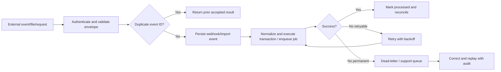

## 25.8 Key entities

| Entity/table | Important fields |
|---|---|
| `integrations` | Provider/type, organization/site scope, status, owner and configuration reference. |
| `integration_credentials` | Secret reference only, rotation/expiry and owner; never plaintext in ordinary tables/logs. |
| `webhook_events` | Provider event ID, signature result, received time, payload hash, status and result. |
| `outbound_events` | Event envelope, subscription, attempts, status and last error. |
| `connector_runs` | Connector, direction, window, counts, status, duration and reconciliation. |
| `import_jobs` / `import_rows` | File/schema, validation, accepted/rejected counts and row-level error. |
| `export_jobs` | Scope, requester, format, status, private file and expiry. |
| `dead_letter_events` | Source, payload reference, error class, attempts, owner and replay result. |
| `api_clients` | Client ID, organization, scopes, key/certificate reference, rate limit and status. |

## 25.9 Security rules

- API clients have explicit organization and permission scopes; RLS remains active for user-context calls.
- Secret/admin client use is restricted to reviewed ingestion/background functions with narrow purpose.
- Secrets live in platform secret management and never in `NEXT_PUBLIC_*`, source control or logs.
- Webhook signature verification uses raw request body where required.
- File imports are quarantined until schema and content validation pass.
- Connector support pages redact secrets and sensitive payload fields.
- External callbacks use separate staging and production endpoints/credentials.

## 25.10 UI and routes

- `/settings/integrations`
- `/settings/api-clients`
- `/integrations/runs`
- `/integrations/errors`
- `/integrations/imports`
- `/integrations/exports`
- `/integrations/webhooks`
- `/integrations/devices`

## 25.11 Module acceptance gate

- Duplicate webhook/device batches do not create duplicate business records.
- Invalid signatures are rejected before business processing.
- Retryable failures enter a visible queue and can be safely replayed.
- Connector reconciliation identifies missing, extra and failed records.
- API and export tests prove tenant/site isolation.

---
# 26. Cross-module data architecture

## 26.1 Modeling principles

- Use explicit relational tables, primary/foreign keys and database constraints for business state that must be filtered, joined, reconciled, authorized or reported.
- Avoid large JSON columns for core operational state. JSON may be appropriate for versioned form definitions, provider payload references or optional metadata when a schema and validation process exist.
- Use UUID primary keys for externally visible records.
- Use `timestamptz` and database defaults; store UTC and display the site's local time with time-zone context.
- Store canonical units and retain entered/source unit where needed.
- Store money as integer minor units or an explicitly precise numeric type; never floating point.
- Use database-enforced status checks/state transitions and non-negative quantity constraints.
- Use soft deletion only when recovery/legal/audit needs justify the added RLS complexity. Prefer status/archive for master data and append-only events for history.
- Append immutable audit/correction events for sensitive changes; do not use the audit table as the primary operational state.
- Every schema change is a reviewed migration and is promoted through environments in order.

## 26.2 Common columns

Most tenant-owned operational tables should include the applicable subset of:

```text
id uuid primary key
organization_id uuid not null
site_id uuid null
zone_id uuid null
house_id uuid null
flock_id uuid null
event_at timestamptz not null
created_at timestamptz not null default now()
created_by uuid null
updated_at timestamptz not null default now()
updated_by uuid null
source text not null            -- web, mobile, device, integration, job, import
source_id text null
client_operation_id uuid null   -- offline/idempotency
version integer not null default 1
status text not null
correlation_id uuid null
data_quality_status text null
```

Do not add every scope column to every table without reason; use the minimum needed for secure filtering, traceability and performance. Denormalized scope columns may be justified to simplify RLS and high-volume queries, but they must remain transactionally consistent.

## 26.3 High-level relationship model

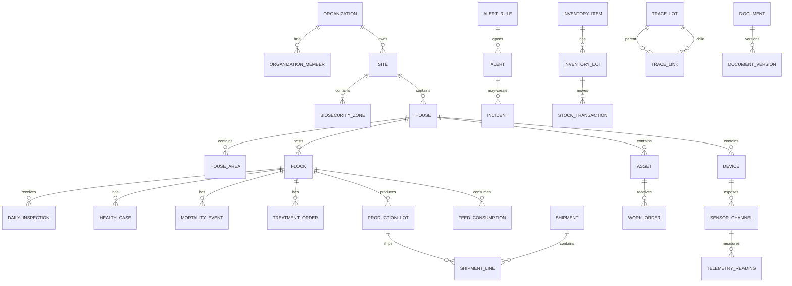

## 26.4 Table catalog by domain

This catalog is a logical baseline. The implementation may combine small tables or split high-volume tables, but it must preserve the stated business boundaries.

| Domain | Principal tables |
|---|---|
| Identity/tenancy | `profiles`, `organizations`, `organization_members`, `member_scopes`, `invitations`, `access_reviews`, `support_sessions`. |
| Structure/master | `sites`, `biosecurity_zones`, `houses`, `house_areas`, `storage_locations`, `production_profiles`, `target_profiles`, `target_profile_versions`, `target_curve_points`, `code_sets`, `code_values`. |
| Flock lifecycle | `flocks`, `flock_plans`, `house_readiness_reviews`, `placements`, `flock_movements`, `flock_count_transactions`, `flock_stage_history`, `harvest_plans`, `flock_closeouts`. |
| Daily operations | `shifts`, `shift_assignments`, `inspection_templates`, `inspection_template_versions`, `inspections`, `inspection_responses`, `observations`, `handovers`, `period_closes`, `record_corrections`, `sync_operations`. |
| Environment/IoT | `gateways`, `devices`, `sensor_channels`, `telemetry_readings`, `current_sensor_state`, `telemetry_aggregates`, `device_events`, `calibrations`, `controller_recipes`, `recipe_versions`, `control_commands`. |
| Alerts/incidents | `alert_rules`, `alert_rule_versions`, `alerts`, `alert_events`, `alert_acknowledgements`, `alert_escalations`, `notifications`, `incidents`, `incident_actions`, `emergency_drills`. |
| Feed/water | `feed_products`, `feed_programs`, `feed_program_versions`, `feed_deliveries`, `silo_balances`, `feed_consumption`, `feed_movements`, `water_sources`, `water_readings`, `water_tests`, `water_treatment_events`, `line_flush_events`. |
| Production | `production_targets`, `egg_collections`, `egg_collection_grades`, `production_lots`, `packing_runs`, `weight_samples`, `harvest_plans`, `harvest_events`, `hatchery_transfers`, `hatchery_results`. |
| Health/welfare | `health_observations`, `health_cases`, `diagnoses`, `lab_samples`, `lab_results`, `medication_products`, `treatment_orders`, `treatment_administrations`, `vaccination_plans`, `vaccinations`, `withdrawal_holds`, `mortality_events`, `welfare_assessments`. |
| Biosecurity | `biosecurity_plans`, `biosecurity_plan_versions`, `access_points`, `visit_requests`, `visitors`, `vehicles`, `visit_events`, `vehicle_visits`, `access_events`, `biosecurity_audits`, `biosecurity_incidents`, `outbreak_controls`. |
| Sanitation/waste/pest | `sanitation_plans`, `sanitation_plan_versions`, `sanitation_events`, `sanitation_step_results`, `sanitation_verifications`, `house_release_approvals`, `litter_events`, `waste_events`, `carcass_disposal_events`, `pest_monitoring_points`, `pest_inspections`, `pest_actions`. |
| Inventory/procurement | `inventory_items`, `item_suppliers`, `inventory_lots`, `stock_transactions`, `stock_reservations`, `purchase_requisitions`, `purchase_orders`, `goods_receipts`, `inventory_counts`, `inventory_count_lines`, `supplier_approvals`, `inventory_disposals`. |
| Maintenance/utilities | `assets`, `asset_components`, `maintenance_plans`, `maintenance_plan_versions`, `work_orders`, `work_order_tasks`, `maintenance_logs`, `asset_parts_usage`, `calibration_plans`, `calibrations`, `utility_meters`, `utility_readings`, `emergency_equipment_tests`. |
| Workforce/knowledge | `task_templates`, `task_template_versions`, `tasks`, `task_dependencies`, `task_comments`, `task_evidence`, `teams`, `team_members`, `competencies`, `user_competencies`, `training_courses`, `training_requirements`, `training_records`, `announcements`, `handovers`. |
| Trace/logistics | `trace_lots`, `trace_links`, `customers`, `destinations`, `shipment_plans`, `shipments`, `shipment_lines`, `shipment_checks`, `shipment_receipts`, `certificates`, `recall_cases`, `recall_actions`. |
| Cost/sustainability | `cost_categories`, `cost_entries`, `cost_allocations`, `allocation_rules`, `allocation_rule_versions`, `budgets`, `budget_lines`, `resource_metrics`, `finance_sync_records`. |
| Reporting/AI | `kpi_definitions`, `kpi_definition_versions`, `report_definitions`, `report_versions`, `report_schedules`, `report_runs`, `dashboard_preferences`, `analytics_models`, `model_versions`, `model_predictions`, `model_feedback`, `data_quality_scores`. |
| Documents/records | `documents`, `document_versions`, `file_objects`, `entity_attachments`, `document_acknowledgements`, `electronic_signatures`, `retention_classes`, `record_holds`. |
| Configuration/audit | `configuration_items`, `configuration_versions`, `configuration_deployments`, `approval_requests`, `data_quality_rules`, `reconciliation_rules`, `retention_policies`, `audit_log`, `data_change_requests`. |
| Integrations | `integrations`, `integration_credentials`, `webhook_events`, `outbound_events`, `connector_runs`, `import_jobs`, `import_rows`, `export_jobs`, `dead_letter_events`, `api_clients`. |

## 26.5 Data integrity rules

- Bird, feed, water, egg/product, medicine and inventory quantities reconcile through immutable movements and approved adjustments.
- A transaction that changes both business state and its audit/domain event should commit atomically.
- Status transitions are validated by server code and database constraints/functions for critical workflows.
- Unique constraints support idempotency for external event IDs, client operation IDs, schedule occurrences and device batches.
- Foreign keys are used unless a deliberate immutable external reference is required.
- `updated_at` is maintained by a database trigger for tables with multiple writers.
- Tables used by RLS are indexed on `organization_id`, membership/scope columns and common filter keys.
- High-volume telemetry and audit tables use partitioning/retention strategies, but trace/audit integrity is preserved.

## 26.6 Data quality framework

| Dimension | Example checks | System response |
|---|---|---|
| Completeness | Required rounds, causes, lot numbers, signatures, certificates and close checks. | Show gaps, block close when required and assign action. |
| Timeliness | Round window, telemetry freshness, lab result, alert acknowledgement. | Flag late/stale data and escalate critical gaps. |
| Validity | Range, unit, stage, dose, date, status transition and product authorization. | Block impossible entries; allow plausible exception only with reason/approval. |
| Consistency | Bird balance, stock balance, eggs vs packed/shipped, sensor agreement. | Reconciliation queue and supervisor review. |
| Accuracy | Calibration, reference check, sample method and source reliability. | Quality flag and restricted use in alerts/analytics. |
| Uniqueness | Duplicate receipt, treatment, telemetry batch, shipment or import row. | Unique key/idempotency and duplicate review. |

## 26.7 Retention and correction

- Retention is defined by record class, jurisdiction, contract and incident/legal needs.
- Health, medicine, withdrawal, mortality, shipment, alarm, control, audit and trace records are never silently deleted.
- A correction records before/after values, reason, requester, approver and effective time.
- Legal, outbreak and recall holds override normal deletion.
- Full tenant export includes relational data, files, code lists, profile versions and a schema/data dictionary.

---

# 27. Supabase security, RLS and authorization design

## 27.1 Client separation

Create three explicit Supabase clients:

| Client | Runs in | Credential | Use |
|---|---|---|---|
| Browser client | Client Components | Publishable key | Browser auth, narrow Realtime and direct private Storage upload under policy. |
| Server client | Server Components, Server Actions, Route Handlers | Publishable key plus request cookies | Operate as current user with RLS. |
| Admin client | Reviewed server-only jobs/functions | Secret key | Narrow ingestion, scheduled or administrative operations that intentionally bypass RLS. |

Never hide these differences behind one universal helper. The admin client should be imported from a `server-only` module and used by a small, reviewed set of functions.

## 27.2 Multi-tenant model

Every tenant-owned record contains `organization_id`. Site/house scope is enforced using membership/scope data. A conceptual membership model:

```text
organization_members
├── organization_id uuid -> organizations.id
├── user_id uuid -> auth.users.id
├── role text
├── status text
├── starts_at timestamptz
├── expires_at timestamptz null
└── unique (organization_id, user_id)

member_scopes
├── organization_member_id uuid
├── site_id uuid null       -- null may mean all permitted sites, based on role
├── zone_id uuid null
├── house_id uuid null
├── permission text null    -- optional override
├── starts_at timestamptz
└── expires_at timestamptz null
```

## 27.3 RLS policy principles

- Enable RLS on every exposed table and Storage bucket/object path.
- Write separate `SELECT`, `INSERT`, `UPDATE` and `DELETE` policies.
- Use `WITH CHECK` for inserts/updates so users cannot move rows into an unauthorized tenant/scope.
- Index columns used by policies.
- Put role/scope checks in Server Actions for clear user-facing errors and in RLS for enforcement.
- Test anonymous, owner, administrator, role member, site-scoped user, cross-tenant user and admin-job identities.
- Use `security definer` helper functions sparingly, fix `search_path`, revoke unnecessary execute privilege and review for recursive-policy risk.
- Do not rely on mutable browser state or hidden UI controls for authorization.

## 27.4 Illustrative SQL pattern

This is a pattern, not a complete migration. Production policies must be tested for the actual role/scope model.

```sql
create table public.organizations (
  id uuid primary key default gen_random_uuid(),
  name text not null check (char_length(name) between 2 and 150),
  created_at timestamptz not null default now()
);

create table public.organization_members (
  organization_id uuid not null references public.organizations(id) on delete cascade,
  user_id uuid not null references auth.users(id) on delete cascade,
  role text not null check (role in (
    'owner','org_admin','farm_manager','supervisor','caretaker',
    'veterinarian','biosecurity_qa','maintenance','inventory',
    'logistics','auditor','support'
  )),
  status text not null default 'active' check (status in ('invited','active','suspended','expired')),
  starts_at timestamptz not null default now(),
  expires_at timestamptz null,
  created_at timestamptz not null default now(),
  primary key (organization_id, user_id)
);

create index organization_members_user_org_idx
  on public.organization_members(user_id, organization_id)
  where status = 'active';

create or replace function public.is_active_org_member(target_org uuid)
returns boolean
language sql
stable
security definer
set search_path = public, pg_temp
as $$
  select exists (
    select 1
    from public.organization_members m
    where m.organization_id = target_org
      and m.user_id = (select auth.uid())
      and m.status = 'active'
      and (m.expires_at is null or m.expires_at > now())
  );
$$;

revoke all on function public.is_active_org_member(uuid) from public;
grant execute on function public.is_active_org_member(uuid) to authenticated;

create table public.sites (
  id uuid primary key default gen_random_uuid(),
  organization_id uuid not null references public.organizations(id) on delete cascade,
  name text not null,
  code text not null,
  time_zone text not null,
  status text not null default 'active',
  created_at timestamptz not null default now(),
  unique (organization_id, code)
);

alter table public.sites enable row level security;

create policy "members can read permitted organization sites"
on public.sites for select to authenticated
using (public.is_active_org_member(organization_id));

create policy "authorized users can create organization sites"
on public.sites for insert to authenticated
with check (
  public.is_active_org_member(organization_id)
  -- add reviewed role/permission helper here
);
```

The actual implementation should include role and site/house scope helpers rather than granting every member the same actions.

## 27.5 Defense in depth

| Layer | Responsibility |
|---|---|
| UI | Hide unavailable controls, explain permission needs and reduce accidental actions. |
| Server Action/Route Handler | Validate input, verify identity, check high-level permission and return safe errors. |
| RLS | Enforce tenant/record access regardless of caller. |
| Database constraint/function | Prevent invalid state, quantity, ownership and transaction results. |
| Audit/observability | Record sensitive access, changes, exports, approvals and control actions. |
| Operational procedure | Separate duties, train users, review access and investigate exceptions. |

## 27.6 Sensitive action controls

Require stronger control for:

- User/role/scope changes.
- Treatment order/withdrawal release.
- Shipment release under warning/exception.
- Controller recipe or command.
- Critical alert rule and notification routing.
- Deletion/retention/legal-hold action.
- Bulk export and support access.

Controls may include MFA/re-authentication, competency, second approval, reason, expiry and post-action review.

## 27.7 OT/device security

- Inventory every controller, gateway, sensor, firmware and communication path.
- Segment OT from office/guest networks.
- Allow only required outbound and management traffic through firewall/VPN.
- Use unique device certificates/keys and secure provisioning.
- Disable default credentials and protect cabinets/ports.
- Use signed firmware/configuration with staged update and rollback.
- Disable vendor remote access by default; approve it as time-limited and logged.
- Detect offline/unapproved devices, repeated authentication failures and unexpected configuration changes.

## 27.8 Privacy

- Minimize worker, visitor, location, image, video and audio data.
- Define purpose, lawful basis where applicable, access, retention and deletion.
- Redact unrelated personal information from customer/auditor exports.
- Scrub tokens, cookies, credentials and unnecessary personal data from application logs.
- Provide transparent notices for camera/audio and visitor processing.

---

# 28. Server, client, UI, forms and caching design

## 28.1 Server Components for reads

Pages and layouts are Server Components by default. Authenticated reads live in `server/queries.ts` and are called directly from the page. Do not create an internal API endpoint solely so the same Next.js server can call its own database.

Recommended query behavior:

- Use explicit column selection rather than `select *`.
- Return typed domain view models, not raw unrestricted rows.
- Include data freshness/quality fields needed by the UI.
- Throw/log internal errors server-side and render a safe error boundary.
- Use pagination for long operational lists.
- Ensure query plans and RLS policy columns are indexed.

## 28.2 Server Actions for mutations

Every Server Action is a server endpoint. It must:

1. Parse input and validate with Zod.
2. Verify authenticated identity.
3. Verify action-level permission/competency when needed.
4. Execute the user-context Supabase mutation under RLS.
5. Use a PostgreSQL function for multi-table atomic operations when appropriate.
6. Create audit/domain events in the same transaction for critical changes.
7. Return safe field/workflow errors, not raw database/policy details.
8. Revalidate the affected route or cache tag.

Protect duplicate submissions with pending UI, unique constraints or idempotency keys.

## 28.3 Client Components as interactive islands

Use Client Components only where browser interaction is required:

- Event handlers and local draft state.
- Barcode/QR scanning, camera, file selection and browser APIs.
- Dialogs, drag/drop and rich charts.
- IndexedDB/offline queue.
- Narrow Realtime subscriptions.
- Optimistic UI only when the recovery behavior is clear.

Place `"use client"` as low as possible and pass serializable server-read data rather than refetching the same data after hydration.

## 28.4 UI layers

| Layer | Responsibility |
|---|---|
| `components/ui` | Generic shadcn/ui primitives such as button, input, dialog, table and form controls. |
| `components/shared` | App shell, navigation, page header, QR scanner wrapper, data-quality badge, offline banner, empty/error states. |
| `features/*/components` | Domain forms, tables, timelines, charts and action panels. |

Centralize design tokens in `globals.css`. Do not scatter arbitrary colors/spacing through modules.

## 28.5 Standard form flow

```text
shadcn/ui fields
  -> optional React Hook Form for complex interaction
  -> client usability validation
  -> Server Action
      -> Zod validation repeated on server
      -> identity and permission check
      -> Supabase mutation under RLS
      -> database constraints / transaction
      -> revalidatePath() or revalidateTag()
  -> inline field result, workflow status or toast
```

Browser validation never replaces server/database validation.

## 28.6 Farm-field UX requirements

- Large touch targets and high contrast for gloves, glare and low light.
- Minimal typing; use scanning, defaults, recent values and controlled choices.
- Start rounds with bird observation before data-heavy questions.
- Show active flock, house, time, target profile and last-sync state clearly.
- Use text/icon plus color; never color alone.
- Show stale, missing, estimated and poor-quality data explicitly.
- Preserve entered data when a server error occurs.
- Provide a simple mode for workers/smallholders and advanced mode for managers/admins.
- Target WCAG 2.2 AA or applicable accessibility requirement.

## 28.7 Caching defaults

| Content | Default |
|---|---|
| Public/marketing pages | Static or cached with deliberate revalidation. |
| Public reference content | Cache with route/tag revalidation. |
| Signed-in dashboards | Dynamic, user-specific rendering unless isolation is proven. |
| After mutation | Revalidate affected path/tag. |
| Auth refresh response | Never share across users or cache in a way that mixes `Set-Cookie`. |
| Private export/download | Authorization check at request time; short-lived URL. |
| Current house/alert status | Server read plus optional narrow Realtime update. |

---
# 29. Offline PWA and synchronization architecture

## 29.1 Objective

Allow essential farm work to continue for at least seven days without cloud connectivity, while making sync state, conflicts and failures visible and predictable.

## 29.2 PWA components

- Service worker for application shell and approved static assets.
- IndexedDB for assigned master data, active flock context, forms, tasks, SOPs, recent summaries and queued mutations.
- Local attachment queue for photos/documents until upload is possible.
- Sync engine that batches operations to `/api/v1/mobile/sync` or an equivalent Edge Function.
- Conflict/rejection user interface.
- Device registration and last-sync health.

## 29.3 Offline package

At sign-in/assignment refresh, download only authorized data needed for field work:

- Assigned sites, houses and active flocks.
- Current inspection/task templates and approved versions.
- Seven days of due work and SOPs.
- Controlled code lists and minimal relevant inventory/asset references.
- Active restrictions, alerts and unresolved findings.
- Recent trend summaries, not unlimited raw telemetry.
- User permissions/competency hints for usability; the server remains authoritative.

## 29.4 Sync contract

A sync request contains:

```json
{
  "device_id": "uuid",
  "client_batch_id": "uuid",
  "schema_version": 1,
  "last_successful_sync_at": "timestamp-or-null",
  "operations": [
    {
      "client_operation_id": "uuid",
      "entity_type": "inspection",
      "operation": "create",
      "entity_id": "uuid",
      "base_version": null,
      "event_at": "timestamp",
      "payload": {}
    }
  ]
}
```

The response returns one result per operation and a server change cursor for permitted downstream updates.

## 29.5 Idempotency and ordering

- `client_operation_id` is globally unique and has a database unique constraint.
- The server returns the previously accepted result for duplicates.
- Operations with dependencies include referenced client-generated entity IDs.
- Server may process independent operations out of order but returns dependency failures clearly.
- A batch acknowledgement does not imply attachment upload completed; attachments have separate state.

## 29.6 Conflict handling

- Append-only events merge safely.
- Drafts use optimistic concurrency with `base_version`.
- Approved/locked records use correction requests.
- Server-owned configuration wins; the user is shown the changed version.
- Deactivated/restricted scope rejects new entries and retains the local payload for supervisor/support resolution.
- Clock differences preserve local event time, device time and server receive time; suspicious drift is flagged.

## 29.7 Security

- Minimize offline personal/sensitive data.
- Require device/browser authentication and normal session renewal on reconnect.
- Consider managed-device controls, screen lock and remote logout for high-risk deployments.
- Never cache admin secret, raw access tokens beyond approved auth library behavior, or unnecessary cross-site data.
- Local deletion occurs after server acceptance and configured retention, while preserving recoverable user-visible sync history.

## 29.8 Offline acceptance tests

- Complete multiple rounds and tasks without network for the agreed duration.
- Restart browser/device and retain unsynced work.
- Create linked observation, health case and work order using client-generated IDs.
- Attach photos and upload after reconnect.
- Retry after partial batch failure without duplicates.
- Handle server-side record change, permission removal, profile update and locked-period conflict.
- Display low storage, failed attachment, expired session, clock drift and corrupted queue recovery.

---

# 30. Storage, Realtime and background-work architecture

## 30.1 Storage controls

- Use private buckets for documents, reports, media, certificates and integration files.
- Use stable ownership paths beginning with `organization_id` and usually `site_id`.
- Store file metadata/status in PostgreSQL when files have ownership, processing state, labels, retention or business relationships.
- Upload large files directly from browser to Storage through a controlled path.
- Generate short-lived signed URLs only after access validation.
- Test Storage policy isolation for anonymous, member, site-scoped, cross-tenant and admin-job identities.
- Perform malware/content validation where risk requires it.

## 30.2 Realtime use cases

Use Realtime only when immediacy materially improves the workflow:

- Active alerts and acknowledgement state.
- Selected current house/device state.
- Job/export/import progress.
- On-call presence or narrow incident collaboration if implemented.

Rules:

- Subscribe to the narrowest table, row or private channel.
- Authorize private Broadcast/Presence channels.
- Unsubscribe on component cleanup and tenant/record change.
- Treat an event as a hint; reconnecting clients perform a normal read.
- Maintain idempotent client updates.
- Do not subscribe ordinary dashboards to raw high-frequency telemetry.

## 30.3 Background job catalog

| Job | Typical frequency/trigger | Recommended execution |
|---|---|---|
| Alert escalation and notification retry | Seconds/minutes | Database schedule + Edge Function/worker, depending provider. |
| Generate recurring tasks/PM | Hourly/daily/event | PostgreSQL function/scheduled job. |
| Withdrawal hold calculation/release review | Treatment event/daily | Transactional DB function + due-review job. |
| Inventory low stock/expiry | Daily/event | Database job. |
| Telemetry aggregation/retention | Minute/hour/day | Database function/worker; partition-aware. |
| Report generation/delivery | Scheduled/on demand | Background job; private Storage output. |
| Import/export processing | On request | Route/Edge accepts, worker processes. |
| Webhook retry/DLQ | Backoff schedule | Worker/Edge Function. |
| Data-quality/reconciliation checks | Daily/period close | Database functions and task creation. |
| Retention/disposal | Scheduled | Reviewed job honoring holds. |
| Model scoring | Scheduled/event, later phase | External worker when workload requires. |

## 30.4 Execution-tool selection

| Tool | Best fit |
|---|---|
| Next.js Server Action | Mutation initiated by the web interface. |
| Next.js Route Handler | Callback, webhook, download or API belonging to the web app. |
| Supabase Edge Function | Independent endpoint, device ingress or multiple client types. |
| PostgreSQL function | Atomic, data-intensive or reconciliation logic near the data. |
| External worker/queue | Long-running, CPU-heavy, retry-heavy or high-volume work. |

## 30.5 Webhook requirements

- Verify provider signature before business processing.
- Store provider event ID under a unique constraint.
- Return success only after durable acceptance.
- Keep retries safe and idempotent.
- Support out-of-order events where the provider permits them.
- Redact secrets and sensitive payload fields from logs/support UI.
- Monitor backlog, repeated failure and provider latency.

---

# 31. Non-functional requirements and service levels

The values below are a production baseline to confirm during discovery and load testing.

| Quality | Baseline requirement | Priority |
|---|---|---|
| Cloud availability | 99.9% monthly excluding approved maintenance. Local farm controls/critical alarms remain independent. | Must |
| Web performance | Common signed-in views return usable content within 2 seconds on normal connectivity at agreed load. | Must |
| Local save | Offline/local form save confirms within 2 seconds on supported devices. | Must |
| Telemetry latency | Normal sensor-to-dashboard within 15 seconds under normal connectivity. | Must |
| Critical notification | Verified critical cloud event to first provider submission within 60 seconds, subject to network/channel. Local alarm is faster and independent. | Must |
| Offline | PWA supports at least seven days of assigned forms/tasks/SOPs; edge buffers at least 30 days at configured rate. | Must |
| Scalability | Load test to agreed tier; reference enterprise target may be up to 100 sites, 2,000 houses and 100,000 devices at 10-second sampling. | Should |
| Recovery | Cloud RPO <= 15 minutes and RTO <= 4 hours as a baseline; edge store-and-forward/local operation maintained. | Must |
| Security | MFA, least privilege, RLS, encryption, audit, secure device identity, vulnerability management and tested response. | Must |
| Data integrity | Transactions, idempotency, constraints, visible corrections and append-only audit. | Must |
| Usability | Daily round with minimal typing, clear exception handling and simple/advanced modes. | Must |
| Accessibility | WCAG 2.2 AA or applicable standard; keyboard, contrast, text scaling and non-color status. | Should |
| Localization | Language, time zone, units, currency and terminology. | Should |
| Maintainability | Feature modules, automated tests, migrations, generated types, observability and runbooks. | Must |
| Portability | Complete data/document export in documented formats and no essential vendor lock-in. | Must |
| Supportability | Safe remote diagnostics, severity process, connector/device health and escalation runbooks. | Must |

## 31.1 Service severity

| Severity | Example | Support acknowledgement target | Restoration/workaround target |
|---|---|---|---|
| P1 | Life-support monitoring/control risk, widespread outage, integrity or security incident. | 15 minutes for contracted 24x7 support. | Continuous effort; safe workaround as soon as possible. |
| P2 | Major workflow unavailable, multiple houses affected or significant integration failure. | 1 hour during support coverage. | 4 hours or agreed workaround. |
| P3 | Single module/house issue with workaround or report defect. | 1 business day. | Planned by impact. |
| P4 | Question, cosmetic issue or enhancement. | 2 business days. | Backlog/release planning. |

Farm operational alarm response is a farm responsibility and should be faster than software support acknowledgement.

## 31.2 Performance and capacity tests

- Concurrent dashboard and mobile users by site/shift.
- Largest expected flock/house history.
- Telemetry ingest rate, aggregation and retention.
- RLS policy query performance under realistic tenant/site membership.
- Trace/recall query across defined history.
- Report/export size and generation time.
- Offline sync batch size after prolonged outage.
- Notification burst and provider retry.
- Storage upload/download and signed URL behavior.

---

# 32. Testing, validation and acceptance strategy

## 32.1 Testing stack

| Tool/type | Coverage |
|---|---|
| Vitest | Business rules, calculations, schemas, utilities and server helpers. |
| React Testing Library | Component behavior, field errors and accessible interaction. |
| Playwright | Authentication, tenant isolation, critical workflows, offline/browser regressions and permissions. |
| pgTAP / SQL tests | RLS policies, constraints, functions, state transitions and database behavior. |
| Webhook/device fixtures | Signature, idempotency, retries, duplicates, out-of-order and malformed payloads. |
| Hardware-in-the-loop | Sensors, gateway, power loss, controller status, local alarm and replay. |
| Performance/soak | Telemetry, dashboards, RLS, queues, reports and long-running operation. |
| Security testing | Threat model, SAST/dependency scan, penetration test, secrets, device/firmware and restore exercise. |
| Domain acceptance | Farm staff, veterinarian, quality and maintenance execute realistic scenarios. |

## 32.2 Minimum identity/security matrix

| Identity | Expected access |
|---|---|
| Anonymous | Only explicitly public assets/pages. No farm data. |
| Authenticated owner/admin | Authorized organization data and privileged actions. |
| Farm manager | Assigned site data and manager actions. |
| Site/house-scoped worker | Only assigned scope and worker actions. |
| Veterinarian | Assigned health scope and qualified actions. |
| Auditor | Explicit read-only scope and limited time. |
| Cross-tenant user | No select, insert, update, delete, subscribe or Storage access. |
| Admin job | Only the narrow reviewed operation using secret client. |

## 32.3 Critical end-to-end acceptance scenarios

1. **Flock lifecycle:** plan, readiness, place, operate, move/harvest, close and preserve complete history.
2. **Offline daily round:** complete without internet, attach media, create linked workflows and sync without duplication.
3. **Critical environment event:** simulate abnormal condition plus cloud loss; local alarm works, cloud escalation works when connected and event is verified closed.
4. **Sensor failure:** stale/disagreement is flagged, manual/alternate value used and calibration task created.
5. **Treatment and withdrawal:** authorized order, product lot and administration recorded; restricted shipment is blocked until authorized release.
6. **Traceability:** shipment to flock/house/input/health/sanitation/destination within target time.
7. **Biosecurity:** visitor risk, zone access, entry/exit, PPE/disinfection and incident evidence.
8. **Inventory:** receive, quarantine/release, FEFO issue, count variance and expiry/disposal.
9. **Maintenance:** fault from alert, urgent work order, parts issue, repair and verification.
10. **Security:** URL tampering, direct Data API, Storage path and Realtime cross-tenant attempts fail.
11. **Recovery:** restore database and replay edge/offline queues without loss or duplicate transactions.
12. **Configuration:** publish a new target/rule version and prove historical records keep the prior version.

## 32.4 Domain-specific validation

- Poultry veterinarian approves health, medication, withdrawal and outbreak workflows.
- Farm operations approves daily rounds, timing and task burden.
- Biosecurity/quality approves visitor, sanitation, traceability and audit evidence.
- Maintenance approves critical asset, fail-safe, calibration and control-command behavior.
- Data/finance approves KPI formula, reconciliation and costing definitions.
- IT/security approves RLS, network/device security, logs, backup and incident response.

## 32.5 Go-live gates

- Named owners, support contacts and escalation matrix.
- Approved SOPs, target profiles, forms, rules and permissions.
- Training/competencies complete.
- Data migration reconciled and signed off.
- RLS/Storage/cross-tenant tests pass.
- Critical E2E and offline tests pass in staging.
- Local alarm/controller independence tested.
- Monitoring, backup, restore, rollback and incident runbooks proven.
- No open critical defect and accepted workaround for any remaining high defect.
- Pilot parallel-run criteria met and formal operational acceptance signed.

---

# 33. Database migrations, local development and schema contract

## 33.1 Environment strategy

| Environment | Supabase project | Purpose |
|---|---|---|
| Local | Supabase CLI stack | Fast iteration, seed data, migration reset and RLS tests. |
| Development/staging | Dedicated non-production project | Integration, preview acceptance, migrations, webhooks and E2E. |
| Production | Dedicated production project | Real users/data, restricted access, backup and monitored change. |

Never point preview deployments at the production database. Use separate provider credentials and webhook endpoints for staging and production.

## 33.2 Local workflow

```bash
npx supabase start
npx supabase migration new create_core_structure
npx supabase db reset
npx supabase gen types typescript --local > src/types/database.generated.ts
```

Process:

1. Create/modify reviewed migration instead of manually changing production.
2. Reset local database from empty to prove reproducibility.
3. Load deterministic seed fixtures.
4. Run database, RLS and function tests.
5. Regenerate TypeScript database types.
6. Type-check and build application.
7. Apply same migration to staging and run smoke/E2E tests.
8. Approve and promote same migration to production.

## 33.3 Schema contract

A pull request changing database schema is incomplete unless it also addresses:

- Migration.
- RLS policies and indexes.
- Constraints/functions/triggers.
- Generated TypeScript types.
- Seed/test fixtures.
- SQL/RLS tests.
- Affected Server Actions/queries.
- Data migration/backfill and rollback/forward-fix plan.
- Monitoring and operational impact.
- Documentation/data dictionary.

## 33.4 Migration safety

- Prefer backward-compatible expand/migrate/contract changes.
- Avoid long table locks during operating hours.
- Backfill in bounded batches with progress and retry.
- Add `NOT NULL`/constraints after data is valid where needed.
- Test RLS and query plans against realistic volumes.
- Production migration requires approval and an incident/rollback contact.
- Never edit a migration already applied to shared environments; add a new migration.

---

# 34. CI/CD, deployment, observability and operations

## 34.1 CI gates

- Install from lockfile.
- Type-check TypeScript.
- Lint source.
- Run unit/component tests.
- Start/reset local Supabase.
- Run migration and seed from empty state.
- Run pgTAP/SQL/RLS tests.
- Verify generated database types are current.
- Build Next.js production bundle.
- Run critical Playwright flows.
- Scan dependencies/secrets and relevant containers/functions.
- Apply migration to staging.
- Run post-deploy smoke and tenant-isolation tests.
- Require approval for production migration/deployment.

## 34.2 Production build order

1. Initialize local Supabase and commit configuration.
2. Configure browser/server/admin clients and auth refresh proxy.
3. Build tenancy/membership schema, enable RLS and write policy tests.
4. Generate types.
5. Build protected dashboard shell and one complete vertical module slice.
6. Add offline sync for daily operations.
7. Add Storage and only the required Realtime use cases.
8. Add device ingestion/read-only IoT pilot.
9. Create staging integrations and validate cross-tenant isolation.
10. Add production secrets, monitoring, backup and migration approval.

## 34.3 Observability

### Application

- Structured server/client errors with correlation ID.
- Route/Server Action latency and error rates.
- Authentication failures and session anomalies.
- Offline sync success/conflict/rejection.
- Export/import/job duration and backlog.

### Database

- Connection usage.
- Slow and policy-heavy queries.
- Lock/deadlock/migration errors.
- Table/index growth, partition and retention health.
- RLS policy performance.

### Storage/Realtime

- Bucket usage, failed uploads and signed-download errors.
- Active subscriptions, channel errors and unexpected broad subscriptions.

### Integration/device

- Webhook verification/failure/retry.
- Connector reconciliation/backlog/DLQ.
- Gateway/device last seen, buffer depth, firmware and clock drift.
- Telemetry ingest latency, rejection and duplicate rate.

### Audit

- Privileged role/configuration changes.
- Treatment/withdrawal/ship release actions.
- Bulk export and support access.
- Controller commands and recipe changes.

Logs must scrub tokens, cookies, keys and unnecessary personal data.

## 34.4 Backup and disaster recovery

- Enable appropriate Supabase backups/PITR for production tier.
- Document RPO/RTO and restore authority.
- Test restore to an isolated environment on a defined schedule.
- Verify files/Storage recovery strategy and export inventory.
- Preserve edge/offline queues and replay idempotently after recovery.
- Maintain configuration, migrations and infrastructure settings in version control.
- Keep emergency farm procedures independent of cloud recovery.
- Record every restore drill, result, gap and corrective action.

## 34.5 Incident response

Runbooks should cover:

- Authentication/credential compromise.
- Cross-tenant or unauthorized access.
- Data corruption/migration failure.
- Ransomware or malicious file.
- Device/gateway compromise or unexpected control change.
- Cloud/application outage.
- Notification provider failure.
- Telemetry backlog or false-alert storm.
- Backup/restore failure.

Each runbook defines detection, owner, containment, communication, evidence, recovery, validation and lessons learned.

## 34.6 Production-readiness checklist

- [ ] RLS enabled on every exposed table.
- [ ] Separate policies exist for required operations.
- [ ] RLS/membership columns are indexed.
- [ ] Server Actions validate all input.
- [ ] Protected actions/endpoints verify identity.
- [ ] Secret/admin key is server-only.
- [ ] Preview deployments never use production data.
- [ ] Private Storage policies and signed URL expiry are tested.
- [ ] Realtime subscriptions are narrow and private where required.
- [ ] Webhook signatures and idempotency are tested.
- [ ] Migrations reproduce from empty state.
- [ ] Generated database types are committed/current.
- [ ] Cross-tenant and site-scope tests pass.
- [ ] Critical E2E/offline workflows pass in staging.
- [ ] Errors are monitored without leaking secrets.
- [ ] Backup/restore and incident procedures are documented/tested.
- [ ] Administrative and control operations are audited.
- [ ] Local life-support and alarm independence is proven.
- [ ] Any service extraction is justified by measured need.

---

# 35. Implementation roadmap and delivery model

## 35.1 Phase 0 - Discovery and operating-model approval

Deliverables:

- Current-state process maps and worker observations.
- Production profile, scale and pilot decision.
- Farm/site/house, controller, sensor and network survey.
- Compliance/retention/health-governance matrix.
- Personas, RACI, target workflows and prioritized backlog.
- Data migration inventory and spreadsheet retirement plan.
- Signed architecture, edge boundary, success measures and support model.

Exit gate: product owner, operations, veterinary/quality, maintenance and IT approve scope and pilot.

## 35.2 Phase 1 - Platform foundation

- Repository, CI/CD and environments.
- Supabase Auth clients, proxy/session refresh and MFA.
- Organization/membership/site/house core schema.
- RLS helpers/policies and cross-tenant tests.
- Audit, configuration versioning and basic documents.
- Dashboard shell, design system and responsive navigation.

Exit gate: protected vertical slice passes RLS, migration and staging tests.

## 35.3 Phase 2 - Operational MVP

- Flock lifecycle and house readiness.
- Daily rounds, observations, tasks, handover and offline sync.
- Health/mortality/treatment/withdrawal.
- Feed/water and one production profile.
- Basic biosecurity, sanitation, inventory, maintenance and reports.
- Traceable correction, approval and period close.

Exit gate: selected flock lifecycle and offline acceptance pass with real users.

## 35.4 Phase 3 - Connected pilot

- Gateway/device registry and read-only telemetry.
- Current/aggregate environment dashboards.
- Sensor quality, calibration and device health.
- Alert rules, notification escalation and local/cloud drill.
- Selected controller/lab/messaging integrations.

Exit gate: sensor commissioning, outage replay, alarm delivery and local-control independence pass.

## 35.5 Phase 4 - Production hardening and rollout

- Performance, security and penetration testing.
- Backup/restore, support, observability and incident drills.
- Data migration, parallel run, training and site readiness.
- Production deployment and hypercare.
- Adoption review and paper/spreadsheet retirement.

Exit gate: go-live checklist and operational acceptance signed.

## 35.6 Phase 5 - Enterprise and advanced capability

- Additional production profiles and sites.
- ERP/lab/government/customer integrations.
- Barcode/RFID, advanced traceability and costing.
- Diagnostic/predictive analytics.
- Advisory or supervised control only after formal safety/change gates.

## 35.7 Recommended delivery team

| Role | Responsibility |
|---|---|
| Product owner | Scope, value, priority and acceptance. |
| Farm operations lead | Workflow, adoption, SOP and field decisions. |
| Veterinary/quality lead | Health, welfare, biosecurity and compliance. |
| Solution architect/tech lead | Architecture, module boundaries, security and delivery quality. |
| Full-stack developers | Next.js, Server Actions, Supabase, PWA and integrations. |
| Database/security engineer | Schema, RLS, migrations, performance and audit. |
| IoT/OT engineer | Gateway, adapters, controller boundary, commissioning and device security. |
| UX/product designer | Field research, workflows, responsive/offline and accessibility. |
| QA/automation engineer | Unit, SQL/RLS, E2E, offline, performance and regression. |
| Data/analytics engineer | KPI catalog, data quality, reports and model governance. |
| Change/training lead | Training, champions, support content and rollout. |

## 35.8 Change and adoption

- Co-design with workers in the house, not only managers in an office.
- Remove duplicate entry rather than adding a digital step on top of paper.
- Pilot with champions and provide immediate support feedback loops.
- Measure task burden and form duration; simplify low-value fields.
- Use fair performance metrics with context and data-quality visibility.
- Train by role and real scenario, including offline and emergency procedures.
- Update SOPs and responsibilities before removing legacy processes.

## 35.9 Principal risks and controls

| Risk | Failure mode | Control |
|---|---|---|
| Alarm fatigue | Users ignore false/excess alerts. | Duration/hysteresis, quality checks, grouping, ownership and tuning KPI. |
| Bad sensor data | Wrong decisions from drift/placement/failure. | Commissioning, calibration, redundancy, quality flags and manual verification. |
| Cloud dependence | Outage threatens operation. | Local controllers/alarms, offline PWA, edge buffer and manual SOPs. |
| User resistance | Incomplete/delayed records. | Field co-design, simple forms, remove duplication and champions. |
| Over-automation | Unsafe control or less human observation. | Maturity levels, interlocks, approval, hazard analysis, rollback and drills. |
| Scope creep | ERP/processing/AI delay core workflows. | MVP boundary, staged roadmap and integration-first policy. |
| Vendor lock-in | Data/controller/cloud cannot be changed. | Open APIs, export, adapters and contractual ownership/exit. |
| Cyber incident | Unauthorized control, ransomware or tampering. | Segmentation, MFA, certificates, audit, backup and incident plan. |
| Regulatory mismatch | Missing record or unsuitable threshold. | Country configuration, qualified review, effective-dated rules and testing. |
| AI error | False recommendation or unsafe reliance. | Advisory use, validation, confidence, human review, drift and fallback. |

---
# 36. Cross-module operational workflow specifications

## 36.1 House readiness and flock placement

| Step | Responsible role | Module/action | Transaction or gate |
|---|---|---|---|
| 1. Close previous flock | Farm manager | MOD-03 closeout | Bird/output/inventory reconciliation approved. |
| 2. Start sanitation | Quality/sanitation | MOD-11 sanitation event | House status becomes sanitation-in-progress. |
| 3. Complete maintenance/calibration | Maintenance | MOD-13 work/calibration | Critical open work and overdue calibration resolved or approved exception. |
| 4. Verify environment/supplies | Supervisor/manager | MOD-05/MOD-07/MOD-12 | Controller/device status, feed/water and required stock verified. |
| 5. Release house | QA/manager | MOD-11 release approval | Failed verification blocks release. |
| 6. Approve flock plan/readiness | Manager/vet/quality | MOD-03 readiness gate | Profile compatibility, documents and health plan confirmed. |
| 7. Receive birds | Supervisor | MOD-03 placement | Source, transport, quantity, DOA and observations captured. |
| 8. Activate flock | System/manager | MOD-03 | Flock state active; schedules/forms/rules generated. |
| 9. Notify team | System | MOD-14 | Due tasks, shifts and handover updated. |

## 36.2 Daily round to corrective action

| Step | Behavior |
|---|---|
| Start | Scan house; load active flock, current alerts, due tasks, restrictions, recent unresolved findings and correct form version. |
| Observe | Worker records bird behavior and visible condition before entering detailed values. |
| Validate | Client and server validate required fields, units, ranges and event context. |
| Classify exception | Finding is categorized as health, environment, feed/water, equipment, biosecurity, production or other. |
| Create linked work | One action creates task, health case, work order, incident or alert acknowledgement with copied context. |
| Immediate response | Worker records action and escalation, including photos/notes. |
| Save/sync | Local record receives UUID and sync state; server accepts idempotently. |
| Review | Supervisor sees missing, late, abnormal, corrected and unresolved items. |
| Close | Period completeness and required approvals lock the record. |

## 36.3 Treatment, withdrawal and shipment release

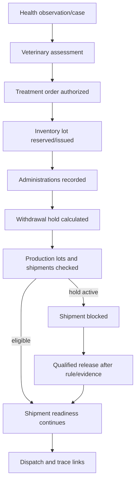

Transaction requirements:

- Authorizing a treatment and reserving/validating stock may use a PostgreSQL transaction/function.
- Each administration creates/updates withdrawal hold in the same consistent operation.
- Shipment readiness reads current hold/restriction under the same transaction used to approve release to prevent race conditions.
- Corrections to administration trigger recalculation and review of affected lots/shipments.

## 36.4 Environment alert to maintenance resolution

1. Edge/local controller detects critical condition and performs approved local alarm/control.
2. Telemetry batch reaches cloud with value, quality and device context.
3. Cloud rule opens/correlates alert and routes notifications.
4. Worker acknowledges and inspects birds/equipment.
5. If equipment fault is suspected, work order is created from the alert.
6. Technician records workaround/repair and functional verification.
7. Alert remains open until recovery condition and verification evidence are satisfied.
8. Repeated events create root-cause/corrective action and rule/sensor review.

## 36.5 Feed receipt to flock consumption and costing

1. Supplier delivery is received and inspected.
2. Inventory lot/feed delivery is quarantined or released.
3. Released lot enters silo/location through stock transaction.
4. Feed movements/consumption allocate quantities to flock/house/time.
5. Variance is reconciled against silo readings and target.
6. Cost entry is generated from purchase/ERP or item cost and allocated to flock.
7. Traceability links feed lots to affected flock/production time.

## 36.6 Production lot to shipment and recall

1. Egg collection/packing or broiler harvest creates a production/trace lot.
2. Source flock, house and time window are immutable links.
3. Shipment checks health/withdrawal, biosecurity, quality, quantity and documents.
4. Dispatch creates destination trace link and records vehicle/crew/time.
5. Receipt reconciles quantity/condition.
6. Recall query traverses source and destination links plus relevant input/health/sanitation/visitor events.
7. Recall case records notification, hold/return/destruction and effectiveness.

## 36.7 Period close and correction

- Daily close checks required rounds, bird balance, production, feed/water, mortality, critical alerts and unresolved exceptions.
- Weekly review examines trends, inventory, maintenance, biosecurity and data quality.
- Flock close performs final reconciliations and locks the cycle.
- A locked record correction creates a request, new version/event and approval; the original is retained.
- Reports show corrected values and indicate that a correction occurred.

---

# 37. Consolidated screen inventory and navigation

## 37.1 Main navigation

| Area | Primary screens |
|---|---|
| Home / My work | Role dashboard, critical alerts, today's rounds/tasks, weather/power, restrictions, handover and offline queue. |
| Portfolio / sites | Site map/list, house cards, exceptions, comparisons and status. |
| House / flock | Environment, bird count/age, feed/water, production, health, tasks, devices, documents and timeline. |
| Daily operations | Guided rounds, observations, handovers, period close and corrections. |
| Environment | Current values, trend, zones, target bands, devices, calibration and controller status. |
| Alerts / incidents | Prioritized queue, acknowledgement, checklist, escalation, evidence, root cause and drills. |
| Health / welfare | Observations, cases, samples/results, treatments, vaccinations, mortality, welfare and withdrawal. |
| Production | Egg collections/grades/lots, weights/growth/harvest or breeder/hatchery records. |
| Feed / water | Deliveries, silos, consumption, water sources/readings/tests and sanitation. |
| Biosecurity | Visitor/vehicle, access events, audits, incidents, outbreak mode and plans. |
| Sanitation / waste | Cleaning events, release, litter, waste, carcass disposal and pest. |
| Inventory / procurement | Stock, lots, receiving, issue, transfer, count, expiry, requisition, PO and suppliers. |
| Maintenance | Assets, work orders, preventive plans, calibration, critical tests, spares and utilities. |
| Workforce / knowledge | Tasks, schedule, teams, training, competencies, SOPs, handovers and announcements. |
| Trace / logistics | Lots, shipments, transfers, certificates, trace search and recalls. |
| Cost / sustainability | Cost statement, allocations, budgets and resource intensity. |
| Reports / analytics | Standard reports, schedules, exports, KPI definitions, quality and models. |
| Administration | Users/roles, structure, profiles, forms, rules, integrations, audit and retention. |

## 37.2 House status card minimum content

- House name/code and active flock.
- Production type, flock age/stage and live-bird estimate.
- Environment status and data freshness.
- Feed/water availability and recent variance.
- Production vs target.
- Mortality/health exception.
- Critical asset/power status.
- Active alert count by severity.
- Due/overdue rounds/tasks.
- Biosecurity or withdrawal restriction.
- Last synchronization/device health where relevant.

## 37.3 Status presentation rules

- Always pair color with text/icon.
- Display `current`, `stale`, `missing`, `estimated`, `manual`, `sensor-quality-failed` states.
- Display event time and last receive/sync time where delay matters.
- Use a consistent severity hierarchy across modules.
- Do not hide a blocked/withdrawal/outbreak status behind a secondary tab.
- Provide direct action from exception cards to the responsible workflow.

## 37.4 Simplified permission matrix

| Action/data | Worker | Supervisor | Vet/QA | Maintenance | Manager | Admin/Auditor |
|---|---|---|---|---|---|---|
| Daily/production records | Create in scope | Review/correct | Read | Read | Approve/export | Configure/read per scope |
| Health observation | Create | Review | Manage/approve | Limited read | Read | Configure/audit |
| Treatment/medicine | Administer if authorized | Verify | Order/approve/release | No | Policy/read | Catalog/audit |
| Environment/alerts | Read/ack/action | Manage | Read/advise | Equipment response | Approve rules | Configure/audit |
| Controller command | No or bounded local | Bounded if authorized | Consult | Execute | Approve | Technical admin/audit |
| Inventory | Issue/use | Review | Controlled-item review | Parts use | Approve | Configure/audit |
| Biosecurity | Record | Site-process approval | Manage/audit | Contractor entry | Exception approval | Configure/audit |
| Reports/export | Own scope | House/site | Health/QA scope | Asset scope | Authorized portfolio | Purpose-limited system/audit |

Final permissions must be encoded as capability plus scope and enforced by RLS/database rules.

---

# 38. Requirement traceability map

| Requirement prefix | Scope | Primary module(s) |
|---|---|---|
| `ADM` | Organization, sites and master data | MOD-01, MOD-02, MOD-19 |
| `FLK` | Flock planning and lifecycle | MOD-03 |
| `DLY` | Daily rounds and operational records | MOD-04, MOD-14 |
| `ENV` | Environment, devices and automation | MOD-05, MOD-06, MOD-13 |
| `FWT` | Feed, water and nutrition | MOD-07, MOD-12 |
| `PRD` | Production | MOD-08 |
| `HLT` | Health, welfare and veterinary | MOD-09 |
| `BIO` | Biosecurity and compliance | MOD-10 |
| `SAN` | Sanitation, litter, waste and pest | MOD-11 |
| `INV` | Inventory, purchasing and suppliers | MOD-12 |
| `MNT` | Assets, maintenance and utilities | MOD-13 |
| `WFM` | Workforce, tasks and training | MOD-14, MOD-18 |
| `TRC` | Traceability, shipments and costing | MOD-15, MOD-16 |
| `ALT` | Alerts, incidents and corrective action | MOD-06 |
| `RPT` | Dashboards, reports and analytics | MOD-17 |
| `MOB` | Mobile, usability and administration | MOD-04, Sections 28-29, MOD-19 |
| `INT` | Integration and platform services | MOD-20 |
| `SEC` | Security, privacy and auditability | MOD-01, MOD-18, MOD-19, Sections 27 and 34 |

The following catalog is the baseline backlog. Each implementation item should add owner, release, estimate, acceptance criteria, test case and trace to design/migration/API where applicable.

# 38.1 Detailed requirements catalog

Priority uses MoSCoW: Must = required for the baseline go-live of the relevant scope; Should = high-value near-term; Could = optional/advanced. A project backlog should add acceptance criteria, owner, release, estimate and traceability to test cases.

### 38.1.1 Organization, sites and master data

| **ID**  | **Requirement**                                                                                                                                          | **Priority** |
|---------|----------------------------------------------------------------------------------------------------------------------------------------------------------|--------------|
| ADM-001 | Support one or many organizations, sites, farms, biosecurity zones, houses/coops and storage areas in a clear hierarchy.                                 | Must         |
| ADM-002 | Allow each house to store capacity, dimensions, housing system, production purpose, equipment, floor plan, geographic location and operational status.   | Must         |
| ADM-003 | Support configurable production profiles for layers, broilers, breeders and simplified smallholder operations without mixing incompatible workflows.     | Must         |
| ADM-004 | Maintain versioned master data for breeds/strains, feed programs, units, suppliers, products, grades, causes, checklist templates and regulatory fields. | Must         |
| ADM-005 | Support multiple languages, time zones, currencies and SI/imperial units with a single canonical unit in storage.                                        | Should       |
| ADM-006 | Assign users, contractors and devices to permitted organizations, sites, zones and houses.                                                               | Must         |
| ADM-007 | Generate durable QR/barcode identifiers for houses, assets, inventory lots, flocks, samples and shipment lots.                                           | Should       |

### 38.1.2 Flock planning and lifecycle

| **ID**  | **Requirement**                                                                                                                                      | **Priority** |
|---------|------------------------------------------------------------------------------------------------------------------------------------------------------|--------------|
| FLK-001 | Create a flock plan with production type, source, breed/strain, sex, hatch date, arrival date, planned quantity, target house and expected end date. | Must         |
| FLK-002 | Record source certificates, hatchery/breeder details, transport information, health status, vaccinations and placement acceptance checks.            | Must         |
| FLK-003 | Require a configurable house-readiness gate covering sanitation, maintenance, environmental readiness, supplies and approval before placement.       | Must         |
| FLK-004 | Record actual placement counts, dead-on-arrival, discrepancies and initial observations with electronic sign-off.                                    | Must         |
| FLK-005 | Calculate age and production stage automatically and apply effective-dated target curves, schedules and alert profiles.                              | Must         |
| FLK-006 | Support flock transfers, splits, merges and partial removals while preserving lineage and quantity reconciliation.                                   | Should       |
| FLK-007 | Prevent a house from carrying overlapping active flocks unless the housing model explicitly permits it.                                              | Must         |
| FLK-008 | Support depopulation/harvest, flock closure, final reconciliation, performance review and house release to sanitation.                               | Must         |
| FLK-009 | Lock approved historical periods and require reasoned, auditable corrections rather than destructive edits.                                          | Must         |
| FLK-010 | Allow comparison against breed/vendor, company and site target profiles with source and version visible.                                             | Should       |

### 38.1.3 Daily rounds and operational records

| **ID**  | **Requirement**                                                                                                                 | **Priority** |
|---------|---------------------------------------------------------------------------------------------------------------------------------|--------------|
| DLY-001 | Provide configurable daily/shift inspection forms by production type, age/stage, house and risk level.                          | Must         |
| DLY-002 | Capture bird count, mortality, culls, behavior, litter, feed, water, equipment, environment, egg/growth data, notes and photos. | Must         |
| DLY-003 | Support offline mobile entry with local timestamp, user, device, house and sync status.                                         | Must         |
| DLY-004 | Display current alerts, due tasks, previous unresolved findings and relevant SOPs during the round.                             | Must         |
| DLY-005 | Convert a finding into a task, health event, work order, biosecurity incident or alert acknowledgement without re-entry.        | Must         |
| DLY-006 | Require supervisor review for late, missing, implausible or corrected daily records.                                            | Should       |
| DLY-007 | Calculate completion, timeliness and data-quality scores by worker, house and site.                                             | Should       |

### 38.1.4 Environmental monitoring, devices and automation

| **ID**  | **Requirement**                                                                                                                                                                        | **Priority** |
|---------|----------------------------------------------------------------------------------------------------------------------------------------------------------------------------------------|--------------|
| ENV-001 | Maintain a device and sensor registry with type, serial number, firmware, location, calibration, accuracy, status and ownership.                                                       | Must         |
| ENV-002 | Ingest manual and automatic readings for temperature, relative humidity, ammonia, carbon dioxide, static pressure, airflow, light, water, feed, power and other configured parameters. | Must         |
| ENV-003 | Store time-series data with source timestamp, receive timestamp, unit, quality flag and device health context.                                                                         | Must         |
| ENV-004 | Apply age/stage-specific target bands and rule profiles rather than hardcoded universal thresholds.                                                                                    | Must         |
| ENV-005 | Detect threshold, duration, rate-of-change, no-data, sensor disagreement and derived-risk conditions.                                                                                  | Must         |
| ENV-006 | Visualize current conditions, trends, compliance percentage, house zones and sensor health in one view.                                                                                | Must         |
| ENV-007 | Support multiple sensors per critical parameter and configurable voting or fallback logic.                                                                                             | Should       |
| ENV-008 | Provide calibration, reference-check and replacement workflows with certificate or evidence attachment.                                                                                | Must         |
| ENV-009 | Integrate existing environmental controllers in read-only mode before enabling supervised commands.                                                                                    | Should       |
| ENV-010 | Keep life-support control and critical fail-safe logic local; cloud unavailability must not stop ventilation, heating, cooling or alarms.                                              | Must         |
| ENV-011 | Log manual overrides, recipe/configuration changes and remote-control actions with limits, approver, duration and rollback.                                                            | Must         |
| ENV-012 | Monitor mains power, generator, UPS, controller communications, fan/heater/pump status and gateway connectivity.                                                                       | Must         |

### 38.1.5 Feed, water and nutrition

| **ID**  | **Requirement**                                                                                                                   | **Priority** |
|---------|-----------------------------------------------------------------------------------------------------------------------------------|--------------|
| FWT-001 | Maintain feed formulations/products, phase programs, supplier lots, delivery documents, quality results and storage locations.    | Must         |
| FWT-002 | Record feed deliveries, silo/bin levels, transfers, wastage, stock adjustments and allocation to flock/house.                     | Must         |
| FWT-003 | Capture feed consumption manually or from scales/meters and compare with age/stage targets and recent baseline.                   | Must         |
| FWT-004 | Capture water flow/consumption and pressure; detect no-flow, leaks, unusual ratios and abrupt changes.                            | Must         |
| FWT-005 | Track water source, treatment, quality tests, sanitation/flush schedules and corrective actions.                                  | Must         |
| FWT-006 | Calculate water-to-feed ratio, feed per bird, cumulative feed, days of stock and predicted depletion.                             | Should       |
| FWT-007 | Support nutrition-phase changes with approval, effective time and automatic task/checklist generation.                            | Should       |
| FWT-008 | Link feed and water deviations to health, environment and production analytics without presenting them as a veterinary diagnosis. | Should       |

### 38.1.6 Production management

| **ID**  | **Requirement**                                                                                                                         | **Priority** |
|---------|-----------------------------------------------------------------------------------------------------------------------------------------|--------------|
| PRD-001 | For layers, record egg collections by house, time/round, grade, weight class, clean/dirty/cracked/reject quantity and collector.        | Must         |
| PRD-002 | Create egg packing/storage lots and preserve traceability from shipment back to collection, house and flock.                            | Must         |
| PRD-003 | Calculate hen-day, hen-housed, egg mass, average egg weight, grade yield, seconds and feed per dozen/egg mass.                          | Must         |
| PRD-004 | For broilers, record body-weight samples, sample method, uniformity, coefficient of variation, growth, feed conversion and livability.  | Must         |
| PRD-005 | For breeders, record hatching egg categories, floor eggs, fertility/hatchability inputs and hatchery handoff.                           | Should       |
| PRD-006 | Maintain age-based target curves for production, growth, consumption, mortality and uniformity with visible source/version.             | Must         |
| PRD-007 | Generate forecasts for egg output, feed demand, harvest weight/date and inventory needs with confidence or assumption notes.            | Should       |
| PRD-008 | Support harvest/collection plans, crew and vehicle readiness, welfare checks, counts/weights, processor/customer receipt and variances. | Must         |
| PRD-009 | Compare houses, flocks, sites and periods while controlling for production type, age, breed and environmental context.                  | Should       |
| PRD-010 | Record closeout losses, condemnations or customer/processor feedback when available.                                                    | Could        |

### 38.1.7 Health, welfare and veterinary management

| **ID**  | **Requirement**                                                                                                                                     | **Priority** |
|---------|-----------------------------------------------------------------------------------------------------------------------------------------------------|--------------|
| HLT-001 | Capture health observations with signs, severity, affected estimate, location, onset, behavior, photos/video and immediate action.                  | Must         |
| HLT-002 | Provide triage and escalation workflows that direct users to qualified veterinary review; the system must not autonomously diagnose or prescribe.   | Must         |
| HLT-003 | Record veterinary assessments, diagnoses, differential diagnoses, recommendations and case status.                                                  | Must         |
| HLT-004 | Manage sampling, chain of custody, laboratory submission, results, interpretation and linked corrective action.                                     | Should       |
| HLT-005 | Schedule vaccinations and preventive programs by flock age/stage with product, lot, route, dose, administrator and completion evidence.             | Must         |
| HLT-006 | Require authorized treatment orders for medicines and record product lot, dose, route, duration, administrator and response.                        | Must         |
| HLT-007 | Calculate egg/meat withdrawal end dates and block or warn against affected shipment until released by an authorized role.                           | Must         |
| HLT-008 | Record mortality and culling by time, count, cause/category, location, disposal method and necropsy result.                                         | Must         |
| HLT-009 | Detect unusual mortality, morbidity, intake, behavior or production patterns and open a review workflow.                                            | Must         |
| HLT-010 | Support isolation/quarantine, restricted movement, enhanced surveillance and outbreak-mode controls.                                                | Must         |
| HLT-011 | Maintain welfare assessments such as gait, injuries, contact dermatitis, feather condition, behavior and humane intervention records as applicable. | Should       |
| HLT-012 | Produce antimicrobial and medicine-use reports by flock, product, indication, prescriber and outcome.                                               | Should       |

### 38.1.8 Biosecurity and compliance

| **ID**  | **Requirement**                                                                                                                          | **Priority** |
|---------|------------------------------------------------------------------------------------------------------------------------------------------|--------------|
| BIO-001 | Store a version-controlled written biosecurity plan with owner, approval, review date, zones, procedures and emergency contacts.         | Must         |
| BIO-002 | Pre-register visitors/contractors and capture contact with other poultry, recent farm visits, purpose, approved areas and risk decision. | Must         |
| BIO-003 | Record visitor and vehicle arrival/departure, PPE, clothing/footwear, cleaning/disinfection and escort.                                  | Must         |
| BIO-004 | Enforce clean-to-dirty movement order, house access restrictions and quarantine rules through tasks and warnings.                        | Should       |
| BIO-005 | Track farm-dedicated tools/equipment and cleaning/disinfection before cross-house or cross-site movement.                                | Must         |
| BIO-006 | Schedule and document wild-bird, rodent, insect and other pest controls, findings, bait maps and corrective action.                      | Must         |
| BIO-007 | Record source assurance for birds, feed, litter, water, packaging and high-risk supplies.                                                | Should       |
| BIO-008 | Conduct biosecurity audits with scored questions, evidence, findings, owners, due dates and verification.                                | Must         |
| BIO-009 | Track required biosecurity training and acknowledgements for employees, visitors and contractors.                                        | Must         |
| BIO-010 | Support country/site-specific compliance profiles, inspections and exports without claiming legal compliance automatically.              | Must         |

### 38.1.9 Sanitation, litter, waste and pest control

| **ID**  | **Requirement**                                                                                                                             | **Priority** |
|---------|---------------------------------------------------------------------------------------------------------------------------------------------|--------------|
| SAN-001 | Create between-flock sanitation plans covering depopulation, litter/manure removal, dry clean, wet wash, disinfection, drying and downtime. | Must         |
| SAN-002 | Record chemical/product, batch, dilution or concentration, contact time, applicator, area, temperature and safety evidence.                 | Must         |
| SAN-003 | Support environmental sampling/swabs, laboratory results and release approval before placement.                                             | Should       |
| SAN-004 | Track litter condition and actions such as top-up, turning, treatment, removal, storage and destination.                                    | Must         |
| SAN-005 | Require dead-bird collection at least daily in the configured checklist and record secure disposal route.                                   | Must         |
| SAN-006 | Track manure, carcass, waste-water, chemical container and general waste volumes, storage and disposal documents.                           | Should       |
| SAN-007 | Link pest-control findings to inventory, building repairs, feed spills and biosecurity corrective actions.                                  | Should       |

### 38.1.10 Inventory, purchasing and suppliers

| **ID**  | **Requirement**                                                                                                          | **Priority** |
|---------|--------------------------------------------------------------------------------------------------------------------------|--------------|
| INV-001 | Maintain item masters for feed, medicines, vaccines, disinfectants, PPE, litter, packaging, spare parts and consumables. | Must         |
| INV-002 | Track lot/batch, expiry, status, storage conditions, certificates, quantity and location.                                | Must         |
| INV-003 | Support receiving, inspection, quarantine, release/reject, transfer, issue, return, adjustment and disposal.             | Must         |
| INV-004 | Use FEFO for expiring controlled items and warn on shortages, expiry and unsuitable storage.                             | Must         |
| INV-005 | Tie consumption to flock, house, task, treatment, sanitation event or work order.                                        | Must         |
| INV-006 | Support minimum/maximum stock, reorder suggestions, requisitions, approvals and purchase orders or ERP integration.      | Should       |
| INV-007 | Provide cycle counts, stock variance, wastage and shrinkage reporting.                                                   | Should       |
| INV-008 | Maintain supplier qualification, certificates, performance, incidents and approved-item scope.                           | Should       |

### 38.1.11 Assets, maintenance and utilities

| **ID**  | **Requirement**                                                                                                                      | **Priority** |
|---------|--------------------------------------------------------------------------------------------------------------------------------------|--------------|
| MNT-001 | Maintain an asset register with hierarchy, location, criticality, specifications, warranty, manuals and spare parts.                 | Must         |
| MNT-002 | Generate preventive maintenance by calendar, runtime, cycle count or condition.                                                      | Must         |
| MNT-003 | Create work orders from inspections, alarms, failures or planned work with priority, safety steps, labor, parts and downtime.        | Must         |
| MNT-004 | Track inspection and test records for generators, alarms, fans, heaters, pumps, cooling, feed/water systems and emergency equipment. | Must         |
| MNT-005 | Manage sensor and instrument calibration with due dates, results, out-of-tolerance impact assessment and certificates.               | Must         |
| MNT-006 | Require controlled manual override and return-to-service tests for critical equipment.                                               | Must         |
| MNT-007 | Support contractor access, permits, lockout/tagout or local safety controls as applicable.                                           | Should       |
| MNT-008 | Report uptime, downtime, mean time to repair, preventive completion and repeat failure.                                              | Should       |

### 38.1.12 Workforce, tasks and training

| **ID**  | **Requirement**                                                                                         | **Priority** |
|---------|---------------------------------------------------------------------------------------------------------|--------------|
| WFM-001 | Create shifts, recurring tasks, role-based checklists and assignments by site/house.                    | Must         |
| WFM-002 | Prioritize work using alerts, welfare risk, due time, location and staff competence.                    | Must         |
| WFM-003 | Provide electronic completion with notes, photos, measurements, signatures and supervisor verification. | Must         |
| WFM-004 | Track competencies, required training, expiry, assessment and authorization for high-risk tasks.        | Must         |
| WFM-005 | Notify users of due, overdue, reassigned and escalated tasks through configured channels.               | Must         |
| WFM-006 | Support contractors and temporary workers with limited time/location access and required induction.     | Should       |
| WFM-007 | Report workload, completion, overdue items, repeat findings and training gaps.                          | Should       |

### 38.1.13 Traceability, shipments and operational costing

| **ID**  | **Requirement**                                                                                                                              | **Priority** |
|---------|----------------------------------------------------------------------------------------------------------------------------------------------|--------------|
| TRC-001 | Preserve genealogy from source birds and input lots through flock, production lot and shipment.                                              | Must         |
| TRC-002 | Create shipment/transfer records with lot, quantity, grade/weight, vehicle, destination, certificates, timestamps and receipt.               | Must         |
| TRC-003 | Run a recall/trace query in both directions: source-to-destination and shipment-to-source.                                                   | Must         |
| TRC-004 | Identify medicines, feed, visitors, health events, alarms and sanitation records relevant to a selected lot or date window.                  | Must         |
| TRC-005 | Support barcode/RFID scanning and printable labels where operations require them.                                                            | Should       |
| TRC-006 | Track basic operational costs by flock/house for feed, chicks/pullets, medicine, labor, energy, maintenance and losses.                      | Should       |
| TRC-007 | Integrate with accounting/ERP for invoices, payments, general ledger and payroll rather than duplicating a full financial system by default. | Should       |
| TRC-008 | Export an auditor/customer traceability pack with controlled access and redaction of unrelated data.                                         | Should       |

### 38.1.14 Alerts, incidents and corrective action

| **ID**  | **Requirement**                                                                                                                | **Priority** |
|---------|--------------------------------------------------------------------------------------------------------------------------------|--------------|
| ALT-001 | Support Information, Warning, Critical and Emergency severities with site-specific definitions.                                | Must         |
| ALT-002 | Combine threshold, duration, hysteresis, schedule, rate-of-change, age/stage and cross-sensor context.                         | Must         |
| ALT-003 | Route notifications by role, site, shift, severity and availability using in-app, SMS, email, voice or messaging integrations. | Must         |
| ALT-004 | Require acknowledgement, owner, response estimate, corrective action and closure evidence.                                     | Must         |
| ALT-005 | Escalate unacknowledged or unresolved alerts and verify delivery receipts where the channel supports it.                       | Must         |
| ALT-006 | Provide approved maintenance mode, suppression, grouping, cooldown and duplicate correlation with expiry and audit.            | Must         |
| ALT-007 | Operate local siren/strobe/controller alarms independently from the cloud for critical conditions.                             | Must         |
| ALT-008 | Create incident records for disease, welfare, food safety, cybersecurity, fire, flood, power and major equipment failure.      | Must         |
| ALT-009 | Report response time, resolution time, recurrence, nuisance alarms and root causes for continuous improvement.                 | Should       |

### 38.1.15 Dashboards, reports and analytics

| **ID**  | **Requirement**                                                                                                  | **Priority** |
|---------|------------------------------------------------------------------------------------------------------------------|--------------|
| RPT-001 | Provide role-based portfolio, site, house, flock and task dashboards with clear exceptions and data freshness.   | Must         |
| RPT-002 | Calculate a governed KPI catalog with formula, unit, source fields, owner, frequency and version.                | Must         |
| RPT-003 | Produce daily, weekly, flock-cycle, management, veterinary, biosecurity, inventory and maintenance reports.      | Must         |
| RPT-004 | Allow scheduled delivery and export to PDF, spreadsheet/CSV and API while respecting permissions.                | Must         |
| RPT-005 | Compare against target, previous flock, site average and selected peer groups with appropriate context.          | Should       |
| RPT-006 | Display missing data, sensor gaps, corrections and confidence/quality flags alongside analytics.                 | Must         |
| RPT-007 | Offer governed self-service filters and report templates without exposing raw database access to ordinary users. | Should       |

### 38.1.16 Mobile, usability and administration

| **ID**  | **Requirement**                                                                                                            | **Priority** |
|---------|----------------------------------------------------------------------------------------------------------------------------|--------------|
| MOB-001 | Provide responsive web and Android/PWA mobile experiences optimized for low bandwidth and intermittent connectivity.       | Must         |
| MOB-002 | Allow at least seven days of offline forms/tasks/SOPs on mobile and reconcile conflicts predictably on reconnect.          | Must         |
| MOB-003 | Use large touch targets, high contrast, clear status, minimal typing, scanning, defaults and optional voice/photo capture. | Must         |
| MOB-004 | Show offline, unsynced, stale and failed states explicitly; never imply data was saved or sent when it was not.            | Must         |
| MOB-005 | Support configurable terminology, units, language and simple/advanced mode by user role.                                   | Should       |
| MOB-006 | Provide delegated administration for users, roles, master data, thresholds, schedules, forms and notification policies.    | Must         |
| MOB-007 | Version and approve high-impact configuration changes, including target profiles, medication catalogs and control recipes. | Must         |

### 38.1.17 Integration and platform services

| **ID**  | **Requirement**                                                                                                                   | **Priority** |
|---------|-----------------------------------------------------------------------------------------------------------------------------------|--------------|
| INT-001 | Expose versioned REST/JSON APIs for master and transaction data with OAuth/OIDC, pagination, idempotency and rate limits.         | Must         |
| INT-002 | Use an IoT messaging protocol such as MQTT and support common farm interfaces such as Modbus and OPC UA through adapters.         | Should       |
| INT-003 | Publish signed webhooks/events for alerts, flock changes, treatments, inventory and shipments.                                    | Should       |
| INT-004 | Integrate with identity, messaging, weather, laboratories, accounting/ERP, controller vendors and government portals as required. | Should       |
| INT-005 | Support validated CSV/spreadsheet imports and complete data export for migration and vendor portability.                          | Must         |
| INT-006 | Provide connector health, error queue, retries, replay, reconciliation and support diagnostics.                                   | Must         |
| INT-007 | Maintain developer documentation, sandbox/test credentials and a compatibility/version policy.                                    | Should       |

### 38.1.18 Security, privacy and auditability

| **ID**  | **Requirement**                                                                                                                         | **Priority** |
|---------|-----------------------------------------------------------------------------------------------------------------------------------------|--------------|
| SEC-001 | Enforce least-privilege role-based access by tenant/organization, site, zone, house and data type.                                      | Must         |
| SEC-002 | Support MFA and optional enterprise SSO; prohibit shared accounts for accountable actions.                                              | Must         |
| SEC-003 | Encrypt data in transit and at rest, protect secrets and rotate credentials/certificates.                                               | Must         |
| SEC-004 | Give every gateway/device a unique identity; disable default credentials and log provisioning, ownership and firmware.                  | Must         |
| SEC-005 | Maintain tamper-evident audit logs for authentication, data changes, approvals, exports, configuration and control actions.             | Must         |
| SEC-006 | Separate farm operational technology from business/user networks and restrict remote access to approved, time-limited, logged sessions. | Must         |
| SEC-007 | Provide tested backups, point-in-time recovery, disaster recovery and edge store-and-forward.                                           | Must         |
| SEC-008 | Operate vulnerability, dependency, firmware, patch and supplier-risk management with defined response times.                            | Must         |
| SEC-009 | Minimize and govern worker, visitor, camera and location data with transparent purpose, access, retention and deletion rules.           | Must         |


---

# 39. Operational and delivery appendices

## 39.1 Sample daily house inspection checklist

| Section | Minimum checks/fields |
|---|---|
| Context | House/flock, date/time, age/stage, worker, shift, weather/house mode and offline status. |
| Observe before entry | Bird distribution, vocalization, activity, panting/huddling, visible distress and unusual odor/noise. |
| Bird count and health | Live estimate, mortality/culls, sick/injured birds, droppings, injuries, feather/skin/feet/gait where applicable. |
| Environment | Temperature/RH, air quality, airflow/pressure, light, litter moisture/caking and sensor/controller status. |
| Feed and water | Availability, line operation, consumption/variance, spills/leaks, pressure, treatment/quality and stock days. |
| Production | Egg round/grade/defects or weight sample/growth; investigate abnormal change. |
| Equipment/utilities | Fans, heaters, cooling, pumps, augers, conveyors, power, generator, alarms and doors. |
| Biosecurity | Entry/PPE, visitors/vehicles, pests/wild birds, tool movement, spills and zone integrity. |
| Actions | Immediate correction, task/work order, health event, alert acknowledgement, escalation and evidence. |
| Close | Unresolved items, handover, supervisor review and signature. |

## 39.2 Sample visitor and vehicle form

- Visitor/driver identity, organization, contact, sponsor and purpose.
- Date/time, vehicle registration, planned site/zone/house and expected departure.
- Configured recent poultry, wild-bird, market, processing, farm-contact, own-bird, illness or restricted-exposure questions.
- Approval decision and restrictions.
- PPE/clothing/footwear, shower/change or other site procedure completed.
- Vehicle/equipment cleaning/disinfection, product and time where applicable.
- Actual entry/exit, escort, zones visited, items brought/removed, incident and signature.

## 39.3 Sample cleaning and disinfection release checklist

1. Flock depopulation and bird reconciliation complete; feed, eggs, medicine and portable items removed/controlled.
2. Dead birds, litter/manure and waste removed, contained and documented.
3. Dry clean from high to low; remove dust and organic material from ceilings, fans, inlets, equipment, floors and exterior interfaces.
4. Wash and rinse using the approved method; protect electrical/control equipment.
5. Apply approved disinfectant with recorded product lot, concentration, coverage and contact time.
6. Dry and maintain required downtime; prevent recontamination and unauthorized access.
7. Inspect, repair, test equipment, calibrate sensors and replenish supplies.
8. Complete swabs/tests if required and resolve failures.
9. Manager/quality approves house readiness before placement.

## 39.4 Emergency drill checklist

| Drill | Minimum evidence |
|---|---|
| Power/generator loss | Mains failure detection, generator start/load, ventilation continuity, fuel, local alarm and communications. |
| Cloud/network loss | Local controller/alarms continue, edge buffers, manual dashboard/export and later replay. |
| Water interruption | Detection, alternate supply, responsibility, restoration and flock condition. |
| Sensor failure | Stale/disagreement alert, alternate/manual reading, calibration/replacement and data-quality flag. |
| Disease/outbreak | Restriction activation, contact list, visitor/vehicle/movement trace, communications and sample workflow. |
| Recall | Backward/forward trace, affected destination list, notification, hold/return reconciliation and effectiveness. |
| Cyber incident | Credential/device containment, remote-access shutdown, evidence, restore and operational fallback. |
| Backup restore | Restore to isolated environment, integrity checks, application smoke test and edge/offline replay. |

## 39.5 Definition of done for every feature/module increment

- Business owner, user story and acceptance criteria approved.
- Permissions, RLS, audit, retention, offline and error behavior defined.
- Database migration, constraints, indexes and generated types complete.
- Units, timestamps, localization, formulas and data-quality rules tested.
- Security/privacy/OT review complete where applicable.
- Unit, SQL/RLS, component and relevant E2E tests pass.
- Representative domain acceptance completed.
- User help/SOP/training and support runbook updated.
- Monitoring, metrics, alerting and rollback/forward-fix added.
- Accessibility reviewed for user-facing work.
- No unresolved critical defect; known limitations documented.

## 39.6 User story template

```text
ID: <module-prefix>-<number>
Title: <clear action/outcome>
As a: <role>
I need: <capability>
So that: <operational outcome>

Scope:
- Organization/site/house/flock applicability
- Online/offline behavior
- Production profile applicability

Business rules:
- ...

Permissions:
- Who can view/create/update/approve/cancel/export?

Data:
- Entities/fields, units, timestamps, source and retention

Acceptance criteria:
Given ... When ... Then ...

Audit/events:
- ...

Test trace:
- Unit / SQL-RLS / E2E / domain acceptance IDs
```

## 39.7 Module acceptance template

Each module sign-off should answer:

1. Can the primary workflow be completed by the intended role on supported devices?
2. Does it work in the required offline/poor-network condition?
3. Are tenant, site, house and sensitive-data permissions enforced by RLS?
4. Are invalid state, quantity, unit and duplicate operations blocked?
5. Are corrections and approvals auditable?
6. Are relevant alerts, tasks, reports, events and integrations generated?
7. Are data freshness and quality visible?
8. Are backups, support diagnostics and monitoring sufficient?
9. Has the relevant farm/veterinary/quality/maintenance owner accepted it?

## 39.8 Vendor / solution evaluation scorecard

| Criterion | Weight | Evidence to request |
|---|---:|---|
| Poultry workflow fit | 20% | Live demonstration of the selected production profile and complete flock cycle. |
| Offline and edge resilience | 15% | Internet/power-loss test, local alarm architecture, buffer and sync evidence. |
| Security and privacy | 15% | RLS/multi-tenancy, penetration test, backup/incident process, device security and access controls. |
| Interoperability and ownership | 10% | APIs, controller adapters, full export, data ownership and exit terms. |
| Usability and adoption | 10% | Field usability test with actual workers and simple mode. |
| Analytics and data quality | 10% | KPI definitions, missing-data visibility, model validation and rule tuning. |
| Implementation capability | 10% | Site survey, migration, training, pilot plan, local integrator and references. |
| Support and reliability | 5% | SLA, monitoring, replacement process, release and escalation history. |
| Total cost and contract | 5% | Five-year software/hardware/storage/messaging/integration and exit cost. |

## 39.9 Open decisions before build

- Primary production profile and release order for other profiles.
- Number of organizations, sites, houses, users, devices and expected growth.
- Housing types and mixed-house exceptions.
- Countries, languages, units, currencies, data residency and retention.
- Existing controller/sensor/meter brands and protocols.
- Connectivity and offline duration by site.
- Required traceability depth and label/scanning technology.
- Veterinary authority, treatment roles, medicine catalog and withdrawal policy.
- Monitoring/advisory/control level by subsystem.
- Required integrations and source-of-truth ownership.
- SaaS multi-tenant, single-company cloud, hybrid or on-premises constraints.
- Camera/audio purpose, privacy and retention.
- Pilot site, flock cycle, baseline KPIs and success gates.

## 39.10 Glossary

**Flock:** A traceable cohort of birds managed as one production group, even if later split or partially removed.

**House / coop:** The physical bird housing unit and associated equipment/environmental zone.

**Production profile:** Versioned configuration selecting workflows, fields, formulas and rules for layers, broilers, breeders or another approved operation.

**Target profile / curve:** Approved expected value or band by age/stage for environment, weight, intake, production, mortality or other metric.

**Edge gateway:** Farm-local device that connects sensors/controllers, normalizes and buffers data and executes approved local rules.

**OT:** Operational technology, including controllers, gateways, sensors, actuators and networks that monitor or operate farm equipment.

**FCR:** Feed conversion ratio; feed consumed divided by live-weight gain using the approved formula and units.

**Hen-day production:** Eggs produced divided by live hens for the period, expressed as a percentage under an approved denominator rule.

**Withdrawal period/hold:** Time and restriction after a treatment during which eggs or birds may be ineligible for the food chain under applicable rules.

**Corrective action:** Assigned action to remove a detected problem and verify the result; may include root-cause and preventive action.

**Trace lot:** A group of birds, eggs, feed, medicine or product assigned an identifier for movement, shipment and recall.

**MTTA / MTTR:** Mean time to acknowledge / mean time to resolve an alert or incident under the governed definition.

**RLS:** PostgreSQL Row Level Security, the final database authorization boundary for tenant-owned rows.

**Server Component:** Next.js component rendered on the server, used by default for authenticated reads.

**Server Action:** Server-side Next.js mutation entry point initiated from the application UI.

**Route Handler:** Next.js HTTP endpoint for APIs, webhooks, downloads or callbacks.

**Idempotency:** Repeating the same accepted request does not create additional business effects.

## 39.11 Architecture and standards reference set

Implementation should verify the current official versions of:

- Next.js App Router documentation for Server/Client Components, Server Actions and Route Handlers.
- Supabase documentation for Next.js SSR clients, Auth, PostgreSQL RLS, Storage access control, Realtime authorization, Edge Functions, local development, database testing and environment management.
- shadcn/ui and Tailwind CSS documentation.
- Applicable poultry biosecurity, welfare, breed/strain management, food-safety/HACCP, veterinary medicine and cybersecurity guidance for each operating country and customer contract.

The uploaded Supabase architecture guide is the application-architecture baseline. The original chicken coop blueprint remains the operational and requirements baseline. This combined document takes precedence as the integrated implementation specification, subject to approved project decisions and local qualified review.

---

# 40. Final architecture recommendation

Build the initial solution as one well-structured Next.js application with feature modules matching the poultry operational domains in this document. Keep reads server-side, mutations validated and authenticated, external contracts explicit, files private, Realtime narrow, migrations reproducible and RLS non-negotiable. Place critical data integrity in PostgreSQL and critical farm safety at the local controller/edge. Add services, automation and AI only after the core operational system, data quality, user adoption and safety controls are proven.

**End of document.**
