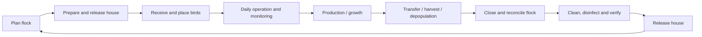
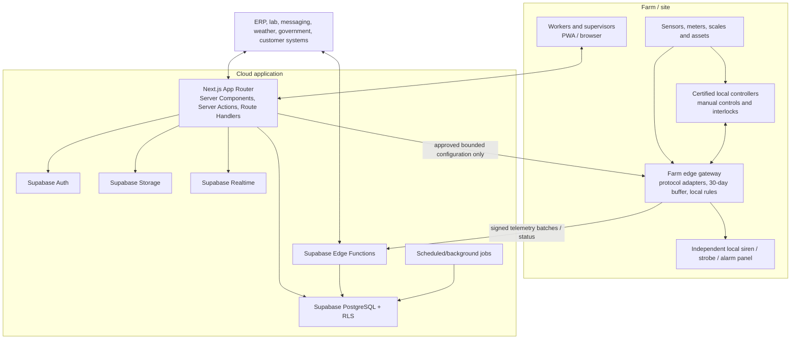
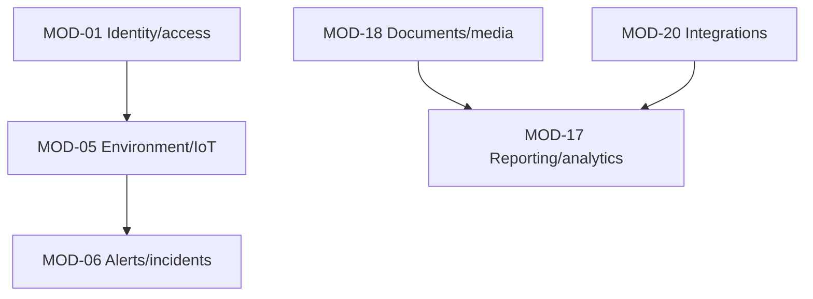

# 00 - Foundation (Sections 1-5)

Source: `documentation/Chicken_Coop_Management_System_Complete_Module_Operations_Blueprint.md` (lines 42-484)

# 1. Executive decisions

## 1.1 Product vision

Give every authorized person a trusted, current and actionable view of every flock and house so that required work is completed on time, abnormal conditions are detected early, bird welfare and biosecurity are protected, and every production lot can be explained from source through shipment.

## 1.2 Recommended architecture decision

Build the first production version as a **Next.js App Router modular monolith**. Use:

- **Server Components** for authenticated page reads.
- **Server Actions** for mutations initiated by the web application.
- **Route Handlers** for webhooks, downloads, explicit mobile/offline sync APIs and external HTTP contracts.
- **Supabase Auth** for identity and sessions.
- **Supabase PostgreSQL** as the source of truth for relational data, constraints, transactions and governed calculations.
- **Row Level Security on every exposed tenant-owned table** as the final authorization boundary.
- **Supabase Storage** for private documents, photos, certificates, reports and other files.
- **Supabase Realtime only for narrow, time-sensitive experiences**, such as active alerts, job progress and selected live house status.
- **Supabase Edge Functions selectively** for device ingestion or endpoints that should operate independently of the Next.js deployment.
- **A farm-local edge gateway and existing certified controllers** for telemetry buffering, local alarm execution and safe equipment operation.

Do not add a separate Express/NestJS API, Prisma, broad global client state, broad Realtime subscriptions or microservices by default. Extract a separate service only after a measured requirement demonstrates independent scaling, strict isolation, long-running computation, specialized networking, a different release cadence or support for multiple non-Next.js clients.

## 1.3 Non-negotiable product principles

1. **Welfare and biosecurity first.** Production optimization may never silently override approved safety limits.
2. **Local resilience.** Farm work, local controls and critical alarms continue during connectivity failure.
3. **Configurable and versioned rules.** Target curves, thresholds, schedules, forms and medicine rules are not hardcoded.
4. **One operational source of truth.** Corrections are visible and audited; parallel uncontrolled spreadsheets are retired through a managed rollout.
5. **Exception-driven workflows.** The system prioritizes abnormal conditions, missing work and unresolved risk.
6. **Traceability by design.** Important events identify organization, site, house, flock, lot, person/device, event time and source.
7. **Human-supervised high-risk decisions.** Veterinary decisions, medicine authorization, shipment release and control changes require qualified approval.
8. **Database-enforced integrity and authorization.** UI permissions improve usability, but PostgreSQL constraints and RLS enforce the rules.
9. **Feature-oriented modularity.** Business modules are separable in code before they become separate services.
10. **Portable data.** The farm must be able to export operational data and documents in documented formats.

## 1.4 Product tiers

| Tier | Purpose | Included capability |
|---|---|---|
| Essential | Digitize daily work and records | Structure, flocks, daily rounds, health, mortality, feed/water, production, tasks, inventory, maintenance, basic biosecurity, reports and audit. |
| Connected | Continuously monitor farm conditions | Device registry, telemetry, edge gateway, sensor health, environment dashboards, local/cloud alarms, power and controller visibility. |
| Automated | Safely assist selected controls | Advisory recommendations, supervised bounded commands, local interlocks, approval, expiry, rollback and control audit. |
| Enterprise | Coordinate multiple sites and partners | Multi-site benchmarks, advanced traceability, ERP/lab/government integrations, data warehouse, forecasting, supplier/customer portals and regional configuration. |

## 1.5 Recommended MVP boundary

The first release should support one primary production profile - layers or broilers - at one pilot site. It should include:

- Organization, site, house, user, role and flock master data.
- House-readiness, placement, active-flock operation, harvest/transfer, closeout and sanitation handoff.
- Offline-capable daily rounds, observations, shift handover and task generation.
- Mortality, health cases, vaccinations, treatments, medicine lots, withdrawal controls and veterinary review.
- Feed and water records, layer egg or broiler weight/harvest records, inventory and basic costing.
- Visitor/vehicle biosecurity, cleaning/disinfection, pest, litter, waste and dead-bird records.
- Assets, preventive maintenance, calibration, work orders and critical equipment tests.
- Configurable alerts, incidents, management dashboards, reports and immutable audit events.
- Read-only IoT ingestion at the pilot site; local certified controllers continue all life-support control.

Out of scope for the first release: full accounting, payroll, slaughter/processing MES, hatchery incubation control, autonomous veterinary diagnosis, cloud-only closed-loop control and unvalidated computer-vision decisions.

---

# 2. Business outcomes and success measures

| Outcome | System contribution | Example measures |
|---|---|---|
| Health and welfare | Structured inspections, early deviation detection, veterinary workflow, environmental evidence and corrective action. | Mortality, livability, morbidity, welfare findings, response time, recurrence. |
| Biosecurity | Controlled access, visitor and vehicle history, sanitation, pest control, training and audit evidence. | Audit score, overdue actions, unauthorized access, biosecurity incidents. |
| Production efficiency | Target curves, feed/water/output tracking, flock comparison and forecasting. | FCR, lay rate, egg mass, uniformity, feed per dozen, harvest variance. |
| Operational discipline | Assigned tasks, digital rounds, shift handover, alerts, maintenance and approvals. | On-time rounds, task completion, MTTA, MTTR, PM completion. |
| Traceability and assurance | Lot genealogy linked to health, feed, medicine, sanitation and shipment records. | Trace query time, record completeness, recall drill result. |
| Cost and sustainability | Input consumption, losses, energy/water use and cost allocation by flock and house. | Cost per kg/dozen, water per bird, energy per output, waste and stock variance. |
| Data trust | Versioned rules, reconciliations, quality flags and auditable corrections. | Missing records, sync failure, sensor uptime, reconciliation variance, correction rate. |
| Adoption | Field-appropriate mobile UX and removal of duplicate work. | Active use, average round duration, offline success, support tickets, user satisfaction. |

## 2.1 Pilot success gates

A pilot is successful only when all of the following are demonstrated:

- The complete selected flock lifecycle is executed in the system.
- Workers complete daily rounds faster or with no more effort than the previous process.
- Offline records synchronize without loss or duplication.
- A simulated critical environmental event triggers the independent local alarm and the configured cloud escalation.
- Treatment and withdrawal controls block or warn against an ineligible shipment.
- A shipment can be traced backward to flock, house, source, feed/medicine lots and relevant health/sanitation events within the agreed time.
- Cross-tenant and cross-site security tests pass.
- Backup restoration and edge replay are proven.
- Farm management, veterinary/quality and worker representatives approve usability and operational fit.

---

# 3. Target operating model

## 3.1 Organizational hierarchy

```text
Organization / tenant
└── Site / farm
    ├── Biosecurity zone
    │   ├── House / coop
    │   │   ├── House area / room / section
    │   │   ├── Active flock
    │   │   ├── Devices, sensors and assets
    │   │   └── Tasks, records, alerts and documents
    │   └── Controlled access point
    ├── Storage location
    ├── Waste / mortality area
    ├── Maintenance area
    └── Packing / dispatch area
```

The same model supports a single-coop farm and a multi-site commercial operation. Every tenant-owned business row contains `organization_id`; site- and house-specific rows also contain the appropriate scope identifiers.

## 3.2 Flock lifecycle



### Lifecycle stage gates

| Stage | Minimum exit criteria |
|---|---|
| Plan | Capacity, source, breed/strain, dates, supplies, target profile, health program and expected output approved. |
| Ready house | Previous flock closed; waste/litter removed; sanitation, maintenance, calibration, environment and supplies verified. |
| Place | Source documents, quantities, dead-on-arrival, transport, initial environment and acceptance observations recorded. |
| Operate | Daily inspections, environment, feed/water, health, welfare, tasks, equipment and biosecurity controlled. |
| Produce | Egg, body-weight, breeder or other production records reconciled to the flock. |
| Harvest/transfer | Welfare, withdrawal, vehicle/crew biosecurity, counts/weights, certificates and destination approved. |
| Close | Bird, inventory, output, cost, incidents and final KPIs reconciled and signed off. |
| Sanitize/release | Cleaning, disinfection, verification, downtime, maintenance and readiness approval completed. |

## 3.3 Daily operating rhythm

The daily operating rhythm is covered by the field workflow modules (MOD-05, MOD-06, MOD-07, MOD-14).

1. **Start shift:** review emergency/critical alerts, weather, power/generator, house restrictions, health actions, staffing and due work.
2. **Respond and escalate:** follow the linked SOP/checklist, acknowledge the alert, create the required event or work order and contact qualified personnel.
3. **Reconcile inputs and outputs:** bird count, feed, water, eggs/weights, medicine, inventory and shipments.
6. **Supervisor review:** inspect missing or implausible records, unresolved alerts, overdue tasks, health trends and handover notes.
7. **Daily close:** sign off the period, lock approved records and keep offline copies until synchronization is confirmed.

## 3.4 Weekly, monthly and cycle routines

| Frequency | Required management routine |
|---|---|
| Weekly | Review flock trend vs target, mortality causes, intake/output variance, unresolved alerts, sensor quality, stock/expiry, PM completion, pest/biosecurity findings and staffing. |
| Monthly | Review access, audit log exceptions, training gaps, supplier performance, cost/sustainability, backup status, nuisance alarms, recurring work orders and configuration changes. |
| Per flock stage | Approve target-profile changes, feed phase, vaccination/treatment schedule, light program, harvest/transfer readiness and welfare checks. |
| Per flock close | Reconcile birds, feed, medicine, eggs/weight, inventory, shipments, costs, incidents and lessons learned; lock the final record. |
| Recurring drill | Test power failure, local alarm, cloud/network loss, manual control, backup water, notification escalation, data restoration and recall trace. |

## 3.5 Roles

| Role | Main responsibility |
|---|---|
| Owner / executive | Portfolio risk, cost, assurance and investment. |
| Farm manager | Daily accountability, flock performance, staffing, approvals, alerts and closeout. |
| Supervisor | Shift execution, round review, task coordination and exception escalation. |
| Caretaker / worker | Daily rounds, observations, records, first response and assigned tasks. |
| Poultry veterinarian | Health program, diagnosis, treatment authorization, withdrawal and outbreak decisions. |
| Biosecurity / quality lead | Biosecurity plan, food-safety evidence, audits and corrective action. |
| Maintenance technician | Critical equipment, preventive maintenance, calibration, repair and emergency tests. |
| Inventory / procurement | Supplier, lot, expiry, stock, purchasing, receiving and issue control. |
| Logistics / sales | Orders, harvest/collection, shipment, vehicle, customer and receipt. |
| Auditor / customer reviewer | Read-only, purpose-limited evidence and traceability packs. |
| System administrator / IT | Identity, configuration, integrations, devices, security, backup and support. |
| Data / analytics lead | KPI definitions, data quality, report governance and model controls. |

---

# 4. Solution architecture

## 4.1 System context



## 4.2 Responsibility boundaries

| Component | Responsibilities | Must not do |
|---|---|---|
| Browser/PWA | Server-rendered UI, interactive forms, scanning, local IndexedDB queue, narrow Realtime, direct signed Storage upload. | Store authorization decisions as the only control; contain secret keys; control life-support equipment directly. |
| Next.js App Router | Rendering, workflow orchestration, validation, authenticated reads/mutations, downloads, webhooks and public/mobile APIs. | Duplicate the database authorization model; become a cloud-only safety controller. |
| Supabase PostgreSQL | Relational source of truth, RLS, constraints, transactions, status transitions, calculated views and audit records. | Hide core business state in ungoverned JSON; accept unvalidated tenant access. |
| Supabase Storage | Private evidence, reports, images, certificates, manuals and exports with path-based policies. | Expose private farm files through permanent public URLs. |
| Supabase Realtime | Narrow active-alert, job-progress and selected live-status subscriptions. | Broadcast high-frequency raw telemetry to every dashboard. |
| Edge Function | Independent device ingress, selected webhooks or multi-client endpoints. | Become a general duplicate backend without a measured reason. |
| Farm edge gateway | Device adapters, local buffer, normalization, device health, local rule execution and store-and-forward. | Replace certified controller safety logic without formal hazard analysis and acceptance. |
| Certified controller | Local closed-loop environment control, physical interlocks, manual fallback and immediate alarms. | Depend on internet or cloud availability. |
| External worker/queue | High-volume, retry-heavy, long-running or CPU-intensive jobs when required. | Be introduced before workload evidence justifies it. |

## 4.3 Request and execution-layer selection

| Operation | Recommended layer |
|---|---|
| Render dashboard, flock, house or report page | Server Component calling a server-only query module. |
| Create/update a record from web UI | Server Action with Zod validation, identity check, RLS mutation and revalidation. |
| Receive lab/ERP/messaging webhook | Route Handler or Edge Function with signature verification and idempotency. |
| Synchronize offline mobile records | Versioned Route Handler or Edge Function using client operation IDs and conflict rules. |
| Ingest device telemetry | Edge Function or dedicated ingress service; batch validation and idempotent insert. |
| Execute transaction-heavy reconciliation | PostgreSQL function within one transaction. |
| Upload a large photo, certificate or report | Browser to private Supabase Storage using policy or signed upload. |
| Show active alert changes or export progress | Client Component with narrow private Realtime subscription. |
| Run high-volume aggregation or model scoring | Scheduled job or external worker when database/Edge Function limits are insufficient. |

### Standard authenticated read

```text
Browser request
  -> Next.js Server Component
      -> cookie-aware Supabase server client
          -> PostgreSQL query evaluated under RLS
      <- typed data or safe database error
  <- rendered HTML plus small interactive client islands
```

### Standard mutation

```text
Form submission
  -> Server Action
      1. Parse and validate input with Zod
      2. Verify authenticated identity and high-level permission
      3. Execute mutation under RLS
      4. Commit audit/event records in the same transaction where required
      5. Revalidate affected route or cache tag
      6. Return safe field or workflow result
```

### IoT telemetry flow

```text
Sensor/controller
  -> farm edge adapter
      -> normalize identifier, unit, timestamp and quality
      -> buffer locally
      -> signed batch to ingestion endpoint
          -> authenticate device/gateway
          -> validate schema, range and idempotency key
          -> insert raw telemetry/staging rows
          -> update current-state and aggregate tables
          -> evaluate non-local cloud rules
          -> create alerts/events when applicable
      <- accepted/rejected item result
  -> edge retains and retries only unaccepted items
```

## 4.4 Feature-oriented project structure

```text
chicken-coop-ops/
├── src/
│   ├── app/
│   │   ├── (auth)/
│   │   │   ├── login/page.tsx
│   │   │   └── auth/callback/route.ts
│   │   ├── (dashboard)/
│   │   │   └── [organizationSlug]/
│   │   │       ├── layout.tsx
│   │   │       ├── overview/page.tsx
│   │   │       ├── sites/[siteId]/...
│   │   │       ├── houses/[houseId]/...
│   │   │       ├── flocks/[flockId]/...
│   │   │       ├── alerts/...
│   │   │       ├── reports/...
│   │   │       └── settings/...
│   │   ├── api/
│   │   │   ├── v1/mobile/sync/route.ts
│   │   │   ├── v1/exports/[jobId]/route.ts
│   │   │   ├── webhooks/lab/route.ts
│   │   │   ├── webhooks/erp/route.ts
│   │   │   └── webhooks/messaging/route.ts
│   │   ├── globals.css
│   │   └── layout.tsx
│   ├── features/
│   │   ├── identity-access/
│   │   ├── farm-structure/
│   │   ├── flocks/
│   │   ├── daily-operations/
│   │   ├── environment-iot/
│   │   ├── alerts-incidents/
│   │   ├── feed-water/
│   │   ├── production/
│   │   ├── health-welfare/
│   │   ├── biosecurity/
│   │   ├── sanitation-waste/
│   │   ├── inventory-procurement/
│   │   ├── maintenance-utilities/
│   │   ├── workforce-knowledge/
│   │   ├── traceability-logistics/
│   │   ├── costing-sustainability/
│   │   ├── reporting-analytics/
│   │   ├── documents-media/
│   │   ├── configuration-governance/
│   │   └── integrations/
│   ├── components/
│   │   ├── ui/
│   │   ├── shared/
│   │   └── providers/
│   ├── lib/
│   │   ├── supabase/client.ts
│   │   ├── supabase/server.ts
│   │   ├── supabase/admin.ts
│   │   ├── supabase/proxy.ts
│   │   ├── auth/require-user.ts
│   │   ├── auth/permissions.ts
│   │   ├── offline/
│   │   ├── telemetry/
│   │   ├── observability/
│   │   ├── env.ts
│   │   └── utils.ts
│   └── types/database.generated.ts
├── supabase/
│   ├── migrations/
│   ├── functions/
│   ├── tests/
│   ├── seed.sql
│   └── config.toml
├── public/
├── proxy.ts
├── components.json
└── package.json
```

Each feature should normally contain:

```text
features/<module>/
├── components/
├── server/queries.ts
├── server/actions.ts
├── schema.ts
├── types.ts
├── permissions.ts
├── events.ts
└── tests/
```

**Dependency rule:** product features may import shared UI and framework adapters. Shared code must not import a product feature. Cross-module coordination should occur through explicit orchestration functions, database transactions or domain events rather than hidden circular imports.

---

# 5. Module catalog and release map

| ID | Module | MVP | Connected / Phase 2 | Advanced / Enterprise |
|---|---|---:|---:|---:|
| MOD-01 | Tenant, identity and access | Yes | SSO, automated lifecycle | Customer billing/portal roles |
| MOD-02 | ~~Farm structure and master data~~ | ~~Yes~~ | ~~GIS/floor plans, richer profiles~~ | ~~Regional configuration packs~~ |
| MOD-03 | ~~Flock planning and lifecycle~~ | ~~Yes~~ | ~~Advanced split/merge/forecast~~ | ~~Cross-company transfers~~ |
| MOD-04 | Daily operations, rounds and close | Yes | Advanced workload optimization | Voice/computer-vision assistance |
| MOD-05 | Environment, IoT and safe control | Read-only pilot | Multi-device integration, advisory | Supervised/local automatic control |
| MOD-06 | Alerts, incidents and emergency | Yes | Cross-signal rules, drills | Predictive risk and advanced correlation |
| MOD-07 | Feed, water and nutrition | Yes | Automated meters and feed planning | Supplier optimization/feed-mill integration |
| MOD-08 | Production management | One profile | Additional profiles | Advanced forecast/packing/hatchery integration |
| MOD-09 | Health, welfare and veterinary | Yes | Lab integration and outbreak packs | Validated advisory analytics |
| MOD-10 | Biosecurity and controlled access | Yes | Digital kiosk/access devices | Regional disease-network integration |
| MOD-11 | Sanitation, litter, waste and pest | Yes | Environmental verification devices | Advanced sustainability/compliance integration |
| MOD-12 | Inventory, procurement and suppliers | Yes | Purchase orders/supplier assurance | Enterprise procurement integration |
| MOD-13 | Assets, maintenance and utilities | Yes | Condition monitoring | Predictive maintenance |
| MOD-14 | Workforce, tasks, training and SOPs | Yes | Competency planning | Workforce-system integration |
| MOD-15 | Traceability, logistics and recall | Basic | Barcode/RFID and partner integrations | Customer/supplier portals and advanced genealogy |
| MOD-16 | Costing, sustainability and finance integration | Basic | ERP reconciliation | Portfolio planning and carbon accounting |
| MOD-17 | Dashboards, reports, analytics and AI | Yes, descriptive | Diagnostic/predictive | Governed advisory AI/computer vision |
| MOD-18 | Documents, media, signatures and records | Yes | External document exchange | Long-term archive/e-discovery |
| MOD-19 | Administration, configuration and data governance | Yes | Regional delegated admin | Enterprise configuration promotion |
| MOD-20 | Integrations, APIs, events and connector operations | Minimum | Lab, ERP, messaging, weather | Marketplace/partner ecosystem |

## 5.1 Module dependency map



---

---

*Source: documentation/Chicken_Coop_Management_System_Complete_Module_Operations_Blueprint.md (lines 42-484)*
