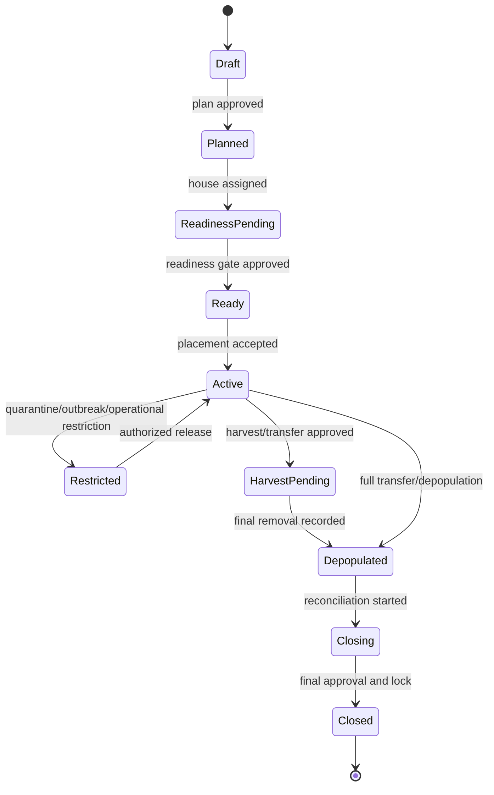

# 03 - MOD-8: Flock planning and lifecycle

Source: `documentation/Chicken_Coop_Management_System_Complete_Module_Operations_Blueprint.md` (lines 717-861)

# 8. MOD-03 - Flock planning and lifecycle

## 8.1 Purpose

Manage each traceable cohort of birds from plan through house readiness, placement, active production, transfer/harvest, closeout and sanitation handoff.

## 8.2 Primary users

Farm manager, supervisor, caretaker, veterinarian, biosecurity/quality, logistics and inventory/procurement.

## 8.3 Flock state model



House sanitation/release is a related but separate state after depopulation.

## 8.4 Capabilities

- Plan flock source, production type, breed/strain, sex, hatch date, planned arrival, quantity, house, target profile and expected end date.
- Link source certificates, vaccination/health status, transport and supplier information.
- Execute a configurable readiness gate covering sanitation, maintenance, calibration, supplies, environment and approvals.
- Record placement quantity, dead-on-arrival, discrepancies, initial observations and acceptance signatures.
- Calculate age and stage automatically using effective operating-day rules.
- Support controlled transfer, split, merge and partial removal while preserving lineage and count reconciliation.
- Apply stage-dependent schedules, forms, targets, alert rules, feed programs and health plans.
- Plan and record harvest/depopulation/transfer, including crew/vehicle biosecurity and withdrawal readiness.
- Reconcile final bird balance, production, feed, medicine, inventory, cost and incidents at closeout.
- Lock approved periods and require reasoned correction events instead of destructive edits.

## 8.5 Key workflows

### Flock plan and approval

1. Planner selects production profile, source, breed/strain, quantity, planned house and dates.
2. System checks house capacity, schedule overlap, sanitation status, supply plan and profile compatibility.
3. Health/vaccination plan and required source documents are attached.
4. Manager approves plan; procurement and readiness tasks are generated.

### House readiness and placement

1. Sanitation release, critical maintenance, calibration, environment stabilization and supply checks must be complete.
2. Authorized approver signs the readiness gate.
3. On arrival, user records vehicle, source documents, actual quantity, DOA, condition and initial readings.
4. Discrepancies create an exception and optional supplier claim.
5. Placement activates the flock and schedules age/stage-driven work.

### Transfer/split/merge

1. User proposes movement with source flock, destination, quantity and reason.
2. System checks destination compatibility, capacity, health/biosecurity restrictions and withdrawal status.
3. Approved movement creates immutable lineage links and quantity transactions.
4. Source and destination counts reconcile; unresolved variance requires supervisor review.

### Closeout

1. Confirm final removal and no remaining live-bird count.
2. Reconcile birds, mortality/culls, feed, medicine, inventory, output, shipment and cost.
3. Review unresolved health, alert, work-order, audit and corrective-action items.
4. Generate final KPI report and lessons learned.
5. Approver closes and locks the flock; house is transferred to sanitation status.

## 8.6 Key entities

| Entity/table | Important fields |
|---|---|
| `flocks` | Organization, site, house, production type, source, breed, hatch date, target version, status. |
| `flock_plans` | Planned quantity/dates, expected output, approvals and planning notes. |
| `house_readiness_reviews` | Checklist version, results, evidence, exceptions, approvers and release time. |
| `placements` | Arrival/placement time, source, vehicle, quantity, DOA, discrepancy and sign-off. |
| `flock_movements` | Type, source/destination flock/house, quantity, reason, approval and lineage. |
| `flock_count_transactions` | Placement, mortality, cull, transfer, harvest and adjustment quantities. |
| `flock_stage_history` | Calculated stage, effective times, profile version and overrides. |
| `harvest_plans` | Planned date, destination, expected quantity/weight, crew, vehicle and readiness. |
| `flock_closeouts` | Reconciliation, final KPIs, issues, approvals and locked timestamp. |

## 8.7 Bird balance rule

For a flock and period, the system must explain:

```text
Opening live birds
+ placements received
+ transfers in
- mortality
- culls
- transfers out
- harvest/depopulation
+/- approved count adjustments
= closing live birds
```

Any adjustment requires reason, evidence where configured and supervisor approval. Closed periods may only be changed through an auditable correction version.

## 8.8 UI and routes

- `/flocks`
- `/flocks/new`
- `/flocks/[flockId]/overview`
- `/flocks/[flockId]/readiness`
- `/flocks/[flockId]/placement`
- `/flocks/[flockId]/movements`
- `/flocks/[flockId]/harvest`
- `/flocks/[flockId]/closeout`
- `/houses/[houseId]/schedule`

## 8.9 Events

- `flock.plan_approved`
- `flock.house_ready`
- `flock.placed`
- `flock.stage_changed`
- `flock.restricted`
- `flock.moved`
- `flock.harvest_started`
- `flock.depopulated`
- `flock.closed`

## 8.10 KPIs

Plan variance, placement discrepancy, DOA rate, age/stage compliance, bird-balance variance, closeout completeness, flock-cycle duration and comparison to the assigned target profile.

## 8.11 Module acceptance gate

- The selected production profile can complete the whole flock lifecycle without manual database intervention.
- A house cannot receive an incompatible or overlapping active flock unless the configured housing model explicitly permits it.
- Splits, merges and transfers preserve lineage and reconcile quantities.
- A flock cannot close while required reconciliations or critical open items remain, unless an authorized exception is recorded.

---


---

*Source: documentation/Chicken_Coop_Management_System_Complete_Module_Operations_Blueprint.md (lines 717-861)*
