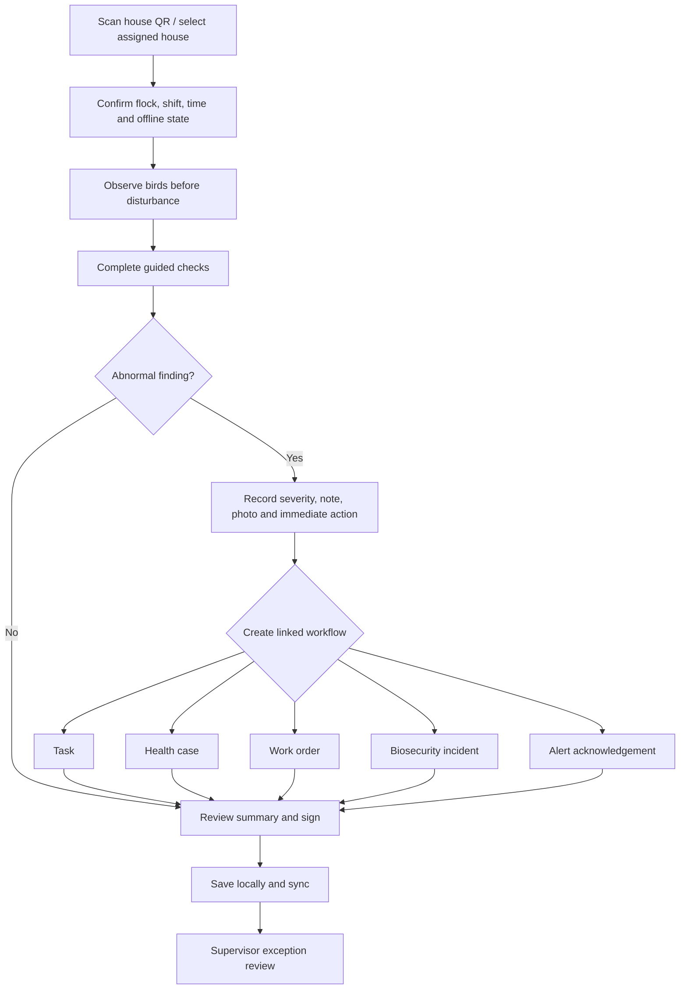

# 04 - MOD-9: Daily operations, rounds, shifts and period close

Source: `documentation/Chicken_Coop_Management_System_Complete_Module_Operations_Blueprint.md` (lines 862-991)

# 9. MOD-04 - Daily operations, rounds, shifts and period close

## 9.1 Purpose

Provide the main field workflow for daily husbandry and operational discipline, optimized for fast use in houses with poor connectivity.

## 9.2 Primary users

Caretakers, supervisors, farm managers, veterinarians, quality/biosecurity and maintenance personnel.

## 9.3 Capabilities

- Configure inspection templates by production type, age/stage, house, shift, season and risk.
- Generate due rounds and tasks from schedules and flock events.
- Start work by scanning a house QR code and loading assigned work, active alerts, unresolved findings and applicable SOPs.
- Capture observations, counts, manual environment readings, feed/water, litter, equipment, production, notes, photos and signatures.
- Create a task, health case, work order, biosecurity incident or alert acknowledgement directly from a finding.
- Support local-first offline entry, client-generated UUIDs, explicit sync status and retry.
- Support shift handover with unresolved risk, equipment state, restricted areas and next actions.
- Identify missing, late, implausible and corrected records for supervisor review.
- Perform daily/weekly period completeness checks, approval and lock.
- Preserve correction history with before/after, reason, user, time and approval.

## 9.4 Daily-round workflow

## 9.5 Offline data model

The PWA stores only assigned, necessary data in IndexedDB:

- Active sites/houses/flocks assigned to the user.
- Current and next seven days of forms, tasks and SOPs.
- Recent alerts, unresolved findings and limited trend summaries.
- Controlled master-data subsets required for entry.
- An encrypted-at-rest capability should be evaluated for managed devices; browser storage is not a substitute for device security.

Every queued operation contains:

- `client_operation_id` UUID.
- Entity ID generated on the client where appropriate.
- Entity type and mutation type.
- Local event time and local save time.
- Base server version for mutable records.
- Payload schema version.
- User/device/session identity.
- Attachment references and upload state.

The sync API returns `accepted`, `duplicate`, `conflict`, `rejected` or `retry_later` per operation.

## 9.6 Conflict policy

| Record type | Conflict behavior |
|---|---|
| Append-only observation, mortality, task comment | Accept idempotently by client operation ID; duplicates return the existing record. |
| Mutable draft owned by one user | Optimistic version check; client can review server version and retry. |
| Approved/locked record | Never overwrite; create a correction request/version. |
| Master data or rule | Server-authoritative; offline user receives current version and must reapply if still relevant. |
| Attachment | Upload separately; record may remain `attachment_pending` until confirmed. |

## 9.7 Key entities

| Entity/table | Important fields |
|---|---|
| `shifts` | Site, start/end, role requirements, status. |
| `shift_assignments` | User, shift, site/house scope and responsibility. |
| `inspection_templates` / `inspection_template_versions` | Applicability, sections, questions, validation and approval. |
| `inspections` | House/flock, shift, template version, started/completed, user/device, status and quality score. |
| `inspection_responses` | Question, typed response, unit, status, reason and source. |
| `observations` | Category, severity, description, immediate action, media and linked entity. |
| `handovers` | From/to shift, unresolved items, restrictions, acknowledgements. |
| `period_closes` | Scope, period, completeness, reviewer, approval and lock. |
| `record_corrections` | Target record/version, before/after, reason, requester and approver. |
| `sync_operations` | Client operation ID, result, conflict detail and processed time. |

## 9.8 Business rules

- The round displays the applicable template version and target profile for the event time.
- Required critical checks cannot be silently skipped; an exception reason and escalation are required.
- Abnormal numeric values prompt confirmation and may automatically create an observation/alert.
- A user cannot approve their own high-risk correction where separation of duties is configured.
- Submitted records retain event time, entry time, device time and sync time.
- The UI explicitly shows offline, unsynced, stale, rejected and conflicted states.
- A daily close cannot pass required completeness checks without an authorized exception.

## 9.9 UI and routes

- `/today`
- `/rounds`
- `/rounds/[inspectionId]`
- `/houses/[houseId]/round`
- `/handovers`
- `/exceptions/daily-records`
- `/period-close`
- `/corrections`

## 9.10 KPIs

Round completion, on-time completion, average duration, missing critical responses, offline sync success, conflict rate, supervisor review backlog, repeated observations and data-quality score.

## 9.11 Module acceptance gate

- A worker can complete a full round offline, take a photo, create linked health/maintenance work and synchronize without duplication.
- The system shows all unsynced operations and provides a safe recovery path.
- Late, missing, abnormal and corrected records are visible to the supervisor.
- Locked records cannot be destructively edited.

---

---

*Source: documentation/Chicken_Coop_Management_System_Complete_Module_Operations_Blueprint.md (lines 862-991)*
