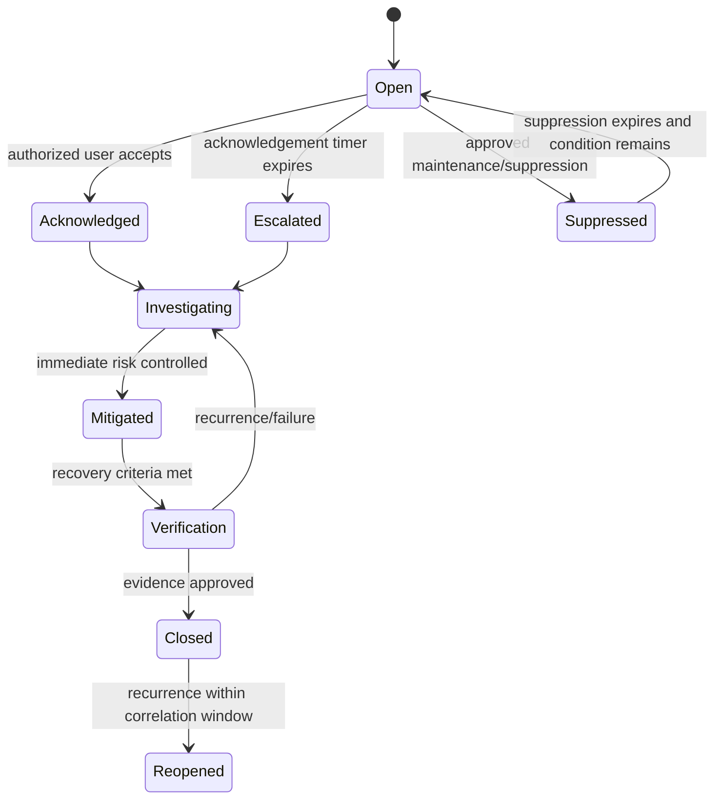

# 06 - MOD-11: Alerts, incidents and emergency management

Source: `documentation/Chicken_Coop_Management_System_Complete_Module_Operations_Blueprint.md` (lines 1107-1253)

# 11. MOD-06 - Alerts, incidents and emergency management

## 11.1 Purpose

Turn abnormal conditions into owned, escalated and verifiably closed operational responses rather than passive notifications.

## 11.2 Primary users

Caretakers, supervisors, farm managers, maintenance, veterinarian, biosecurity/quality, IT/security and on-call responders.

## 11.3 Severity model

| Severity | Meaning | Expected behavior |
|---|---|---|
| Information | Awareness or completed automated event. | Display and retain; no acknowledgement unless configured. |
| Warning | Deviation requiring timely inspection or planned action. | Assign to shift/site role and track due time. |
| Critical | Material risk to birds, product, equipment or compliance. | Immediate notification, acknowledgement, escalation and evidence. |
| Emergency | Imminent life-support, disease, fire, power, water or major safety risk. | Independent local alarm plus immediate multi-channel escalation and emergency procedure. |

Each site may refine names and response times, but the meaning and escalation path must remain governed.

## 11.4 Capabilities

- Define versioned rules combining threshold, duration, hysteresis, rate-of-change, schedule, age/stage, house mode, weather, device quality and cross-signal context.
- Detect no-data/stale conditions for critical signals.
- Route notifications by organization, site, house, shift, role, on-call availability and severity.
- Support in-app, SMS, email, voice and approved messaging channels.
- Require acknowledgement, owner, response estimate, action notes and closure evidence.
- Escalate unacknowledged or unresolved alerts according to the rule version active at opening.
- Correlate duplicate events and group related sensor/equipment conditions.
- Support time-limited maintenance mode, suppression, cooldown and approved override with complete audit.
- Convert or link alerts to health cases, work orders, biosecurity incidents, emergency plans and corrective actions.
- Support incident command, contact lists, timeline, communications, evidence, root cause and lessons learned.
- Schedule emergency drills and track findings and corrective actions.

## 11.5 Alert lifecycle

## 11.6 Rule definition requirements

Every rule version records:

- Name, description, owner and source/justification.
- Applicable organizations, sites, houses, production types, ages/stages and schedules.
- Input signals, quality prerequisites and fallback behavior.
- Open condition, duration, hysteresis/deadband and clear condition.
- Severity, response checklist, target acknowledgement/resolution and escalation tree.
- Notification channels and quiet-hour/emergency behavior.
- Suppression/maintenance permissions and maximum duration.
- Test cases, test results, approval, effective date and superseded version.

## 11.7 Sample operational conditions

| Condition | Typical severity | First response workflow |
|---|---|---|
| High/low temperature | Warning or Critical | Inspect birds and sensor; verify ventilation/heating/cooling and local controller status; escalate if not recovering. |
| High ammonia/CO2 or poor airflow | Critical | Verify sensor, ventilation, inlets/fans/heaters and litter/water; use approved emergency ventilation plan. |
| Water no-flow | Emergency | Confirm supply, valves, pump and pressure; provide alternate water and notify manager/maintenance immediately. |
| Water high-flow/leak | Critical | Locate/isolate leak safely, protect litter and create work order. |
| Feed depletion/no intake | Warning or Critical | Check stock, auger/line, flock behavior and health; reconcile meter/silo data. |
| Power loss | Emergency | Verify generator and local alarms; follow ventilation/power emergency plan. |
| Generator/UPS fault | Critical | Maintenance response, backup plan and operational restriction if resilience is inadequate. |
| Fan/heater/pump failure | Critical | Inspect, use redundant unit/interlock and create urgent work order. |
| Sensor stale/disagreement | Warning or Critical | Use alternate/manual reading; create calibration/replacement task. |
| Mortality spike | Critical | Open health case, notify veterinarian and quality; activate outbreak controls when indicated. |
| Production/intake drop | Warning | Review environment, feed, water, health and data completeness. |
| Door/access violation | Warning or Critical | Verify person/animal/predator risk and open biosecurity incident if required. |
| Cloud/gateway outage | Warning | Confirm local operation and buffer; contact IT if local monitoring is threatened. |

Thresholds must come from approved site/production profiles, not universal hardcoded values.

## 11.8 Incident and emergency workflows

The module must support at minimum:

- Extended power/generator failure and ventilation emergency.
- Heat, cold, flood, fire, storm or other natural disaster.
- Water/feed interruption or contamination.
- Suspected reportable disease, zoonotic risk, high mortality or quarantine.
- Controller, network or gateway failure requiring manual operation.
- Withdrawal violation, food-safety event, traceability failure or recall.
- Cybersecurity event affecting devices, integrity or remote access.
- Staffing/access emergency and authorized alternate contacts.

An incident record includes category, severity, commander/owner, affected scope, timeline, decisions, communications, tasks, external notifications, evidence, root cause, corrective/preventive action and closure approval.

## 11.9 Key entities

| Entity/table | Important fields |
|---|---|
| `alert_rules` / `alert_rule_versions` | Applicability, condition, severity, workflow, owner, approval and effective date. |
| `alerts` | Rule version, source, affected scope, opened/closed time, current state and correlation key. |
| `alert_events` | State changes, values, quality, user/device, notes and evidence. |
| `alert_acknowledgements` | User, channel, acknowledgement time, estimate and first action. |
| `alert_escalations` | Level, target, attempt, delivery result and response. |
| `notifications` | Channel, recipient, template, provider ID, status and delivery evidence. |
| `incidents` | Category, severity, commander, scope, status, timeline and regulatory flags. |
| `incident_actions` | Owner, due date, action, evidence, verification and recurrence control. |
| `emergency_drills` | Scenario, date, participants, result, findings and corrective actions. |

## 11.10 Realtime and background work

- Use private, narrow Realtime channels for active alerts relevant to the signed-in user's assigned scope.
- Do not use Realtime as the source of truth; reconnecting clients perform a normal server read.
- A scheduled/background process evaluates escalation timers, notification retries and overdue incident actions.
- Notification providers are treated as external integrations with idempotent message keys, delivery receipts and retry limits.

## 11.11 UI and routes

- `/alerts`
- `/alerts/[alertId]`
- `/incidents`
- `/incidents/[incidentId]`
- `/emergency-plans`
- `/emergency-drills`
- `/settings/alert-rules`
- `/settings/notification-policies`
- `/on-call`

## 11.12 KPIs

Alert count by severity/source, MTTA, MTTR, unacknowledged rate, escalation success, nuisance/duplicate rate, recurrence, suppression time, incident closure age and drill corrective-action completion.

## 11.13 Module acceptance gate

- Simulated critical and emergency conditions follow the approved local and cloud pathways.
- An unacknowledged alert escalates to the configured alternate and records delivery evidence.
- Suppression expires automatically and cannot hide an active condition indefinitely.
- Closure requires recovery criteria and evidence; alert history is immutable.

---

---

*Source: documentation/Chicken_Coop_Management_System_Complete_Module_Operations_Blueprint.md (lines 1107-1253)*
