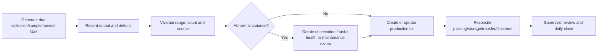

# 08 - MOD-13: Production management

Source: `documentation/Chicken_Coop_Management_System_Complete_Module_Operations_Blueprint.md` (lines 1372-1509)

# 13. MOD-08 - Production management

## 13.1 Purpose

Record and optimize production using a shared flock/house core with profile-specific workflows for layers, broilers and breeders.

## 13.2 Common capabilities

- Apply approved production target curves by flock age/stage and profile version.
- Record outputs by house, flock, date/time, shift, collection/harvest event and operator.
- Reconcile gross output, defects/losses, packed/transferred/shipped output and closing inventory.
- Show target, previous flock and site benchmark with clear formula/version.
- Capture cause codes and linked observations for abnormal production.
- Generate production lots and trace links to source flock/house and time window.
- Forecast short-term output and operational needs when data quality is adequate.

## 13.3 Layer extension

### Capabilities

- Schedule and record egg collection rounds.
- Capture total count/weight and grade categories such as saleable, dirty, cracked, floor, rejected and other configured categories.
- Record average egg weight, egg mass, nest/floor distribution and storage/packing lot.
- Reconcile collected eggs to packing, stock, transfer, loss and shipment.
- Track nest, conveyor, grading and storage equipment exceptions.

### Principal KPIs

- Hen-day production percent.
- Hen-housed production percent.
- Eggs per hen and cumulative eggs.
- Average egg weight and egg mass.
- Grade yield, dirty percent, cracked percent and floor-egg percent.
- Feed per dozen eggs or per unit egg mass.

Formula definitions must be versioned and show denominator rules.

## 13.4 Broiler extension

### Capabilities

- Define sampling plan, scale and sample method.
- Record individual/group weight samples, sample count and selection method.
- Calculate average weight, daily gain, uniformity and coefficient of variation.
- Compare growth and feed conversion against the assigned target profile.
- Create harvest plan by date, target weight, destination, catch crew, vehicle and expected quantity.
- Record catch/harvest counts, live weight, rejects, transport and processor receipt.

### Principal KPIs

- Average live weight.
- Average daily gain.
- Uniformity and coefficient of variation.
- Feed conversion ratio using an approved formula.
- Livability/mortality.
- Harvest count/weight variance and processor reconciliation.

## 13.5 Breeder extension

### Capabilities

- Record hatching eggs, floor/dirty/cracked categories and storage conditions.
- Maintain sex ratio/mating-related operational inputs where used.
- Transfer lots to hatchery and integrate fertility, hatchability and chick results.
- Trace hatchery results back to flock, house and collection period.

### Principal KPIs

Hatching eggs, saleable hatching eggs, floor eggs, fertility, hatchability, saleable chicks and breeder mortality.

## 13.6 Production workflow

## 13.7 Key entities

| Entity/table | Important fields |
|---|---|
| `production_targets` | Target profile version, metric, period and value/band. |
| `egg_collections` | Flock/house, round, count/weight, operator and source. |
| `egg_collection_grades` | Collection, grade/category, quantity/weight and reason. |
| `production_lots` | Lot code, source flock/house/time window, quantity, status and destination. |
| `packing_runs` | Input lots, output lots, grades, loss and equipment. |
| `weight_samples` | Flock/house, sample plan, scale, count, values and statistics. |
| `harvest_plans` | Target, schedule, crew, vehicle, destination and readiness. |
| `harvest_events` | Actual quantity/weight, rejects, times, welfare checks and receipt. |
| `hatchery_transfers` | Hatching-egg lot, hatchery, quantity, storage/transport and receipt. |
| `hatchery_results` | Fertility, hatchability, chicks, losses and returned result time. |

## 13.8 Business rules

- The active production profile controls available fields, formulas and validations.
- Production entries cannot reference a flock outside the event time or house assignment without approved exception.
- A production lot has immutable source links after release.
- Adjustments never erase the original collection/sample/harvest record.
- Formula variants are named, owned and effective-dated.
- Reports expose missing data and quality flags rather than treating absent values as zero.

## 13.9 UI and routes

- `/production/overview`
- `/production/eggs`
- `/production/egg-collections/[id]`
- `/production/packing`
- `/production/weights`
- `/production/harvests`
- `/production/breeder`
- `/production/lots`

## 13.10 Events

- `production.collection_recorded`
- `production.weight_sample_recorded`
- `production.target_deviation`
- `production.lot_created`
- `production.harvest_approved`
- `production.harvest_completed`
- `production.hatchery_result_received`

## 13.11 Module acceptance gate

- One selected production profile can be operated end to end with target comparison and output reconciliation.
- Profile-specific formulas are traceable to their version and source fields.
- Production lots preserve source flock/house/time genealogy.
- Abnormal output can be converted to health, feed/water, environment or maintenance action without re-entry.

---

---

*Source: documentation/Chicken_Coop_Management_System_Complete_Module_Operations_Blueprint.md (lines 1372-1509)*
