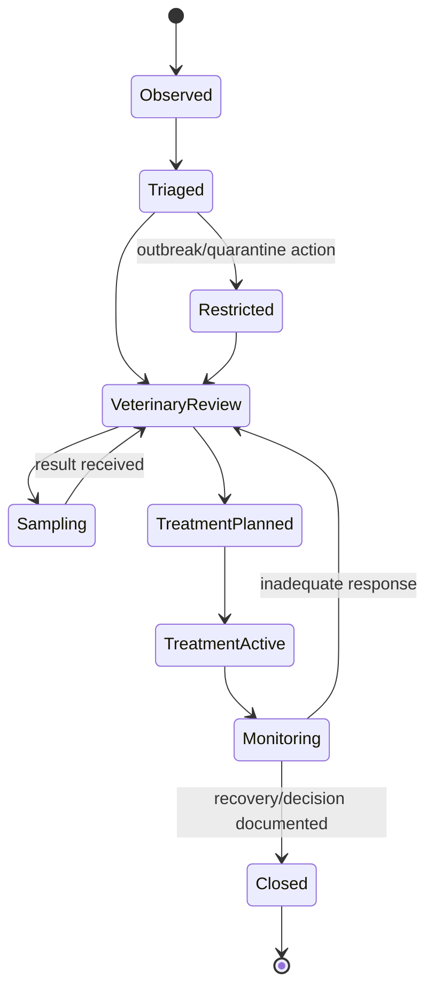

# 09 - MOD-14: Health, welfare, mortality and veterinary management

Source: `documentation/Chicken_Coop_Management_System_Complete_Module_Operations_Blueprint.md` (lines 1510-1648)

# 14. MOD-09 - Health, welfare, mortality and veterinary management

## 14.1 Purpose

Provide a controlled, auditable pathway from observation through veterinary assessment, sampling, diagnosis, treatment, withdrawal, monitoring and closure while preserving bird welfare and food-chain restrictions.

## 14.2 Primary users

Caretakers, supervisors, farm manager, poultry veterinarian, biosecurity/quality, inventory/medicine custodian, laboratory integration and authorized auditors.

## 14.3 Capabilities

- Record clinical/welfare observations with species/production context, severity, affected count, signs, photos and immediate action.
- Open health cases from daily rounds, alerts, mortality trends, lab results or manual reporting.
- Support triage, restrictions, isolation/quarantine, veterinarian review and outbreak mode.
- Maintain diagnoses/differentials using controlled codes while allowing qualified narrative.
- Create sample requests, chain of custody, laboratory submission and result review.
- Maintain vaccination plans and administration records by product lot, dose, route, crew and response.
- Maintain medicine products, authorization class, storage, expiry, approved use and withdrawal rules.
- Create veterinarian-authorized treatment orders and record each administration.
- Calculate and enforce egg/meat withdrawal holds from approved rule versions and actual administration.
- Record mortality and culls by time, count, cause, disposal path and post-mortem/lab link.
- Perform welfare assessments and corrective actions appropriate to the production profile.
- Produce case summaries, medicine registers, mortality reports, withdrawal status and outbreak evidence.

## 14.4 Health-case state model

## 14.5 Treatment and withdrawal workflow

1. Authorized veterinarian/role selects case, product, indication, dose, route, frequency, duration and flock/house scope.
2. System validates product status, stock lot, expiry, authorization, dose/unit and applicable restriction rules.
3. Treatment order is approved and cannot be changed silently.
4. Authorized worker records each administration with actual product lot, quantity, time and signer.
5. System creates/updates withdrawal holds for affected eggs/birds and downstream lots.
6. Shipment/transfer/release workflows check active holds.
7. Qualified user records completion, response and release decision according to local rules.
8. Corrections create an auditable version; they do not delete the original administration.

## 14.6 Mortality workflow

- Record mortality/cull count as soon as discovered with event time, discovery time, house area and preliminary cause.
- Link carcass examination, sample, photo, disposal and health case when required.
- Update flock bird balance transactionally.
- Compare hourly/daily/cumulative rate to target and recent baseline.
- Trigger critical health/biosecurity workflow on configured spike or unusual pattern.
- Supervisor reconciles unexplained count variance and late entries.

## 14.7 Key entities

| Entity/table | Important fields |
|---|---|
| `health_observations` | Flock/house, signs, severity, affected count, media, immediate action and reporter. |
| `health_cases` | Category, status, owner/veterinarian, restrictions, summary and outcome. |
| `diagnoses` | Case, code, confidence/status, veterinarian, effective time and notes. |
| `lab_samples` | Sample type, flock/house, collection, collector, seal, chain of custody and lab. |
| `lab_results` | Sample, test, result, unit, interpretation, file, received/reviewed time. |
| `medication_products` | Active ingredient/product, authorization, storage, unit and withdrawal-rule reference. |
| `treatment_orders` | Case, product, indication, dose, route, schedule, scope, authorizer and status. |
| `treatment_administrations` | Order, product lot, actual dose/quantity, time, administrator and exceptions. |
| `vaccination_plans` / `vaccinations` | Schedule, product lot, route, crew, quantity, response and certificate. |
| `withdrawal_holds` | Scope, product/administration source, restriction type, start/end, status and releaser. |
| `mortality_events` | Flock/house, count, category/cause, discovery/event time, disposal and case link. |
| `welfare_assessments` | Template/version, measures, score, findings, action and approver. |

## 14.8 Permission and RLS requirements

- Workers may create observations, mortality and authorized administration entries within assigned scope.
- Only authorized veterinary/quality roles may diagnose, authorize/cancel treatment, change withdrawal rules or release certain restrictions.
- Medicine inventory details may be visible only to approved roles.
- Auditor access is purpose-limited and may redact worker personal data or unrelated health narratives.
- High-risk changes require re-authentication and immutable audit events.
- The normal server client operates under user RLS; an admin client is not used to bypass veterinary permissions.

## 14.9 Safety rules

- The system must not autonomously diagnose disease or prescribe medication.
- Decision support may show evidence, confidence and approved guidance but a qualified person remains responsible.
- A treatment cannot use an expired, quarantined, depleted or unauthorized product lot.
- Dose and unit validation occurs in browser for usability and again on the server/database.
- Active withdrawal holds are checked in production-lot, packing, transfer, shipment and flock-close workflows.
- Reportable disease logic, contacts and forms are configured for each jurisdiction and reviewed by qualified personnel.

## 14.10 UI and routes

- `/health/overview`
- `/health/observations`
- `/health/cases/[caseId]`
- `/health/samples`
- `/health/lab-results`
- `/health/treatments`
- `/health/vaccinations`
- `/health/withdrawals`
- `/health/mortality`
- `/health/welfare`
- `/health/outbreak-mode`

## 14.11 Events and alerts

- `health.case_opened`
- `health.restriction_applied`
- `health.sample_collected`
- `health.lab_result_received`
- `treatment.authorized`
- `treatment.administration_missed`
- `withdrawal.hold_started`
- `withdrawal.hold_released`
- `mortality.spike_detected`
- `welfare.critical_finding`

## 14.12 KPIs

Mortality, culls, livability, cause distribution, health-case incidence, time to veterinary review, treatment response, vaccination completion, missed administrations, active withdrawal, welfare findings and recurring health issues.

## 14.13 Module acceptance gate

- A health case can progress from observation through lab/treatment/monitoring to closure with full audit.
- A worker cannot create an unauthorized treatment order or release a withdrawal hold.
- Active withdrawal prevents or clearly blocks affected shipment/lot release.
- Mortality updates bird balance and triggers configured escalation on abnormal rate.

---

---

*Source: documentation/Chicken_Coop_Management_System_Complete_Module_Operations_Blueprint.md (lines 1510-1648)*
