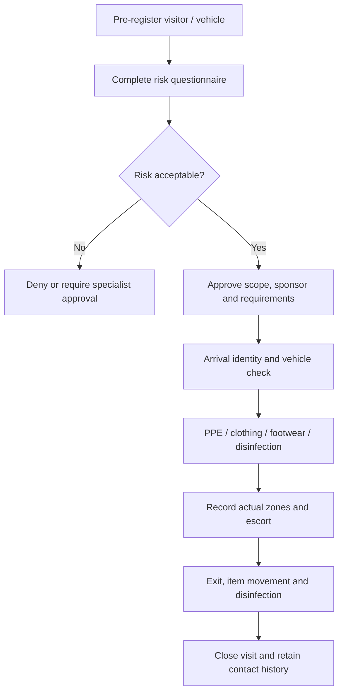

# 10 - MOD-15: Biosecurity, visitors, vehicles and outbreak control

Source: `documentation/Chicken_Coop_Management_System_Complete_Module_Operations_Blueprint.md` (lines 1649-1765)

# 15. MOD-10 - Biosecurity, visitors, vehicles and outbreak control

## 15.1 Purpose

Control entry, movement and evidence across farm biosecurity zones, and provide rapid restriction and contact tracing during a suspected disease or contamination event.

## 15.2 Primary users

Biosecurity/quality lead, farm manager, security/gate personnel, supervisors, workers, veterinarian, visitors, drivers, contractors and auditors.

## 15.3 Capabilities

- Maintain a versioned site biosecurity plan, zones, access points, entry requirements and movement rules.
- Pre-register visitors, drivers, contractors and vehicles.
- Capture configurable risk questions about recent poultry/farm/wild-bird/market/processing exposure, illness and own-bird contact.
- Route approval/denial/restriction decisions to authorized roles.
- Record identity, sponsor, purpose, vehicle, arrival/departure, PPE, clothing/footwear, shower/change and disinfection steps.
- Record actual zones/houses visited, escort, items/equipment brought or removed and incidents.
- Control contractors through induction, temporary scope and expiry.
- Record vehicle/equipment cleaning/disinfection and product/time where required.
- Record access events from manual, QR, badge or supported physical access integration.
- Perform biosecurity inspections/audits, findings and corrective/preventive actions.
- Activate outbreak mode that freezes non-essential entry, applies zone restrictions, displays emergency procedures and supports contact tracing.
- Produce exposure/contact lists by visitor, vehicle, site, zone, house, flock and time window.

## 15.4 Visitor entry workflow

## 15.5 Outbreak mode

When activated by an authorized manager/veterinarian/quality role, the system can:

- Mark affected organization/site/zone/house/flock with a visible restriction banner.
- Cancel or suspend non-essential visits and deliveries.
- Require additional approvals and PPE steps.
- Freeze selected bird, egg, feed, equipment and vehicle movements.
- Create contact/exposure lists for a configurable time window.
- Link health cases, mortality, lab results, visitors, vehicles, staff shifts and shipments.
- Generate daily situation reports and required authority/customer communication packs.
- Preserve legal/incident hold on relevant records and files.
- Require authorized release with reason, evidence and effective time.

## 15.6 Key entities

| Entity/table | Important fields |
|---|---|
| `biosecurity_plans` / `biosecurity_plan_versions` | Scope, rules, owner, approval, effective date and source. |
| `access_points` | Site/zone, type, requirements, device and status. |
| `visit_requests` | Visitor/driver, sponsor, purpose, planned scope/time and risk answers. |
| `visitors` | Identity/contact, organization and privacy/retention metadata. |
| `vehicles` | Registration, owner/operator, type and status. |
| `visit_events` | Arrival/departure, actual scope, PPE, escort, disinfection and incidents. |
| `vehicle_visits` | Vehicle, driver, load/equipment, cleaning/disinfection and access. |
| `access_events` | Person/credential, access point, result, reason and source device. |
| `biosecurity_audits` | Template/version, scope, score, findings and approval. |
| `biosecurity_incidents` | Breach type, affected scope, immediate control, owner and outcome. |
| `outbreak_controls` | Restriction type, scope, start/end, authority and release. |

## 15.7 Business and privacy rules

- Access is denied by default where no approved scope/visit exists.
- Risk questions, decisions and retention are configurable to local policy and privacy law.
- A visitor may only access approved zones during the approved window and with required escort.
- Temporary worker/contractor app access aligns with the visit/contract period.
- Outbreak restrictions are checked by flock movement, inventory movement, maintenance access and shipment workflows.
- Visitor and worker personal data is minimized, access-controlled and retained only as required.
- Physical access integration is advisory only unless the site has validated fail-safe entry procedures.

## 15.8 UI and routes

- `/biosecurity/overview`
- `/biosecurity/visitors`
- `/biosecurity/check-in`
- `/biosecurity/vehicles`
- `/biosecurity/access-events`
- `/biosecurity/audits`
- `/biosecurity/incidents`
- `/biosecurity/outbreak`
- `/settings/biosecurity-plans`

A public or kiosk check-in surface should expose only the minimum fields required and never use a secret/admin client in browser code.

## 15.9 Events and alerts

- `biosecurity.visit_requested`
- `biosecurity.visit_denied`
- `biosecurity.visitor_checked_in`
- `biosecurity.visitor_overdue_exit`
- `biosecurity.access_denied`
- `biosecurity.breach_reported`
- `biosecurity.outbreak_activated`
- `biosecurity.restriction_released`

## 15.10 KPIs

Visitor/vehicle count, denied/high-risk visits, overdue exits, unauthorized access attempts, audit score, repeat findings, corrective-action completion, outbreak contact-query time and training/induction compliance.

## 15.11 Module acceptance gate

- A visitor cannot be recorded as entering a restricted zone without the configured approval and entry controls.
- Actual entry/exit, zones, vehicle and disinfection evidence are traceable.
- Outbreak mode immediately affects visits, movements and shipments according to configured policy.
- Contact tracing can identify people/vehicles associated with an affected house/flock and time window.

---

---

*Source: documentation/Chicken_Coop_Management_System_Complete_Module_Operations_Blueprint.md (lines 1649-1765)*
