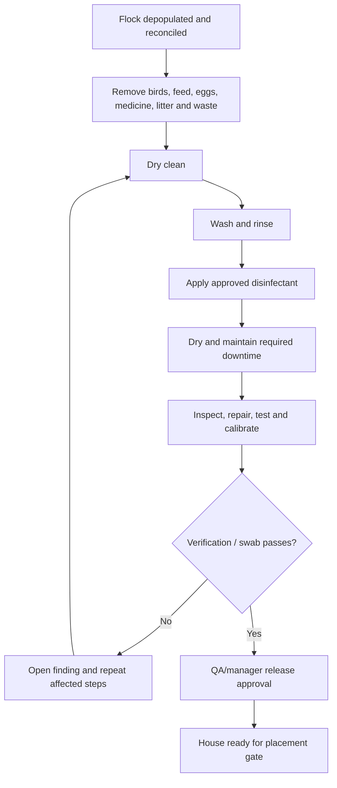

# 11 - MOD-16: Sanitation, litter, waste, mortality disposal and pest control

Source: `documentation/Chicken_Coop_Management_System_Complete_Module_Operations_Blueprint.md` (lines 1766-1866)

# 16. MOD-11 - Sanitation, litter, waste, mortality disposal and pest control

## 16.1 Purpose

Control cleaning, disinfection, downtime, litter, waste, carcass disposal and pest activity so that house release is evidence-based and the next flock cannot be placed before critical sanitation requirements are complete.

## 16.2 Primary users

Biosecurity/quality, farm manager, supervisors, sanitation crews, caretakers, veterinarian, maintenance, waste contractors and auditors.

## 16.3 Capabilities

- Define sanitation plans and checklists by house type, production profile, risk level and event.
- Generate cleaning/disinfection work after depopulation or contamination.
- Record dry cleaning, washing, rinsing, approved disinfectant product/lot, concentration, coverage, contact time, drying and downtime.
- Record staff/contractor, equipment, weather/temperature and evidence photos.
- Record verification inspection, swab/sample, laboratory result, failures and rework.
- Require maintenance, sensor calibration and supply-restocking checks before release.
- Track litter condition during a flock and litter removal, storage, treatment, reuse or disposal.
- Record mortality/carcass disposal method, quantity, container/location, pickup/processing and certificate.
- Record waste streams, quantities, storage, transport, destination and contractor.
- Maintain pest monitoring points, inspection results, activity, product/device use and corrective action.
- Link sanitation failures, waste incidents and pest findings to incidents, work orders and biosecurity corrective action.

## 16.4 House sanitation and release workflow

## 16.5 Key entities

| Entity/table | Important fields |
|---|---|
| `sanitation_plans` / `sanitation_plan_versions` | Applicability, steps, chemical requirements, verification and approval. |
| `sanitation_events` | House/site, trigger, crew, status, start/end, plan version and notes. |
| `sanitation_step_results` | Step, completion, product/lot, concentration, contact time, evidence and exception. |
| `sanitation_verifications` | Inspector, checklist, result, sample/lab links and release recommendation. |
| `house_release_approvals` | House, event, approver, release time, conditions and expiration if applicable. |
| `litter_events` | House/flock, condition, treatment, removal/reuse/disposal quantity and destination. |
| `waste_events` | Waste type, quantity, storage, transporter, destination, certificate and incident link. |
| `carcass_disposal_events` | Flock, count/weight, method, location, contractor, document and time. |
| `pest_monitoring_points` | Site/zone/house, point code, type, map location and status. |
| `pest_inspections` / `pest_actions` | Findings, activity level, product/device lot, action, follow-up and verifier. |

## 16.6 Business rules

- Only approved sanitation products and active inventory lots may be selected.
- Concentration, unit and contact-time values are validated against the plan version but allow an approved exception with reason.
- Placement readiness cannot pass without a valid house release when required.
- A failed verification automatically prevents release and creates corrective work.
- Waste and mortality disposal records preserve contractor, destination and certificate links.
- Pest-control chemical use is tied to inventory lot, authorized user and applicable restrictions.
- Records are append-only after approval; changes use correction workflow.

## 16.7 UI and routes

- `/sanitation/overview`
- `/sanitation/events/[eventId]`
- `/sanitation/house-release`
- `/litter`
- `/waste`
- `/mortality-disposal`
- `/pest-control`
- `/settings/sanitation-plans`

## 16.8 Events and alerts

- `sanitation.started`
- `sanitation.verification_failed`
- `sanitation.house_released`
- `sanitation.release_expiring`
- `waste.collection_overdue`
- `waste.incident_reported`
- `pest.activity_high`
- `pest.follow_up_overdue`

## 16.9 KPIs

Turnaround/downtime, sanitation completion, first-pass verification, repeat failure, release lead time, litter condition trend, waste per flock/output, mortality-disposal timeliness, pest activity and corrective-action completion.

## 16.10 Module acceptance gate

- A house cannot be marked ready while required sanitation, verification or release steps are incomplete.
- Products, lots, concentration, contact time and evidence are traceable.
- Failed verification creates rework and blocks release.
- Waste, litter and carcass movements can be traced to method, transporter/destination and documentation.

---

---

*Source: documentation/Chicken_Coop_Management_System_Complete_Module_Operations_Blueprint.md (lines 1766-1866)*
