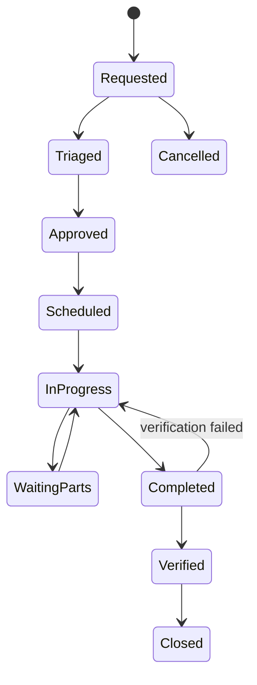

# 13 - MOD-18: Assets, maintenance, calibration and utilities

Source: `documentation/Chicken_Coop_Management_System_Complete_Module_Operations_Blueprint.md` (lines 1992-2125)

# 18. MOD-13 - Assets, maintenance, calibration and utilities

## 18.1 Purpose

Keep critical farm equipment available, calibrated and safe through an asset registry, preventive maintenance, work orders, spare parts, utility tracking and emergency tests.

## 18.2 Primary users

Maintenance technicians, farm manager, supervisors, caretakers, quality, inventory and approved service vendors.

## 18.3 Capabilities

- Maintain assets and components with site/house location, criticality, manufacturer/model, serial, commissioning, warranty, manuals and current status.
- Classify life-support/critical assets such as fans, heaters, cooling, pumps, controllers, generators, UPS and alarms.
- Define time-, meter-, stage- or event-based preventive maintenance plans.
- Generate work orders automatically from schedules, inspections, device faults, alerts and observations.
- Plan priority, required skill, lockout/safety steps, parts, downtime and target completion.
- Record diagnosis, labor, parts, readings, photos, service vendor and repair outcome.
- Require functional verification before critical work order closure.
- Manage calibration schedules and certificates for sensors, scales, meters and dosing equipment.
- Track spare parts and automatically issue them from inventory to a work order.
- Record utility meters and abnormal use for electricity, fuel/generator, gas and water.
- Schedule and evidence generator, UPS, alarm, failover and emergency ventilation tests.
- Calculate downtime, recurrence, maintenance compliance and lifecycle cost.

## 18.4 Asset criticality

| Class | Definition | Minimum control |
|---|---|---|
| Critical A | Failure may immediately threaten birds, water, ventilation, fire safety or critical alarm. | Redundancy/fallback, urgent response, routine proof test, stricter change control. |
| Critical B | Failure materially affects welfare, production, biosecurity or traceability. | Priority response, PM, spare strategy and verification. |
| Operational C | Failure has a workaround or limited impact. | Normal work-order and maintenance process. |
| General D | Non-operational support asset. | Basic inventory and repair history. |

## 18.5 Work-order state model

## 18.6 Core workflows

### Fault from alert or round

1. Alert/observation creates a prefilled work request with asset, house, symptom, severity and evidence.
2. Maintenance triages risk and determines immediate safe workaround.
3. Work order is approved/scheduled or marked emergency.
4. Technician records lockout/safety, diagnosis, parts, repair and readings.
5. Critical asset is function-tested; related alert is verified, not merely closed by repair entry.
6. Recurring failures trigger root-cause/capital-review workflow.

### Preventive maintenance

1. Scheduled job generates due work based on plan version and trigger.
2. Planner assigns technician and required parts/skills.
3. Technician completes checklist and records measured results.
4. Out-of-tolerance result creates corrective work/calibration failure.
5. Next due date/meter is calculated from approved rule.

## 18.7 Key entities

| Entity/table | Important fields |
|---|---|
| `assets` | Site/house, asset class/type, manufacturer/model/serial, criticality, status and dates. |
| `asset_components` | Parent asset, component, serial/version, status and replacement history. |
| `maintenance_plans` / `maintenance_plan_versions` | Trigger, tasks, frequency, skills, parts, approval and applicability. |
| `work_orders` | Asset, source, priority, status, owner, due time, downtime and verification. |
| `work_order_tasks` | Checklist step, result, reading, evidence, exception and completion. |
| `maintenance_logs` | Diagnosis, action, labor, vendor, measurements and outcome. |
| `asset_parts_usage` | Work order, inventory lot, quantity and return/waste. |
| `calibration_plans` / `calibrations` | Instrument, method, reference, result, next due and certificate. |
| `utility_meters` / `utility_readings` | Utility, site/house, reading, source, interval and quality. |
| `emergency_equipment_tests` | Generator/UPS/alarm/failover test, load, result, finding and approval. |

## 18.8 Business rules

- Critical assets cannot be returned to service without configured verification.
- Work order source links remain intact to alert, observation, audit or PM schedule.
- Calibration failure marks affected device/data quality and may invalidate or flag readings from the review window.
- Parts issue is transactional and cannot use blocked/expired inventory.
- Critical PM overdue status appears on site/house readiness and management dashboards.
- Manual overrides and controller/asset configuration changes require role, reason, duration and audit.
- Work orders and asset history are retained after asset retirement.

## 18.9 UI and routes

- `/maintenance/overview`
- `/assets`
- `/assets/[assetId]`
- `/maintenance/work-orders`
- `/maintenance/preventive`
- `/maintenance/calibrations`
- `/maintenance/critical-tests`
- `/maintenance/spares`
- `/utilities`

## 18.10 Events and alerts

- `asset.fault_reported`
- `asset.status_changed`
- `work_order.created`
- `work_order.overdue`
- `work_order.completed`
- `work_order.verification_failed`
- `maintenance.pm_due`
- `calibration.due`
- `calibration.failed`
- `generator.test_failed`

## 18.11 KPIs

PM completion, critical PM overdue, mean time between failure, mean time to repair, downtime, repeat failure, work-order age, first-time fix, calibration compliance, spare stockout, maintenance cost and utility use per bird/output.

## 18.12 Module acceptance gate

- A fault from a round or alert creates a linked work order without re-entry.
- Critical work cannot close before functional verification.
- Calibration status changes sensor/data quality and appears in affected workflows.
- Parts usage updates inventory and asset/work-order cost.

---

---

*Source: documentation/Chicken_Coop_Management_System_Complete_Module_Operations_Blueprint.md (lines 1992-2125)*
