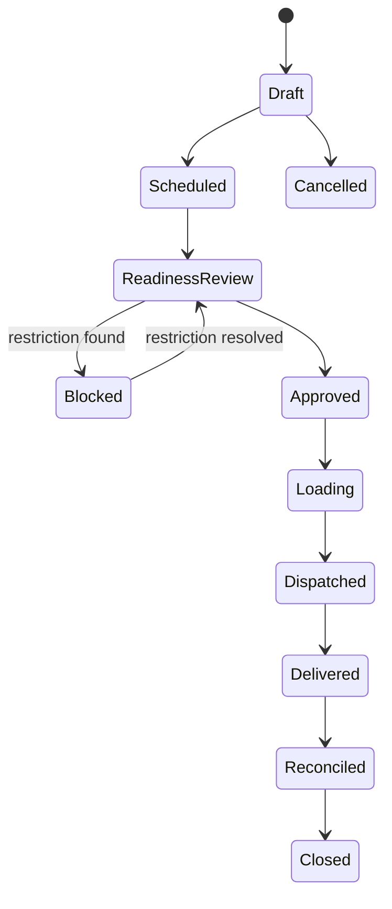

# 15 - MOD-20: Traceability, logistics, shipments and recall

Source: `documentation/Chicken_Coop_Management_System_Complete_Module_Operations_Blueprint.md` (lines 2243-2371)

# 20. MOD-15 - Traceability, logistics, shipments and recall

## 20.1 Purpose

Preserve bidirectional genealogy from source birds and input lots through flock, production lot and destination, and coordinate transfers/shipments with health, withdrawal, biosecurity and document controls.

## 20.2 Primary users

Farm manager, logistics/sales, quality, veterinarian, inventory, packing/production, customer service and auditors.

## 20.3 Capabilities

- Create durable flock, production, packing, sample, inventory and shipment lot identifiers.
- Preserve source-to-destination links for birds, feed, medicines, eggs/products, equipment or other tracked inputs.
- Plan and approve flock transfer, egg/product dispatch, harvest shipment or other movement.
- Record vehicle, driver/crew, destination, times, quantity, grade/weight, seals, certificates and receipt.
- Check active withdrawal, disease, biosecurity, quality, inventory and customer restrictions before release.
- Support barcode/RFID scanning and printable labels where operationally required.
- Reconcile dispatched and received quantity/weight and record claims/variance.
- Run backward and forward trace queries across a selected lot, flock, house and time window.
- Identify relevant feed/medicine lots, health cases, visitors, alerts, sanitation, equipment and shipments.
- Create recall/withdrawal cases, affected-lot list, destination list, communications, returned quantity and closure evidence.
- Produce controlled customer/auditor packs with redaction of unrelated information.

## 20.4 Shipment state model

## 20.5 Release checks

Before approval, the system evaluates:

- Source lot/flock status and available quantity.
- Active withdrawal hold or veterinary restriction.
- Biosecurity/outbreak movement restriction.
- Required welfare/harvest readiness and vehicle/crew controls.
- Required certificate, test result or customer specification.
- Packaging/storage/temperature requirement where applicable.
- Lot label and destination/customer authorization.
- No unresolved duplicate or reconciliation issue.

A warning may be overridable only if the rule explicitly permits it and records qualified approval. A hard block cannot be bypassed by ordinary users.

## 20.6 Trace and recall workflow

1. Select shipment, production lot, flock, inventory lot or date window.
2. Query immutable trace links in both directions.
3. Present source flock/house/time, inputs, health/withdrawal, sanitation, alerts, visitors/vehicles and all destinations.
4. Mark potentially affected lots/shipments and document the rationale.
5. Open recall/withdrawal case and assign communications/actions.
6. Track acknowledgement, return/hold/destruction and reconciliation.
7. Close only after scope, effectiveness and corrective action are approved.

## 20.7 Key entities

| Entity/table | Important fields |
|---|---|
| `trace_lots` | Lot code/type, source scope/time, quantity, status and label data. |
| `trace_links` | Parent lot/entity, child lot/entity, relationship type, quantity and event. |
| `customers` / `destinations` | Organization, address, approval/status, requirements and contacts. |
| `shipment_plans` | Source, destination, planned quantity/time, vehicle/crew and requirements. |
| `shipments` | Shipment code, status, dispatch/delivery, vehicle, destination and documents. |
| `shipment_lines` | Lot, quantity/weight, grade, unit and disposition. |
| `shipment_checks` | Rule/version, result, blocker/warning, reviewer and evidence. |
| `shipment_receipts` | Receiver, quantity/weight, temperature/condition, variance and signature. |
| `certificates` | Type, issuer, number, validity, scope and private file reference. |
| `recall_cases` | Trigger, scope, severity, status, owner, authority/customer refs and outcome. |
| `recall_actions` | Destination/lot, communication, hold/return/destruction, result and evidence. |

## 20.8 Business rules

- Released trace-lot genealogy is immutable; corrections append a superseding link/event.
- Shipment line quantity cannot exceed available released quantity without approved adjustment.
- Active hard restrictions block approval transactionally.
- The trace query displays data gaps and quality flags, not a false complete result.
- Export packs are generated server-side, access-controlled and logged.
- Private certificates use short-lived signed URLs.
- Recall actions and communications are retained under incident/legal hold rules.

## 20.9 UI and routes

- `/traceability/search`
- `/lots`
- `/shipments`
- `/shipments/[shipmentId]`
- `/transfers`
- `/recalls`
- `/recalls/[recallId]`
- `/customers`
- `/certificates`

## 20.10 Events and alerts

- `trace.lot_created`
- `shipment.blocked`
- `shipment.approved`
- `shipment.dispatched`
- `shipment.delivered`
- `shipment.variance_reported`
- `recall.opened`
- `recall.destination_notified`
- `recall.closed`

## 20.11 KPIs

Trace query time, genealogy completeness, shipment readiness failures, dispatch/receipt variance, on-time delivery, certificate completeness, recall notification completion and recall reconciliation.

## 20.12 Module acceptance gate

- A shipment can be traced backward to flock/house/time and relevant input/health/sanitation history.
- A source lot can be traced forward to every downstream shipment/destination.
- Withdrawal or outbreak hard restrictions block shipment approval.
- Recall drill produces affected-lot and destination lists within the agreed target and records all actions.

---

---

*Source: documentation/Chicken_Coop_Management_System_Complete_Module_Operations_Blueprint.md (lines 2243-2371)*
