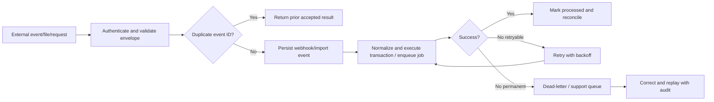

# 20 - MOD-25: Integrations, APIs, events and connector operations

Source: `documentation/Chicken_Coop_Management_System_Complete_Module_Operations_Blueprint.md` (lines 2755-2914)

# 25. MOD-20 - Integrations, APIs, events and connector operations

## 25.1 Purpose

Exchange trusted data with controllers, laboratories, ERP/accounting, messaging providers, weather services, identity systems, government portals, customers and other partners while preserving authentication, idempotency, traceability and supportability.

## 25.2 Primary users

Integration developers, system administrators, data/finance teams, device integrators, support and auditors.

## 25.3 Integration principles

- Prefer stable, versioned contracts and explicit ownership.
- Use Next.js Route Handlers for application-owned webhooks/APIs and Edge Functions for independent/multi-client/device endpoints.
- Verify identity/signature before parsing or acting on external messages.
- Require idempotency for every externally retried create/update event.
- Return success only after the event is durably accepted.
- Move slow/retry-heavy processing to a job/queue and make retries safe.
- Maintain connector health, error queue, replay, reconciliation and diagnostics.
- Never trust amounts, customer status, entitlement, lab result or device identity sent by an untrusted browser when an authoritative provider exists.
- Preserve raw received payload or hash according to privacy/retention needs, plus normalized result and processing history.

## 25.4 Integration patterns

| Pattern | Best use | Controls |
|---|---|---|
| Versioned REST/JSON API | Master data, transactions, queries and administration. | OAuth/OIDC, RLS, pagination, validation, idempotency, rate limits and compatibility policy. |
| Signed webhook | Lab result, ERP update, messaging status or partner notification. | Raw-body signature verification, unique event ID, durable acceptance, retry and replay. |
| MQTT/device messaging | Telemetry, device state and approved command/configuration. | Mutual identity, topic authorization, QoS, replay policy, sequence and device registry. |
| Modbus/OPC UA/vendor adapter | Existing farm controllers/meters. | Read-only first, mapping version, timeout, safe bounds and hardware test harness. |
| CSV/SFTP/file exchange | Legacy, government or partner batch. | Schema version, checksum, quarantine, validation, reconciliation and error report. |
| Identity federation | Enterprise user lifecycle. | OIDC/SAML, group mapping, MFA and emergency local admin process. |
| Outbound event/webhook | Alerts, flock changes, treatments, stock or shipments. | Signed payload, subscription scope, retries, DLQ and delivery audit. |

## 25.5 API resource groups

```text
/api/v1/organizations
/api/v1/sites
/api/v1/zones
/api/v1/houses
/api/v1/flocks
/api/v1/placements
/api/v1/daily-records
/api/v1/observations
/api/v1/mortality
/api/v1/health-cases
/api/v1/treatments
/api/v1/vaccinations
/api/v1/withdrawals
/api/v1/feed-deliveries
/api/v1/feed-consumption
/api/v1/water-readings
/api/v1/egg-collections
/api/v1/weight-samples
/api/v1/harvests
/api/v1/devices
/api/v1/telemetry
/api/v1/calibrations
/api/v1/alerts
/api/v1/incidents
/api/v1/inventory-lots
/api/v1/work-orders
/api/v1/tasks
/api/v1/visits
/api/v1/sanitation-events
/api/v1/shipments
/api/v1/trace-queries
/api/v1/reports
/api/v1/mobile/sync
```

The internal Next.js UI should call server queries/actions directly; it should not create unnecessary internal HTTP calls merely to reach the same database.

## 25.6 Event envelope

```json
{
  "event_id": "uuid",
  "event_type": "shipment.dispatched",
  "event_version": 1,
  "occurred_at": "2026-06-24T12:00:00Z",
  "organization_id": "uuid",
  "site_id": "uuid-or-null",
  "subject_type": "shipment",
  "subject_id": "uuid",
  "correlation_id": "uuid",
  "causation_id": "uuid-or-null",
  "data": {},
  "metadata": {
    "source": "web|mobile|device|integration|job",
    "actor_user_id": "uuid-or-null",
    "device_id": "uuid-or-null"
  }
}
```

Event payloads include only required fields and must not leak unrelated tenant or personal data.

## 25.7 Connector processing model



## 25.8 Key entities

| Entity/table | Important fields |
|---|---|
| `integrations` | Provider/type, organization/site scope, status, owner and configuration reference. |
| `integration_credentials` | Secret reference only, rotation/expiry and owner; never plaintext in ordinary tables/logs. |
| `webhook_events` | Provider event ID, signature result, received time, payload hash, status and result. |
| `outbound_events` | Event envelope, subscription, attempts, status and last error. |
| `connector_runs` | Connector, direction, window, counts, status, duration and reconciliation. |
| `import_jobs` / `import_rows` | File/schema, validation, accepted/rejected counts and row-level error. |
| `export_jobs` | Scope, requester, format, status, private file and expiry. |
| `dead_letter_events` | Source, payload reference, error class, attempts, owner and replay result. |
| `api_clients` | Client ID, organization, scopes, key/certificate reference, rate limit and status. |

## 25.9 Security rules

- API clients have explicit organization and permission scopes; RLS remains active for user-context calls.
- Secret/admin client use is restricted to reviewed ingestion/background functions with narrow purpose.
- Secrets live in platform secret management and never in `NEXT_PUBLIC_*`, source control or logs.
- Webhook signature verification uses raw request body where required.
- File imports are quarantined until schema and content validation pass.
- Connector support pages redact secrets and sensitive payload fields.
- External callbacks use separate staging and production endpoints/credentials.

## 25.10 UI and routes

- `/settings/integrations`
- `/settings/api-clients`
- `/integrations/runs`
- `/integrations/errors`
- `/integrations/imports`
- `/integrations/exports`
- `/integrations/webhooks`
- `/integrations/devices`

## 25.11 Module acceptance gate

- Duplicate webhook/device batches do not create duplicate business records.
- Invalid signatures are rejected before business processing.
- Retryable failures enter a visible queue and can be safely replayed.
- Connector reconciliation identifies missing, extra and failed records.
- API and export tests prove tenant/site isolation.

---

---

*Source: documentation/Chicken_Coop_Management_System_Complete_Module_Operations_Blueprint.md (lines 2755-2914)*
