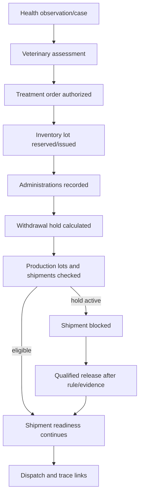

# Operations, Roadmap, Workflows, Screens, Delivery (Sections 35-40)

Source: `documentation/Chicken_Coop_Management_System_Complete_Module_Operations_Blueprint.md` (lines 3770-4510)

# 35. Implementation roadmap and delivery model

## 35.1 Phase 0 - Discovery and operating-model approval

Deliverables:

- Current-state process maps and worker observations.
- Production profile, scale and pilot decision.
- Farm/site/house, controller, sensor and network survey.
- Compliance/retention/health-governance matrix.
- Personas, RACI, target workflows and prioritized backlog.
- Data migration inventory and spreadsheet retirement plan.
- Signed architecture, edge boundary, success measures and support model.

Exit gate: product owner, operations, veterinary/quality, maintenance and IT approve scope and pilot.

## 35.2 Phase 1 - Platform foundation

- Repository, CI/CD and environments.
- Supabase Auth clients, proxy/session refresh and MFA.
- Organization/membership/site/house core schema.
- RLS helpers/policies and cross-tenant tests.
- Audit, configuration versioning and basic documents.
- Dashboard shell, design system and responsive navigation.

Exit gate: protected vertical slice passes RLS, migration and staging tests.

## 35.3 Phase 2 - Operational MVP

- Flock lifecycle and house readiness.
- Daily rounds, observations, tasks, handover and offline sync.
- Health/mortality/treatment/withdrawal.
- Feed/water and one production profile.
- Basic biosecurity, sanitation, inventory, maintenance and reports.
- Traceable correction, approval and period close.

Exit gate: selected flock lifecycle and offline acceptance pass with real users.

## 35.4 Phase 3 - Connected pilot

- Gateway/device registry and read-only telemetry.
- Current/aggregate environment dashboards.
- Sensor quality, calibration and device health.
- Alert rules, notification escalation and local/cloud drill.
- Selected controller/lab/messaging integrations.

Exit gate: sensor commissioning, outage replay, alarm delivery and local-control independence pass.

## 35.5 Phase 4 - Production hardening and rollout

- Performance, security and penetration testing.
- Backup/restore, support, observability and incident drills.
- Data migration, parallel run, training and site readiness.
- Production deployment and hypercare.
- Adoption review and paper/spreadsheet retirement.

Exit gate: go-live checklist and operational acceptance signed.

## 35.6 Phase 5 - Enterprise and advanced capability

- Additional production profiles and sites.
- ERP/lab/government/customer integrations.
- Barcode/RFID, advanced traceability and costing.
- Diagnostic/predictive analytics.
- Advisory or supervised control only after formal safety/change gates.

## 35.7 Recommended delivery team

| Role | Responsibility |
|---|---|
| Product owner | Scope, value, priority and acceptance. |
| Farm operations lead | Workflow, adoption, SOP and field decisions. |
| Veterinary/quality lead | Health, welfare, biosecurity and compliance. |
| Solution architect/tech lead | Architecture, module boundaries, security and delivery quality. |
| Full-stack developers | Next.js, Server Actions, Supabase, PWA and integrations. |
| Database/security engineer | Schema, RLS, migrations, performance and audit. |
| IoT/OT engineer | Gateway, adapters, controller boundary, commissioning and device security. |
| UX/product designer | Field research, workflows, responsive/offline and accessibility. |
| QA/automation engineer | Unit, SQL/RLS, E2E, offline, performance and regression. |
| Data/analytics engineer | KPI catalog, data quality, reports and model governance. |
| Change/training lead | Training, champions, support content and rollout. |

## 35.8 Change and adoption

- Co-design with workers in the house, not only managers in an office.
- Remove duplicate entry rather than adding a digital step on top of paper.
- Pilot with champions and provide immediate support feedback loops.
- Measure task burden and form duration; simplify low-value fields.
- Use fair performance metrics with context and data-quality visibility.
- Train by role and real scenario, including offline and emergency procedures.
- Update SOPs and responsibilities before removing legacy processes.

## 35.9 Principal risks and controls

| Risk | Failure mode | Control |
|---|---|---|
| Alarm fatigue | Users ignore false/excess alerts. | Duration/hysteresis, quality checks, grouping, ownership and tuning KPI. |
| Bad sensor data | Wrong decisions from drift/placement/failure. | Commissioning, calibration, redundancy, quality flags and manual verification. |
| Cloud dependence | Outage threatens operation. | Local controllers/alarms, offline PWA, edge buffer and manual SOPs. |
| User resistance | Incomplete/delayed records. | Field co-design, simple forms, remove duplication and champions. |
| Over-automation | Unsafe control or less human observation. | Maturity levels, interlocks, approval, hazard analysis, rollback and drills. |
| Scope creep | ERP/processing/AI delay core workflows. | MVP boundary, staged roadmap and integration-first policy. |
| Vendor lock-in | Data/controller/cloud cannot be changed. | Open APIs, export, adapters and contractual ownership/exit. |
| Cyber incident | Unauthorized control, ransomware or tampering. | Segmentation, MFA, certificates, audit, backup and incident plan. |
| Regulatory mismatch | Missing record or unsuitable threshold. | Country configuration, qualified review, effective-dated rules and testing. |
| AI error | False recommendation or unsafe reliance. | Advisory use, validation, confidence, human review, drift and fallback. |

---
# 36. Cross-module operational workflow specifications

## 36.1 House readiness and flock placement

| Step | Responsible role | Module/action | Transaction or gate |
|---|---|---|---|
| 1. Close previous flock | Farm manager | MOD-03 closeout | Bird/output/inventory reconciliation approved. |
| 2. Start sanitation | Quality/sanitation | MOD-11 sanitation event | House status becomes sanitation-in-progress. |
| 3. Complete maintenance/calibration | Maintenance | MOD-13 work/calibration | Critical open work and overdue calibration resolved or approved exception. |
| 4. Verify environment/supplies | Supervisor/manager | MOD-05/MOD-07/MOD-12 | Controller/device status, feed/water and required stock verified. |
| 5. Release house | QA/manager | MOD-11 release approval | Failed verification blocks release. |
| 6. Approve flock plan/readiness | Manager/vet/quality | MOD-03 readiness gate | Profile compatibility, documents and health plan confirmed. |
| 7. Receive birds | Supervisor | MOD-03 placement | Source, transport, quantity, DOA and observations captured. |
| 8. Activate flock | System/manager | MOD-03 | Flock state active; schedules/forms/rules generated. |
| 9. Notify team | System | MOD-14 | Due tasks, shifts and handover updated. |

## 36.2 Daily round to corrective action

| Step | Behavior |
|---|---|
| Start | Scan house; load active flock, current alerts, due tasks, restrictions, recent unresolved findings and correct form version. |
| Observe | Worker records bird behavior and visible condition before entering detailed values. |
| Validate | Client and server validate required fields, units, ranges and event context. |
| Classify exception | Finding is categorized as health, environment, feed/water, equipment, biosecurity, production or other. |
| Create linked work | One action creates task, health case, work order, incident or alert acknowledgement with copied context. |
| Immediate response | Worker records action and escalation, including photos/notes. |
| Save/sync | Local record receives UUID and sync state; server accepts idempotently. |
| Review | Supervisor sees missing, late, abnormal, corrected and unresolved items. |
| Close | Period completeness and required approvals lock the record. |

## 36.3 Treatment, withdrawal and shipment release



Transaction requirements:

- Authorizing a treatment and reserving/validating stock may use a PostgreSQL transaction/function.
- Each administration creates/updates withdrawal hold in the same consistent operation.
- Shipment readiness reads current hold/restriction under the same transaction used to approve release to prevent race conditions.
- Corrections to administration trigger recalculation and review of affected lots/shipments.

## 36.4 Environment alert to maintenance resolution

1. Edge/local controller detects critical condition and performs approved local alarm/control.
2. Telemetry batch reaches cloud with value, quality and device context.
3. Cloud rule opens/correlates alert and routes notifications.
4. Worker acknowledges and inspects birds/equipment.
5. If equipment fault is suspected, work order is created from the alert.
6. Technician records workaround/repair and functional verification.
7. Alert remains open until recovery condition and verification evidence are satisfied.
8. Repeated events create root-cause/corrective action and rule/sensor review.

## 36.5 Feed receipt to flock consumption and costing

1. Supplier delivery is received and inspected.
2. Inventory lot/feed delivery is quarantined or released.
3. Released lot enters silo/location through stock transaction.
4. Feed movements/consumption allocate quantities to flock/house/time.
5. Variance is reconciled against silo readings and target.
6. Cost entry is generated from purchase/ERP or item cost and allocated to flock.
7. Traceability links feed lots to affected flock/production time.

## 36.6 Production lot to shipment and recall

1. Egg collection/packing or broiler harvest creates a production/trace lot.
2. Source flock, house and time window are immutable links.
3. Shipment checks health/withdrawal, biosecurity, quality, quantity and documents.
4. Dispatch creates destination trace link and records vehicle/crew/time.
5. Receipt reconciles quantity/condition.
6. Recall query traverses source and destination links plus relevant input/health/sanitation/visitor events.
7. Recall case records notification, hold/return/destruction and effectiveness.

## 36.7 Period close and correction

- Daily close checks required rounds, bird balance, production, feed/water, mortality, critical alerts and unresolved exceptions.
- Weekly review examines trends, inventory, maintenance, biosecurity and data quality.
- Flock close performs final reconciliations and locks the cycle.
- A locked record correction creates a request, new version/event and approval; the original is retained.
- Reports show corrected values and indicate that a correction occurred.

---

# 37. Consolidated screen inventory and navigation

## 37.1 Main navigation

| Area | Primary screens |
|---|---|
| Home / My work | Role dashboard, critical alerts, today's rounds/tasks, weather/power, restrictions, handover and offline queue. |
| Portfolio / sites | Site map/list, house cards, exceptions, comparisons and status. |
| House / flock | Environment, bird count/age, feed/water, production, health, tasks, devices, documents and timeline. |
| Daily operations | Guided rounds, observations, handovers, period close and corrections. |
| Environment | Current values, trend, zones, target bands, devices, calibration and controller status. |
| Alerts / incidents | Prioritized queue, acknowledgement, checklist, escalation, evidence, root cause and drills. |
| Health / welfare | Observations, cases, samples/results, treatments, vaccinations, mortality, welfare and withdrawal. |
| Production | Egg collections/grades/lots, weights/growth/harvest or breeder/hatchery records. |
| Feed / water | Deliveries, silos, consumption, water sources/readings/tests and sanitation. |
| Biosecurity | Visitor/vehicle, access events, audits, incidents, outbreak mode and plans. |
| Sanitation / waste | Cleaning events, release, litter, waste, carcass disposal and pest. |
| Inventory / procurement | Stock, lots, receiving, issue, transfer, count, expiry, requisition, PO and suppliers. |
| Maintenance | Assets, work orders, preventive plans, calibration, critical tests, spares and utilities. |
| Workforce / knowledge | Tasks, schedule, teams, training, competencies, SOPs, handovers and announcements. |
| Trace / logistics | Lots, shipments, transfers, certificates, trace search and recalls. |
| Cost / sustainability | Cost statement, allocations, budgets and resource intensity. |
| Reports / analytics | Standard reports, schedules, exports, KPI definitions, quality and models. |
| Administration | Users/roles, structure, profiles, forms, rules, integrations, audit and retention. |

## 37.2 House status card minimum content

- House name/code and active flock.
- Production type, flock age/stage and live-bird estimate.
- Environment status and data freshness.
- Feed/water availability and recent variance.
- Production vs target.
- Mortality/health exception.
- Critical asset/power status.
- Active alert count by severity.
- Due/overdue rounds/tasks.
- Biosecurity or withdrawal restriction.
- Last synchronization/device health where relevant.

## 37.3 Status presentation rules

- Always pair color with text/icon.
- Display `current`, `stale`, `missing`, `estimated`, `manual`, `sensor-quality-failed` states.
- Display event time and last receive/sync time where delay matters.
- Use a consistent severity hierarchy across modules.
- Do not hide a blocked/withdrawal/outbreak status behind a secondary tab.
- Provide direct action from exception cards to the responsible workflow.

## 37.4 Simplified permission matrix

| Action/data | Worker | Supervisor | Vet/QA | Maintenance | Manager | Admin/Auditor |
|---|---|---|---|---|---|---|
| Daily/production records | Create in scope | Review/correct | Read | Read | Approve/export | Configure/read per scope |
| Health observation | Create | Review | Manage/approve | Limited read | Read | Configure/audit |
| Treatment/medicine | Administer if authorized | Verify | Order/approve/release | No | Policy/read | Catalog/audit |
| Environment/alerts | Read/ack/action | Manage | Read/advise | Equipment response | Approve rules | Configure/audit |
| Controller command | No or bounded local | Bounded if authorized | Consult | Execute | Approve | Technical admin/audit |
| Inventory | Issue/use | Review | Controlled-item review | Parts use | Approve | Configure/audit |
| Biosecurity | Record | Site-process approval | Manage/audit | Contractor entry | Exception approval | Configure/audit |
| Reports/export | Own scope | House/site | Health/QA scope | Asset scope | Authorized portfolio | Purpose-limited system/audit |

Final permissions must be encoded as capability plus scope and enforced by RLS/database rules.

---

# 38. Requirement traceability map

| Requirement prefix | Scope | Primary module(s) |
|---|---|---|
| `ADM` | Organization, sites and master data | MOD-01, MOD-02, MOD-19 |
| `FLK` | Flock planning and lifecycle | MOD-03 |
| `DLY` | Daily rounds and operational records | MOD-04, MOD-14 |
| `ENV` | Environment, devices and automation | MOD-05, MOD-06, MOD-13 |
| `FWT` | Feed, water and nutrition | MOD-07, MOD-12 |
| `PRD` | Production | MOD-08 |
| `HLT` | Health, welfare and veterinary | MOD-09 |
| `BIO` | Biosecurity and compliance | MOD-10 |
| `SAN` | Sanitation, litter, waste and pest | MOD-11 |
| `INV` | Inventory, purchasing and suppliers | MOD-12 |
| `MNT` | Assets, maintenance and utilities | MOD-13 |
| `WFM` | Workforce, tasks and training | MOD-14, MOD-18 |
| `TRC` | Traceability, shipments and costing | MOD-15, MOD-16 |
| `ALT` | Alerts, incidents and corrective action | MOD-06 |
| `RPT` | Dashboards, reports and analytics | MOD-17 |
| `MOB` | Mobile, usability and administration | MOD-04, Sections 28-29, MOD-19 |
| `INT` | Integration and platform services | MOD-20 |
| `SEC` | Security, privacy and auditability | MOD-01, MOD-18, MOD-19, Sections 27 and 34 |

The following catalog is the baseline backlog. Each implementation item should add owner, release, estimate, acceptance criteria, test case and trace to design/migration/API where applicable.

# 38.1 Detailed requirements catalog

Priority uses MoSCoW: Must = required for the baseline go-live of the relevant scope; Should = high-value near-term; Could = optional/advanced. A project backlog should add acceptance criteria, owner, release, estimate and traceability to test cases.

### 38.1.1 Organization, sites and master data

| **ID**  | **Requirement**                                                                                                                                          | **Priority** |
|---------|----------------------------------------------------------------------------------------------------------------------------------------------------------|--------------|
| ADM-001 | Support one or many organizations, sites, farms, biosecurity zones, houses/coops and storage areas in a clear hierarchy.                                 | Must         |
| ADM-002 | Allow each house to store capacity, dimensions, housing system, production purpose, equipment, floor plan, geographic location and operational status.   | Must         |
| ADM-003 | Support configurable production profiles for layers, broilers, breeders and simplified smallholder operations without mixing incompatible workflows.     | Must         |
| ADM-004 | Maintain versioned master data for breeds/strains, feed programs, units, suppliers, products, grades, causes, checklist templates and regulatory fields. | Must         |
| ADM-005 | Support multiple languages, time zones, currencies and SI/imperial units with a single canonical unit in storage.                                        | Should       |
| ADM-006 | Assign users, contractors and devices to permitted organizations, sites, zones and houses.                                                               | Must         |
| ADM-007 | Generate durable QR/barcode identifiers for houses, assets, inventory lots, flocks, samples and shipment lots.                                           | Should       |

### 38.1.2 Flock planning and lifecycle

| **ID**  | **Requirement**                                                                                                                                      | **Priority** |
|---------|------------------------------------------------------------------------------------------------------------------------------------------------------|--------------|
| FLK-001 | Create a flock plan with production type, source, breed/strain, sex, hatch date, arrival date, planned quantity, target house and expected end date. | Must         |
| FLK-002 | Record source certificates, hatchery/breeder details, transport information, health status, vaccinations and placement acceptance checks.            | Must         |
| FLK-003 | Require a configurable house-readiness gate covering sanitation, maintenance, environmental readiness, supplies and approval before placement.       | Must         |
| FLK-004 | Record actual placement counts, dead-on-arrival, discrepancies and initial observations with electronic sign-off.                                    | Must         |
| FLK-005 | Calculate age and production stage automatically and apply effective-dated target curves, schedules and alert profiles.                              | Must         |
| FLK-006 | Support flock transfers, splits, merges and partial removals while preserving lineage and quantity reconciliation.                                   | Should       |
| FLK-007 | Prevent a house from carrying overlapping active flocks unless the housing model explicitly permits it.                                              | Must         |
| FLK-008 | Support depopulation/harvest, flock closure, final reconciliation, performance review and house release to sanitation.                               | Must         |
| FLK-009 | Lock approved historical periods and require reasoned, auditable corrections rather than destructive edits.                                          | Must         |
| FLK-010 | Allow comparison against breed/vendor, company and site target profiles with source and version visible.                                             | Should       |

### 38.1.3 Daily rounds and operational records

| **ID**  | **Requirement**                                                                                                                 | **Priority** |
|---------|---------------------------------------------------------------------------------------------------------------------------------|--------------|
| DLY-001 | Provide configurable daily/shift inspection forms by production type, age/stage, house and risk level.                          | Must         |
| DLY-002 | Capture bird count, mortality, culls, behavior, litter, feed, water, equipment, environment, egg/growth data, notes and photos. | Must         |
| DLY-003 | Support offline mobile entry with local timestamp, user, device, house and sync status.                                         | Must         |
| DLY-004 | Display current alerts, due tasks, previous unresolved findings and relevant SOPs during the round.                             | Must         |
| DLY-005 | Convert a finding into a task, health event, work order, biosecurity incident or alert acknowledgement without re-entry.        | Must         |
| DLY-006 | Require supervisor review for late, missing, implausible or corrected daily records.                                            | Should       |
| DLY-007 | Calculate completion, timeliness and data-quality scores by worker, house and site.                                             | Should       |

### 38.1.4 Environmental monitoring, devices and automation

| **ID**  | **Requirement**                                                                                                                                                                        | **Priority** |
|---------|----------------------------------------------------------------------------------------------------------------------------------------------------------------------------------------|--------------|
| ENV-001 | Maintain a device and sensor registry with type, serial number, firmware, location, calibration, accuracy, status and ownership.                                                       | Must         |
| ENV-002 | Ingest manual and automatic readings for temperature, relative humidity, ammonia, carbon dioxide, static pressure, airflow, light, water, feed, power and other configured parameters. | Must         |
| ENV-003 | Store time-series data with source timestamp, receive timestamp, unit, quality flag and device health context.                                                                         | Must         |
| ENV-004 | Apply age/stage-specific target bands and rule profiles rather than hardcoded universal thresholds.                                                                                    | Must         |
| ENV-005 | Detect threshold, duration, rate-of-change, no-data, sensor disagreement and derived-risk conditions.                                                                                  | Must         |
| ENV-006 | Visualize current conditions, trends, compliance percentage, house zones and sensor health in one view.                                                                                | Must         |
| ENV-007 | Support multiple sensors per critical parameter and configurable voting or fallback logic.                                                                                             | Should       |
| ENV-008 | Provide calibration, reference-check and replacement workflows with certificate or evidence attachment.                                                                                | Must         |
| ENV-009 | Integrate existing environmental controllers in read-only mode before enabling supervised commands.                                                                                    | Should       |
| ENV-010 | Keep life-support control and critical fail-safe logic local; cloud unavailability must not stop ventilation, heating, cooling or alarms.                                              | Must         |
| ENV-011 | Log manual overrides, recipe/configuration changes and remote-control actions with limits, approver, duration and rollback.                                                            | Must         |
| ENV-012 | Monitor mains power, generator, UPS, controller communications, fan/heater/pump status and gateway connectivity.                                                                       | Must         |

### 38.1.5 Feed, water and nutrition

| **ID**  | **Requirement**                                                                                                                   | **Priority** |
|---------|-----------------------------------------------------------------------------------------------------------------------------------|--------------|
| FWT-001 | Maintain feed formulations/products, phase programs, supplier lots, delivery documents, quality results and storage locations.    | Must         |
| FWT-002 | Record feed deliveries, silo/bin levels, transfers, wastage, stock adjustments and allocation to flock/house.                     | Must         |
| FWT-003 | Capture feed consumption manually or from scales/meters and compare with age/stage targets and recent baseline.                   | Must         |
| FWT-004 | Capture water flow/consumption and pressure; detect no-flow, leaks, unusual ratios and abrupt changes.                            | Must         |
| FWT-005 | Track water source, treatment, quality tests, sanitation/flush schedules and corrective actions.                                  | Must         |
| FWT-006 | Calculate water-to-feed ratio, feed per bird, cumulative feed, days of stock and predicted depletion.                             | Should       |
| FWT-007 | Support nutrition-phase changes with approval, effective time and automatic task/checklist generation.                            | Should       |
| FWT-008 | Link feed and water deviations to health, environment and production analytics without presenting them as a veterinary diagnosis. | Should       |

### 38.1.6 Production management

| **ID**  | **Requirement**                                                                                                                         | **Priority** |
|---------|-----------------------------------------------------------------------------------------------------------------------------------------|--------------|
| PRD-001 | For layers, record egg collections by house, time/round, grade, weight class, clean/dirty/cracked/reject quantity and collector.        | Must         |
| PRD-002 | Create egg packing/storage lots and preserve traceability from shipment back to collection, house and flock.                            | Must         |
| PRD-003 | Calculate hen-day, hen-housed, egg mass, average egg weight, grade yield, seconds and feed per dozen/egg mass.                          | Must         |
| PRD-004 | For broilers, record body-weight samples, sample method, uniformity, coefficient of variation, growth, feed conversion and livability.  | Must         |
| PRD-005 | For breeders, record hatching egg categories, floor eggs, fertility/hatchability inputs and hatchery handoff.                           | Should       |
| PRD-006 | Maintain age-based target curves for production, growth, consumption, mortality and uniformity with visible source/version.             | Must         |
| PRD-007 | Generate forecasts for egg output, feed demand, harvest weight/date and inventory needs with confidence or assumption notes.            | Should       |
| PRD-008 | Support harvest/collection plans, crew and vehicle readiness, welfare checks, counts/weights, processor/customer receipt and variances. | Must         |
| PRD-009 | Compare houses, flocks, sites and periods while controlling for production type, age, breed and environmental context.                  | Should       |
| PRD-010 | Record closeout losses, condemnations or customer/processor feedback when available.                                                    | Could        |

### 38.1.7 Health, welfare and veterinary management

| **ID**  | **Requirement**                                                                                                                                     | **Priority** |
|---------|-----------------------------------------------------------------------------------------------------------------------------------------------------|--------------|
| HLT-001 | Capture health observations with signs, severity, affected estimate, location, onset, behavior, photos/video and immediate action.                  | Must         |
| HLT-002 | Provide triage and escalation workflows that direct users to qualified veterinary review; the system must not autonomously diagnose or prescribe.   | Must         |
| HLT-003 | Record veterinary assessments, diagnoses, differential diagnoses, recommendations and case status.                                                  | Must         |
| HLT-004 | Manage sampling, chain of custody, laboratory submission, results, interpretation and linked corrective action.                                     | Should       |
| HLT-005 | Schedule vaccinations and preventive programs by flock age/stage with product, lot, route, dose, administrator and completion evidence.             | Must         |
| HLT-006 | Require authorized treatment orders for medicines and record product lot, dose, route, duration, administrator and response.                        | Must         |
| HLT-007 | Calculate egg/meat withdrawal end dates and block or warn against affected shipment until released by an authorized role.                           | Must         |
| HLT-008 | Record mortality and culling by time, count, cause/category, location, disposal method and necropsy result.                                         | Must         |
| HLT-009 | Detect unusual mortality, morbidity, intake, behavior or production patterns and open a review workflow.                                            | Must         |
| HLT-010 | Support isolation/quarantine, restricted movement, enhanced surveillance and outbreak-mode controls.                                                | Must         |
| HLT-011 | Maintain welfare assessments such as gait, injuries, contact dermatitis, feather condition, behavior and humane intervention records as applicable. | Should       |
| HLT-012 | Produce antimicrobial and medicine-use reports by flock, product, indication, prescriber and outcome.                                               | Should       |

### 38.1.8 Biosecurity and compliance

| **ID**  | **Requirement**                                                                                                                          | **Priority** |
|---------|------------------------------------------------------------------------------------------------------------------------------------------|--------------|
| BIO-001 | Store a version-controlled written biosecurity plan with owner, approval, review date, zones, procedures and emergency contacts.         | Must         |
| BIO-002 | Pre-register visitors/contractors and capture contact with other poultry, recent farm visits, purpose, approved areas and risk decision. | Must         |
| BIO-003 | Record visitor and vehicle arrival/departure, PPE, clothing/footwear, cleaning/disinfection and escort.                                  | Must         |
| BIO-004 | Enforce clean-to-dirty movement order, house access restrictions and quarantine rules through tasks and warnings.                        | Should       |
| BIO-005 | Track farm-dedicated tools/equipment and cleaning/disinfection before cross-house or cross-site movement.                                | Must         |
| BIO-006 | Schedule and document wild-bird, rodent, insect and other pest controls, findings, bait maps and corrective action.                      | Must         |
| BIO-007 | Record source assurance for birds, feed, litter, water, packaging and high-risk supplies.                                                | Should       |
| BIO-008 | Conduct biosecurity audits with scored questions, evidence, findings, owners, due dates and verification.                                | Must         |
| BIO-009 | Track required biosecurity training and acknowledgements for employees, visitors and contractors.                                        | Must         |
| BIO-010 | Support country/site-specific compliance profiles, inspections and exports without claiming legal compliance automatically.              | Must         |

### 38.1.9 Sanitation, litter, waste and pest control

| **ID**  | **Requirement**                                                                                                                             | **Priority** |
|---------|---------------------------------------------------------------------------------------------------------------------------------------------|--------------|
| SAN-001 | Create between-flock sanitation plans covering depopulation, litter/manure removal, dry clean, wet wash, disinfection, drying and downtime. | Must         |
| SAN-002 | Record chemical/product, batch, dilution or concentration, contact time, applicator, area, temperature and safety evidence.                 | Must         |
| SAN-003 | Support environmental sampling/swabs, laboratory results and release approval before placement.                                             | Should       |
| SAN-004 | Track litter condition and actions such as top-up, turning, treatment, removal, storage and destination.                                    | Must         |
| SAN-005 | Require dead-bird collection at least daily in the configured checklist and record secure disposal route.                                   | Must         |
| SAN-006 | Track manure, carcass, waste-water, chemical container and general waste volumes, storage and disposal documents.                           | Should       |
| SAN-007 | Link pest-control findings to inventory, building repairs, feed spills and biosecurity corrective actions.                                  | Should       |

### 38.1.10 Inventory, purchasing and suppliers

| **ID**  | **Requirement**                                                                                                          | **Priority** |
|---------|--------------------------------------------------------------------------------------------------------------------------|--------------|
| INV-001 | Maintain item masters for feed, medicines, vaccines, disinfectants, PPE, litter, packaging, spare parts and consumables. | Must         |
| INV-002 | Track lot/batch, expiry, status, storage conditions, certificates, quantity and location.                                | Must         |
| INV-003 | Support receiving, inspection, quarantine, release/reject, transfer, issue, return, adjustment and disposal.             | Must         |
| INV-004 | Use FEFO for expiring controlled items and warn on shortages, expiry and unsuitable storage.                             | Must         |
| INV-005 | Tie consumption to flock, house, task, treatment, sanitation event or work order.                                        | Must         |
| INV-006 | Support minimum/maximum stock, reorder suggestions, requisitions, approvals and purchase orders or ERP integration.      | Should       |
| INV-007 | Provide cycle counts, stock variance, wastage and shrinkage reporting.                                                   | Should       |
| INV-008 | Maintain supplier qualification, certificates, performance, incidents and approved-item scope.                           | Should       |

### 38.1.11 Assets, maintenance and utilities

| **ID**  | **Requirement**                                                                                                                      | **Priority** |
|---------|--------------------------------------------------------------------------------------------------------------------------------------|--------------|
| MNT-001 | Maintain an asset register with hierarchy, location, criticality, specifications, warranty, manuals and spare parts.                 | Must         |
| MNT-002 | Generate preventive maintenance by calendar, runtime, cycle count or condition.                                                      | Must         |
| MNT-003 | Create work orders from inspections, alarms, failures or planned work with priority, safety steps, labor, parts and downtime.        | Must         |
| MNT-004 | Track inspection and test records for generators, alarms, fans, heaters, pumps, cooling, feed/water systems and emergency equipment. | Must         |
| MNT-005 | Manage sensor and instrument calibration with due dates, results, out-of-tolerance impact assessment and certificates.               | Must         |
| MNT-006 | Require controlled manual override and return-to-service tests for critical equipment.                                               | Must         |
| MNT-007 | Support contractor access, permits, lockout/tagout or local safety controls as applicable.                                           | Should       |
| MNT-008 | Report uptime, downtime, mean time to repair, preventive completion and repeat failure.                                              | Should       |

### 38.1.12 Workforce, tasks and training

| **ID**  | **Requirement**                                                                                         | **Priority** |
|---------|---------------------------------------------------------------------------------------------------------|--------------|
| WFM-001 | Create shifts, recurring tasks, role-based checklists and assignments by site/house.                    | Must         |
| WFM-002 | Prioritize work using alerts, welfare risk, due time, location and staff competence.                    | Must         |
| WFM-003 | Provide electronic completion with notes, photos, measurements, signatures and supervisor verification. | Must         |
| WFM-004 | Track competencies, required training, expiry, assessment and authorization for high-risk tasks.        | Must         |
| WFM-005 | Notify users of due, overdue, reassigned and escalated tasks through configured channels.               | Must         |
| WFM-006 | Support contractors and temporary workers with limited time/location access and required induction.     | Should       |
| WFM-007 | Report workload, completion, overdue items, repeat findings and training gaps.                          | Should       |

### 38.1.13 Traceability, shipments and operational costing

| **ID**  | **Requirement**                                                                                                                              | **Priority** |
|---------|----------------------------------------------------------------------------------------------------------------------------------------------|--------------|
| TRC-001 | Preserve genealogy from source birds and input lots through flock, production lot and shipment.                                              | Must         |
| TRC-002 | Create shipment/transfer records with lot, quantity, grade/weight, vehicle, destination, certificates, timestamps and receipt.               | Must         |
| TRC-003 | Run a recall/trace query in both directions: source-to-destination and shipment-to-source.                                                   | Must         |
| TRC-004 | Identify medicines, feed, visitors, health events, alarms and sanitation records relevant to a selected lot or date window.                  | Must         |
| TRC-005 | Support barcode/RFID scanning and printable labels where operations require them.                                                            | Should       |
| TRC-006 | Track basic operational costs by flock/house for feed, chicks/pullets, medicine, labor, energy, maintenance and losses.                      | Should       |
| TRC-007 | Integrate with accounting/ERP for invoices, payments, general ledger and payroll rather than duplicating a full financial system by default. | Should       |
| TRC-008 | Export an auditor/customer traceability pack with controlled access and redaction of unrelated data.                                         | Should       |

### 38.1.14 Alerts, incidents and corrective action

| **ID**  | **Requirement**                                                                                                                | **Priority** |
|---------|--------------------------------------------------------------------------------------------------------------------------------|--------------|
| ALT-001 | Support Information, Warning, Critical and Emergency severities with site-specific definitions.                                | Must         |
| ALT-002 | Combine threshold, duration, hysteresis, schedule, rate-of-change, age/stage and cross-sensor context.                         | Must         |
| ALT-003 | Route notifications by role, site, shift, severity and availability using in-app, SMS, email, voice or messaging integrations. | Must         |
| ALT-004 | Require acknowledgement, owner, response estimate, corrective action and closure evidence.                                     | Must         |
| ALT-005 | Escalate unacknowledged or unresolved alerts and verify delivery receipts where the channel supports it.                       | Must         |
| ALT-006 | Provide approved maintenance mode, suppression, grouping, cooldown and duplicate correlation with expiry and audit.            | Must         |
| ALT-007 | Operate local siren/strobe/controller alarms independently from the cloud for critical conditions.                             | Must         |
| ALT-008 | Create incident records for disease, welfare, food safety, cybersecurity, fire, flood, power and major equipment failure.      | Must         |
| ALT-009 | Report response time, resolution time, recurrence, nuisance alarms and root causes for continuous improvement.                 | Should       |

### 38.1.15 Dashboards, reports and analytics

| **ID**  | **Requirement**                                                                                                  | **Priority** |
|---------|------------------------------------------------------------------------------------------------------------------|--------------|
| RPT-001 | Provide role-based portfolio, site, house, flock and task dashboards with clear exceptions and data freshness.   | Must         |
| RPT-002 | Calculate a governed KPI catalog with formula, unit, source fields, owner, frequency and version.                | Must         |
| RPT-003 | Produce daily, weekly, flock-cycle, management, veterinary, biosecurity, inventory and maintenance reports.      | Must         |
| RPT-004 | Allow scheduled delivery and export to PDF, spreadsheet/CSV and API while respecting permissions.                | Must         |
| RPT-005 | Compare against target, previous flock, site average and selected peer groups with appropriate context.          | Should       |
| RPT-006 | Display missing data, sensor gaps, corrections and confidence/quality flags alongside analytics.                 | Must         |
| RPT-007 | Offer governed self-service filters and report templates without exposing raw database access to ordinary users. | Should       |

### 38.1.16 Mobile, usability and administration

| **ID**  | **Requirement**                                                                                                            | **Priority** |
|---------|----------------------------------------------------------------------------------------------------------------------------|--------------|
| MOB-001 | Provide responsive web and Android/PWA mobile experiences optimized for low bandwidth and intermittent connectivity.       | Must         |
| MOB-002 | Allow at least seven days of offline forms/tasks/SOPs on mobile and reconcile conflicts predictably on reconnect.          | Must         |
| MOB-003 | Use large touch targets, high contrast, clear status, minimal typing, scanning, defaults and optional voice/photo capture. | Must         |
| MOB-004 | Show offline, unsynced, stale and failed states explicitly; never imply data was saved or sent when it was not.            | Must         |
| MOB-005 | Support configurable terminology, units, language and simple/advanced mode by user role.                                   | Should       |
| MOB-006 | Provide delegated administration for users, roles, master data, thresholds, schedules, forms and notification policies.    | Must         |
| MOB-007 | Version and approve high-impact configuration changes, including target profiles, medication catalogs and control recipes. | Must         |

### 38.1.17 Integration and platform services

| **ID**  | **Requirement**                                                                                                                   | **Priority** |
|---------|-----------------------------------------------------------------------------------------------------------------------------------|--------------|
| INT-001 | Expose versioned REST/JSON APIs for master and transaction data with OAuth/OIDC, pagination, idempotency and rate limits.         | Must         |
| INT-002 | Use an IoT messaging protocol such as MQTT and support common farm interfaces such as Modbus and OPC UA through adapters.         | Should       |
| INT-003 | Publish signed webhooks/events for alerts, flock changes, treatments, inventory and shipments.                                    | Should       |
| INT-004 | Integrate with identity, messaging, weather, laboratories, accounting/ERP, controller vendors and government portals as required. | Should       |
| INT-005 | Support validated CSV/spreadsheet imports and complete data export for migration and vendor portability.                          | Must         |
| INT-006 | Provide connector health, error queue, retries, replay, reconciliation and support diagnostics.                                   | Must         |
| INT-007 | Maintain developer documentation, sandbox/test credentials and a compatibility/version policy.                                    | Should       |

### 38.1.18 Security, privacy and auditability

| **ID**  | **Requirement**                                                                                                                         | **Priority** |
|---------|-----------------------------------------------------------------------------------------------------------------------------------------|--------------|
| SEC-001 | Enforce least-privilege role-based access by tenant/organization, site, zone, house and data type.                                      | Must         |
| SEC-002 | Support MFA and optional enterprise SSO; prohibit shared accounts for accountable actions.                                              | Must         |
| SEC-003 | Encrypt data in transit and at rest, protect secrets and rotate credentials/certificates.                                               | Must         |
| SEC-004 | Give every gateway/device a unique identity; disable default credentials and log provisioning, ownership and firmware.                  | Must         |
| SEC-005 | Maintain tamper-evident audit logs for authentication, data changes, approvals, exports, configuration and control actions.             | Must         |
| SEC-006 | Separate farm operational technology from business/user networks and restrict remote access to approved, time-limited, logged sessions. | Must         |
| SEC-007 | Provide tested backups, point-in-time recovery, disaster recovery and edge store-and-forward.                                           | Must         |
| SEC-008 | Operate vulnerability, dependency, firmware, patch and supplier-risk management with defined response times.                            | Must         |
| SEC-009 | Minimize and govern worker, visitor, camera and location data with transparent purpose, access, retention and deletion rules.           | Must         |


---

# 39. Operational and delivery appendices

## 39.1 Sample daily house inspection checklist

| Section | Minimum checks/fields |
|---|---|
| Context | House/flock, date/time, age/stage, worker, shift, weather/house mode and offline status. |
| Observe before entry | Bird distribution, vocalization, activity, panting/huddling, visible distress and unusual odor/noise. |
| Bird count and health | Live estimate, mortality/culls, sick/injured birds, droppings, injuries, feather/skin/feet/gait where applicable. |
| Environment | Temperature/RH, air quality, airflow/pressure, light, litter moisture/caking and sensor/controller status. |
| Feed and water | Availability, line operation, consumption/variance, spills/leaks, pressure, treatment/quality and stock days. |
| Production | Egg round/grade/defects or weight sample/growth; investigate abnormal change. |
| Equipment/utilities | Fans, heaters, cooling, pumps, augers, conveyors, power, generator, alarms and doors. |
| Biosecurity | Entry/PPE, visitors/vehicles, pests/wild birds, tool movement, spills and zone integrity. |
| Actions | Immediate correction, task/work order, health event, alert acknowledgement, escalation and evidence. |
| Close | Unresolved items, handover, supervisor review and signature. |

## 39.2 Sample visitor and vehicle form

- Visitor/driver identity, organization, contact, sponsor and purpose.
- Date/time, vehicle registration, planned site/zone/house and expected departure.
- Configured recent poultry, wild-bird, market, processing, farm-contact, own-bird, illness or restricted-exposure questions.
- Approval decision and restrictions.
- PPE/clothing/footwear, shower/change or other site procedure completed.
- Vehicle/equipment cleaning/disinfection, product and time where applicable.
- Actual entry/exit, escort, zones visited, items brought/removed, incident and signature.

## 39.3 Sample cleaning and disinfection release checklist

1. Flock depopulation and bird reconciliation complete; feed, eggs, medicine and portable items removed/controlled.
2. Dead birds, litter/manure and waste removed, contained and documented.
3. Dry clean from high to low; remove dust and organic material from ceilings, fans, inlets, equipment, floors and exterior interfaces.
4. Wash and rinse using the approved method; protect electrical/control equipment.
5. Apply approved disinfectant with recorded product lot, concentration, coverage and contact time.
6. Dry and maintain required downtime; prevent recontamination and unauthorized access.
7. Inspect, repair, test equipment, calibrate sensors and replenish supplies.
8. Complete swabs/tests if required and resolve failures.
9. Manager/quality approves house readiness before placement.

## 39.4 Emergency drill checklist

| Drill | Minimum evidence |
|---|---|
| Power/generator loss | Mains failure detection, generator start/load, ventilation continuity, fuel, local alarm and communications. |
| Cloud/network loss | Local controller/alarms continue, edge buffers, manual dashboard/export and later replay. |
| Water interruption | Detection, alternate supply, responsibility, restoration and flock condition. |
| Sensor failure | Stale/disagreement alert, alternate/manual reading, calibration/replacement and data-quality flag. |
| Disease/outbreak | Restriction activation, contact list, visitor/vehicle/movement trace, communications and sample workflow. |
| Recall | Backward/forward trace, affected destination list, notification, hold/return reconciliation and effectiveness. |
| Cyber incident | Credential/device containment, remote-access shutdown, evidence, restore and operational fallback. |
| Backup restore | Restore to isolated environment, integrity checks, application smoke test and edge/offline replay. |

## 39.5 Definition of done for every feature/module increment

- Business owner, user story and acceptance criteria approved.
- Permissions, RLS, audit, retention, offline and error behavior defined.
- Database migration, constraints, indexes and generated types complete.
- Units, timestamps, localization, formulas and data-quality rules tested.
- Security/privacy/OT review complete where applicable.
- Unit, SQL/RLS, component and relevant E2E tests pass.
- Representative domain acceptance completed.
- User help/SOP/training and support runbook updated.
- Monitoring, metrics, alerting and rollback/forward-fix added.
- Accessibility reviewed for user-facing work.
- No unresolved critical defect; known limitations documented.

## 39.6 User story template

```text
ID: <module-prefix>-<number>
Title: <clear action/outcome>
As a: <role>
I need: <capability>
So that: <operational outcome>

Scope:
- Organization/site/house/flock applicability
- Online/offline behavior
- Production profile applicability

Business rules:
- ...

Permissions:
- Who can view/create/update/approve/cancel/export?

Data:
- Entities/fields, units, timestamps, source and retention

Acceptance criteria:
Given ... When ... Then ...

Audit/events:
- ...

Test trace:
- Unit / SQL-RLS / E2E / domain acceptance IDs
```

## 39.7 Module acceptance template

Each module sign-off should answer:

1. Can the primary workflow be completed by the intended role on supported devices?
2. Does it work in the required offline/poor-network condition?
3. Are tenant, site, house and sensitive-data permissions enforced by RLS?
4. Are invalid state, quantity, unit and duplicate operations blocked?
5. Are corrections and approvals auditable?
6. Are relevant alerts, tasks, reports, events and integrations generated?
7. Are data freshness and quality visible?
8. Are backups, support diagnostics and monitoring sufficient?
9. Has the relevant farm/veterinary/quality/maintenance owner accepted it?

## 39.8 Vendor / solution evaluation scorecard

| Criterion | Weight | Evidence to request |
|---|---:|---|
| Poultry workflow fit | 20% | Live demonstration of the selected production profile and complete flock cycle. |
| Offline and edge resilience | 15% | Internet/power-loss test, local alarm architecture, buffer and sync evidence. |
| Security and privacy | 15% | RLS/multi-tenancy, penetration test, backup/incident process, device security and access controls. |
| Interoperability and ownership | 10% | APIs, controller adapters, full export, data ownership and exit terms. |
| Usability and adoption | 10% | Field usability test with actual workers and simple mode. |
| Analytics and data quality | 10% | KPI definitions, missing-data visibility, model validation and rule tuning. |
| Implementation capability | 10% | Site survey, migration, training, pilot plan, local integrator and references. |
| Support and reliability | 5% | SLA, monitoring, replacement process, release and escalation history. |
| Total cost and contract | 5% | Five-year software/hardware/storage/messaging/integration and exit cost. |

## 39.9 Open decisions before build

- Primary production profile and release order for other profiles.
- Number of organizations, sites, houses, users, devices and expected growth.
- Housing types and mixed-house exceptions.
- Countries, languages, units, currencies, data residency and retention.
- Existing controller/sensor/meter brands and protocols.
- Connectivity and offline duration by site.
- Required traceability depth and label/scanning technology.
- Veterinary authority, treatment roles, medicine catalog and withdrawal policy.
- Monitoring/advisory/control level by subsystem.
- Required integrations and source-of-truth ownership.
- SaaS multi-tenant, single-company cloud, hybrid or on-premises constraints.
- Camera/audio purpose, privacy and retention.
- Pilot site, flock cycle, baseline KPIs and success gates.

## 39.10 Glossary

**Flock:** A traceable cohort of birds managed as one production group, even if later split or partially removed.

**House / coop:** The physical bird housing unit and associated equipment/environmental zone.

**Production profile:** Versioned configuration selecting workflows, fields, formulas and rules for layers, broilers, breeders or another approved operation.

**Target profile / curve:** Approved expected value or band by age/stage for environment, weight, intake, production, mortality or other metric.

**Edge gateway:** Farm-local device that connects sensors/controllers, normalizes and buffers data and executes approved local rules.

**OT:** Operational technology, including controllers, gateways, sensors, actuators and networks that monitor or operate farm equipment.

**FCR:** Feed conversion ratio; feed consumed divided by live-weight gain using the approved formula and units.

**Hen-day production:** Eggs produced divided by live hens for the period, expressed as a percentage under an approved denominator rule.

**Withdrawal period/hold:** Time and restriction after a treatment during which eggs or birds may be ineligible for the food chain under applicable rules.

**Corrective action:** Assigned action to remove a detected problem and verify the result; may include root-cause and preventive action.

**Trace lot:** A group of birds, eggs, feed, medicine or product assigned an identifier for movement, shipment and recall.

**MTTA / MTTR:** Mean time to acknowledge / mean time to resolve an alert or incident under the governed definition.

**RLS:** PostgreSQL Row Level Security, the final database authorization boundary for tenant-owned rows.

**Server Component:** Next.js component rendered on the server, used by default for authenticated reads.

**Server Action:** Server-side Next.js mutation entry point initiated from the application UI.

**Route Handler:** Next.js HTTP endpoint for APIs, webhooks, downloads or callbacks.

**Idempotency:** Repeating the same accepted request does not create additional business effects.

## 39.11 Architecture and standards reference set

Implementation should verify the current official versions of:

- Next.js App Router documentation for Server/Client Components, Server Actions and Route Handlers.
- Supabase documentation for Next.js SSR clients, Auth, PostgreSQL RLS, Storage access control, Realtime authorization, Edge Functions, local development, database testing and environment management.
- shadcn/ui and Tailwind CSS documentation.
- Applicable poultry biosecurity, welfare, breed/strain management, food-safety/HACCP, veterinary medicine and cybersecurity guidance for each operating country and customer contract.

The uploaded Supabase architecture guide is the application-architecture baseline. The original chicken coop blueprint remains the operational and requirements baseline. This combined document takes precedence as the integrated implementation specification, subject to approved project decisions and local qualified review.

---

# 40. Final architecture recommendation

Build the initial solution as one well-structured Next.js application with feature modules matching the poultry operational domains in this document. Keep reads server-side, mutations validated and authenticated, external contracts explicit, files private, Realtime narrow, migrations reproducible and RLS non-negotiable. Place critical data integrity in PostgreSQL and critical farm safety at the local controller/edge. Add services, automation and AI only after the core operational system, data quality, user adoption and safety controls are proven.

**End of document.**

---

*Source: documentation/Chicken_Coop_Management_System_Complete_Module_Operations_Blueprint.md (lines 3770-4510)*
