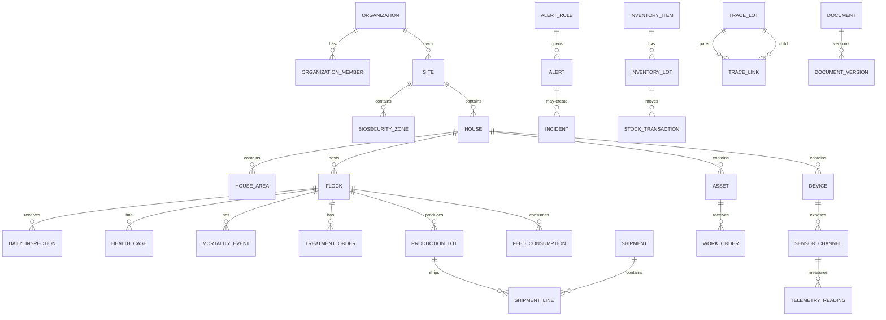

# Shared - Data, Security, Architecture, UI, Offline (Sections 26-29)

Source: `documentation/Chicken_Coop_Management_System_Complete_Module_Operations_Blueprint.md` (lines 2915-3404)

# 26. Cross-module data architecture

## 26.1 Modeling principles

- Use explicit relational tables, primary/foreign keys and database constraints for business state that must be filtered, joined, reconciled, authorized or reported.
- Avoid large JSON columns for core operational state. JSON may be appropriate for versioned form definitions, provider payload references or optional metadata when a schema and validation process exist.
- Use UUID primary keys for externally visible records.
- Use `timestamptz` and database defaults; store UTC and display the site's local time with time-zone context.
- Store canonical units and retain entered/source unit where needed.
- Store money as integer minor units or an explicitly precise numeric type; never floating point.
- Use database-enforced status checks/state transitions and non-negative quantity constraints.
- Use soft deletion only when recovery/legal/audit needs justify the added RLS complexity. Prefer status/archive for master data and append-only events for history.
- Append immutable audit/correction events for sensitive changes; do not use the audit table as the primary operational state.
- Every schema change is a reviewed migration and is promoted through environments in order.

## 26.2 Common columns

Most tenant-owned operational tables should include the applicable subset of:

```text
id uuid primary key
organization_id uuid not null
site_id uuid null
zone_id uuid null
house_id uuid null
flock_id uuid null
event_at timestamptz not null
created_at timestamptz not null default now()
created_by uuid null
updated_at timestamptz not null default now()
updated_by uuid null
source text not null            -- web, mobile, device, integration, job, import
source_id text null
client_operation_id uuid null   -- offline/idempotency
version integer not null default 1
status text not null
correlation_id uuid null
data_quality_status text null
```

Do not add every scope column to every table without reason; use the minimum needed for secure filtering, traceability and performance. Denormalized scope columns may be justified to simplify RLS and high-volume queries, but they must remain transactionally consistent.

## 26.3 High-level relationship model



## 26.4 Table catalog by domain

This catalog is a logical baseline. The implementation may combine small tables or split high-volume tables, but it must preserve the stated business boundaries.

| Domain | Principal tables |
|---|---|
| Identity/tenancy | `profiles`, `organizations`, `organization_members`, `member_scopes`, `invitations`, `access_reviews`, `support_sessions`. |
| Structure/master | `sites`, `biosecurity_zones`, `houses`, `house_areas`, `storage_locations`, `production_profiles`, `target_profiles`, `target_profile_versions`, `target_curve_points`, `code_sets`, `code_values`. |
| Flock lifecycle | `flocks`, `flock_plans`, `house_readiness_reviews`, `placements`, `flock_movements`, `flock_count_transactions`, `flock_stage_history`, `harvest_plans`, `flock_closeouts`. |
| Daily operations | `shifts`, `shift_assignments`, `inspection_templates`, `inspection_template_versions`, `inspections`, `inspection_responses`, `observations`, `handovers`, `period_closes`, `record_corrections`, `sync_operations`. |
| Environment/IoT | `gateways`, `devices`, `sensor_channels`, `telemetry_readings`, `current_sensor_state`, `telemetry_aggregates`, `device_events`, `calibrations`, `controller_recipes`, `recipe_versions`, `control_commands`. |
| Alerts/incidents | `alert_rules`, `alert_rule_versions`, `alerts`, `alert_events`, `alert_acknowledgements`, `alert_escalations`, `notifications`, `incidents`, `incident_actions`, `emergency_drills`. |
| Feed/water | `feed_products`, `feed_programs`, `feed_program_versions`, `feed_deliveries`, `silo_balances`, `feed_consumption`, `feed_movements`, `water_sources`, `water_readings`, `water_tests`, `water_treatment_events`, `line_flush_events`. |
| Production | `production_targets`, `egg_collections`, `egg_collection_grades`, `production_lots`, `packing_runs`, `weight_samples`, `harvest_plans`, `harvest_events`, `hatchery_transfers`, `hatchery_results`. |
| Health/welfare | `health_observations`, `health_cases`, `diagnoses`, `lab_samples`, `lab_results`, `medication_products`, `treatment_orders`, `treatment_administrations`, `vaccination_plans`, `vaccinations`, `withdrawal_holds`, `mortality_events`, `welfare_assessments`. |
| Biosecurity | `biosecurity_plans`, `biosecurity_plan_versions`, `access_points`, `visit_requests`, `visitors`, `vehicles`, `visit_events`, `vehicle_visits`, `access_events`, `biosecurity_audits`, `biosecurity_incidents`, `outbreak_controls`. |
| Sanitation/waste/pest | `sanitation_plans`, `sanitation_plan_versions`, `sanitation_events`, `sanitation_step_results`, `sanitation_verifications`, `house_release_approvals`, `litter_events`, `waste_events`, `carcass_disposal_events`, `pest_monitoring_points`, `pest_inspections`, `pest_actions`. |
| Inventory/procurement | `inventory_items`, `item_suppliers`, `inventory_lots`, `stock_transactions`, `stock_reservations`, `purchase_requisitions`, `purchase_orders`, `goods_receipts`, `inventory_counts`, `inventory_count_lines`, `supplier_approvals`, `inventory_disposals`. |
| Maintenance/utilities | `assets`, `asset_components`, `maintenance_plans`, `maintenance_plan_versions`, `work_orders`, `work_order_tasks`, `maintenance_logs`, `asset_parts_usage`, `calibration_plans`, `calibrations`, `utility_meters`, `utility_readings`, `emergency_equipment_tests`. |
| Workforce/knowledge | `task_templates`, `task_template_versions`, `tasks`, `task_dependencies`, `task_comments`, `task_evidence`, `teams`, `team_members`, `competencies`, `user_competencies`, `training_courses`, `training_requirements`, `training_records`, `announcements`, `handovers`. |
| Trace/logistics | `trace_lots`, `trace_links`, `customers`, `destinations`, `shipment_plans`, `shipments`, `shipment_lines`, `shipment_checks`, `shipment_receipts`, `certificates`, `recall_cases`, `recall_actions`. |
| Cost/sustainability | `cost_categories`, `cost_entries`, `cost_allocations`, `allocation_rules`, `allocation_rule_versions`, `budgets`, `budget_lines`, `resource_metrics`, `finance_sync_records`. |
| Reporting/AI | `kpi_definitions`, `kpi_definition_versions`, `report_definitions`, `report_versions`, `report_schedules`, `report_runs`, `dashboard_preferences`, `analytics_models`, `model_versions`, `model_predictions`, `model_feedback`, `data_quality_scores`. |
| Documents/records | `documents`, `document_versions`, `file_objects`, `entity_attachments`, `document_acknowledgements`, `electronic_signatures`, `retention_classes`, `record_holds`. |
| Configuration/audit | `configuration_items`, `configuration_versions`, `configuration_deployments`, `approval_requests`, `data_quality_rules`, `reconciliation_rules`, `retention_policies`, `audit_log`, `data_change_requests`. |
| Integrations | `integrations`, `integration_credentials`, `webhook_events`, `outbound_events`, `connector_runs`, `import_jobs`, `import_rows`, `export_jobs`, `dead_letter_events`, `api_clients`. |

## 26.5 Data integrity rules

- Bird, feed, water, egg/product, medicine and inventory quantities reconcile through immutable movements and approved adjustments.
- A transaction that changes both business state and its audit/domain event should commit atomically.
- Status transitions are validated by server code and database constraints/functions for critical workflows.
- Unique constraints support idempotency for external event IDs, client operation IDs, schedule occurrences and device batches.
- Foreign keys are used unless a deliberate immutable external reference is required.
- `updated_at` is maintained by a database trigger for tables with multiple writers.
- Tables used by RLS are indexed on `organization_id`, membership/scope columns and common filter keys.
- High-volume telemetry and audit tables use partitioning/retention strategies, but trace/audit integrity is preserved.

## 26.6 Data quality framework

| Dimension | Example checks | System response |
|---|---|---|
| Completeness | Required rounds, causes, lot numbers, signatures, certificates and close checks. | Show gaps, block close when required and assign action. |
| Timeliness | Round window, telemetry freshness, lab result, alert acknowledgement. | Flag late/stale data and escalate critical gaps. |
| Validity | Range, unit, stage, dose, date, status transition and product authorization. | Block impossible entries; allow plausible exception only with reason/approval. |
| Consistency | Bird balance, stock balance, eggs vs packed/shipped, sensor agreement. | Reconciliation queue and supervisor review. |
| Accuracy | Calibration, reference check, sample method and source reliability. | Quality flag and restricted use in alerts/analytics. |
| Uniqueness | Duplicate receipt, treatment, telemetry batch, shipment or import row. | Unique key/idempotency and duplicate review. |

## 26.7 Retention and correction

- Retention is defined by record class, jurisdiction, contract and incident/legal needs.
- Health, medicine, withdrawal, mortality, shipment, alarm, control, audit and trace records are never silently deleted.
- A correction records before/after values, reason, requester, approver and effective time.
- Legal, outbreak and recall holds override normal deletion.
- Full tenant export includes relational data, files, code lists, profile versions and a schema/data dictionary.

---

# 27. Supabase security, RLS and authorization design

## 27.1 Client separation

Create three explicit Supabase clients:

| Client | Runs in | Credential | Use |
|---|---|---|---|
| Browser client | Client Components | Publishable key | Browser auth, narrow Realtime and direct private Storage upload under policy. |
| Server client | Server Components, Server Actions, Route Handlers | Publishable key plus request cookies | Operate as current user with RLS. |
| Admin client | Reviewed server-only jobs/functions | Secret key | Narrow ingestion, scheduled or administrative operations that intentionally bypass RLS. |

Never hide these differences behind one universal helper. The admin client should be imported from a `server-only` module and used by a small, reviewed set of functions.

## 27.2 Multi-tenant model

Every tenant-owned record contains `organization_id`. Site/house scope is enforced using membership/scope data. A conceptual membership model:

```text
organization_members
├── organization_id uuid -> organizations.id
├── user_id uuid -> auth.users.id
├── role text
├── status text
├── starts_at timestamptz
├── expires_at timestamptz null
└── unique (organization_id, user_id)

member_scopes
├── organization_member_id uuid
├── site_id uuid null       -- null may mean all permitted sites, based on role
├── zone_id uuid null
├── house_id uuid null
├── permission text null    -- optional override
├── starts_at timestamptz
└── expires_at timestamptz null
```

## 27.3 RLS policy principles

- Enable RLS on every exposed table and Storage bucket/object path.
- Write separate `SELECT`, `INSERT`, `UPDATE` and `DELETE` policies.
- Use `WITH CHECK` for inserts/updates so users cannot move rows into an unauthorized tenant/scope.
- Index columns used by policies.
- Put role/scope checks in Server Actions for clear user-facing errors and in RLS for enforcement.
- Test anonymous, owner, administrator, role member, site-scoped user, cross-tenant user and admin-job identities.
- Use `security definer` helper functions sparingly, fix `search_path`, revoke unnecessary execute privilege and review for recursive-policy risk.
- Do not rely on mutable browser state or hidden UI controls for authorization.

## 27.4 Illustrative SQL pattern

This is a pattern, not a complete migration. Production policies must be tested for the actual role/scope model.

```sql
create table public.organizations (
  id uuid primary key default gen_random_uuid(),
  name text not null check (char_length(name) between 2 and 150),
  created_at timestamptz not null default now()
);

create table public.organization_members (
  organization_id uuid not null references public.organizations(id) on delete cascade,
  user_id uuid not null references auth.users(id) on delete cascade,
  role text not null check (role in (
    'owner','org_admin','farm_manager','supervisor','caretaker',
    'veterinarian','biosecurity_qa','maintenance','inventory',
    'logistics','auditor','support'
  )),
  status text not null default 'active' check (status in ('invited','active','suspended','expired')),
  starts_at timestamptz not null default now(),
  expires_at timestamptz null,
  created_at timestamptz not null default now(),
  primary key (organization_id, user_id)
);

create index organization_members_user_org_idx
  on public.organization_members(user_id, organization_id)
  where status = 'active';

create or replace function public.is_active_org_member(target_org uuid)
returns boolean
language sql
stable
security definer
set search_path = public, pg_temp
as $$
  select exists (
    select 1
    from public.organization_members m
    where m.organization_id = target_org
      and m.user_id = (select auth.uid())
      and m.status = 'active'
      and (m.expires_at is null or m.expires_at > now())
  );
$$;

revoke all on function public.is_active_org_member(uuid) from public;
grant execute on function public.is_active_org_member(uuid) to authenticated;

create table public.sites (
  id uuid primary key default gen_random_uuid(),
  organization_id uuid not null references public.organizations(id) on delete cascade,
  name text not null,
  code text not null,
  time_zone text not null,
  status text not null default 'active',
  created_at timestamptz not null default now(),
  unique (organization_id, code)
);

alter table public.sites enable row level security;

create policy "members can read permitted organization sites"
on public.sites for select to authenticated
using (public.is_active_org_member(organization_id));

create policy "authorized users can create organization sites"
on public.sites for insert to authenticated
with check (
  public.is_active_org_member(organization_id)
  -- add reviewed role/permission helper here
);
```

The actual implementation should include role and site/house scope helpers rather than granting every member the same actions.

## 27.5 Defense in depth

| Layer | Responsibility |
|---|---|
| UI | Hide unavailable controls, explain permission needs and reduce accidental actions. |
| Server Action/Route Handler | Validate input, verify identity, check high-level permission and return safe errors. |
| RLS | Enforce tenant/record access regardless of caller. |
| Database constraint/function | Prevent invalid state, quantity, ownership and transaction results. |
| Audit/observability | Record sensitive access, changes, exports, approvals and control actions. |
| Operational procedure | Separate duties, train users, review access and investigate exceptions. |

## 27.6 Sensitive action controls

Require stronger control for:

- User/role/scope changes.
- Treatment order/withdrawal release.
- Shipment release under warning/exception.
- Controller recipe or command.
- Critical alert rule and notification routing.
- Deletion/retention/legal-hold action.
- Bulk export and support access.

Controls may include MFA/re-authentication, competency, second approval, reason, expiry and post-action review.

## 27.7 OT/device security

- Inventory every controller, gateway, sensor, firmware and communication path.
- Segment OT from office/guest networks.
- Allow only required outbound and management traffic through firewall/VPN.
- Use unique device certificates/keys and secure provisioning.
- Disable default credentials and protect cabinets/ports.
- Use signed firmware/configuration with staged update and rollback.
- Disable vendor remote access by default; approve it as time-limited and logged.
- Detect offline/unapproved devices, repeated authentication failures and unexpected configuration changes.

## 27.8 Privacy

- Minimize worker, visitor, location, image, video and audio data.
- Define purpose, lawful basis where applicable, access, retention and deletion.
- Redact unrelated personal information from customer/auditor exports.
- Scrub tokens, cookies, credentials and unnecessary personal data from application logs.
- Provide transparent notices for camera/audio and visitor processing.

---

# 28. Server, client, UI, forms and caching design

## 28.1 Server Components for reads

Pages and layouts are Server Components by default. Authenticated reads live in `server/queries.ts` and are called directly from the page. Do not create an internal API endpoint solely so the same Next.js server can call its own database.

Recommended query behavior:

- Use explicit column selection rather than `select *`.
- Return typed domain view models, not raw unrestricted rows.
- Include data freshness/quality fields needed by the UI.
- Throw/log internal errors server-side and render a safe error boundary.
- Use pagination for long operational lists.
- Ensure query plans and RLS policy columns are indexed.

## 28.2 Server Actions for mutations

Every Server Action is a server endpoint. It must:

1. Parse input and validate with Zod.
2. Verify authenticated identity.
3. Verify action-level permission/competency when needed.
4. Execute the user-context Supabase mutation under RLS.
5. Use a PostgreSQL function for multi-table atomic operations when appropriate.
6. Create audit/domain events in the same transaction for critical changes.
7. Return safe field/workflow errors, not raw database/policy details.
8. Revalidate the affected route or cache tag.

Protect duplicate submissions with pending UI, unique constraints or idempotency keys.

## 28.3 Client Components as interactive islands

Use Client Components only where browser interaction is required:

- Event handlers and local draft state.
- Barcode/QR scanning, camera, file selection and browser APIs.
- Dialogs, drag/drop and rich charts.
- IndexedDB/offline queue.
- Narrow Realtime subscriptions.
- Optimistic UI only when the recovery behavior is clear.

Place `"use client"` as low as possible and pass serializable server-read data rather than refetching the same data after hydration.

## 28.4 UI layers

| Layer | Responsibility |
|---|---|
| `components/ui` | Generic shadcn/ui primitives such as button, input, dialog, table and form controls. |
| `components/shared` | App shell, navigation, page header, QR scanner wrapper, data-quality badge, offline banner, empty/error states. |
| `features/*/components` | Domain forms, tables, timelines, charts and action panels. |

Centralize design tokens in `globals.css`. Do not scatter arbitrary colors/spacing through modules.

## 28.5 Standard form flow

```text
shadcn/ui fields
  -> optional React Hook Form for complex interaction
  -> client usability validation
  -> Server Action
      -> Zod validation repeated on server
      -> identity and permission check
      -> Supabase mutation under RLS
      -> database constraints / transaction
      -> revalidatePath() or revalidateTag()
  -> inline field result, workflow status or toast
```

Browser validation never replaces server/database validation.

## 28.6 Farm-field UX requirements

- Large touch targets and high contrast for gloves, glare and low light.
- Minimal typing; use scanning, defaults, recent values and controlled choices.
- Start rounds with bird observation before data-heavy questions.
- Show active flock, house, time, target profile and last-sync state clearly.
- Use text/icon plus color; never color alone.
- Show stale, missing, estimated and poor-quality data explicitly.
- Preserve entered data when a server error occurs.
- Provide a simple mode for workers/smallholders and advanced mode for managers/admins.
- Target WCAG 2.2 AA or applicable accessibility requirement.

## 28.7 Caching defaults

| Content | Default |
|---|---|
| Public/marketing pages | Static or cached with deliberate revalidation. |
| Public reference content | Cache with route/tag revalidation. |
| Signed-in dashboards | Dynamic, user-specific rendering unless isolation is proven. |
| After mutation | Revalidate affected path/tag. |
| Auth refresh response | Never share across users or cache in a way that mixes `Set-Cookie`. |
| Private export/download | Authorization check at request time; short-lived URL. |
| Current house/alert status | Server read plus optional narrow Realtime update. |

---
# 29. Offline PWA and synchronization architecture

## 29.1 Objective

Allow essential farm work to continue for at least seven days without cloud connectivity, while making sync state, conflicts and failures visible and predictable.

## 29.2 PWA components

- Service worker for application shell and approved static assets.
- IndexedDB for assigned master data, active flock context, forms, tasks, SOPs, recent summaries and queued mutations.
- Local attachment queue for photos/documents until upload is possible.
- Sync engine that batches operations to `/api/v1/mobile/sync` or an equivalent Edge Function.
- Conflict/rejection user interface.
- Device registration and last-sync health.

## 29.3 Offline package

At sign-in/assignment refresh, download only authorized data needed for field work:

- Assigned sites, houses and active flocks.
- Current inspection/task templates and approved versions.
- Seven days of due work and SOPs.
- Controlled code lists and minimal relevant inventory/asset references.
- Active restrictions, alerts and unresolved findings.
- Recent trend summaries, not unlimited raw telemetry.
- User permissions/competency hints for usability; the server remains authoritative.

## 29.4 Sync contract

A sync request contains:

```json
{
  "device_id": "uuid",
  "client_batch_id": "uuid",
  "schema_version": 1,
  "last_successful_sync_at": "timestamp-or-null",
  "operations": [
    {
      "client_operation_id": "uuid",
      "entity_type": "inspection",
      "operation": "create",
      "entity_id": "uuid",
      "base_version": null,
      "event_at": "timestamp",
      "payload": {}
    }
  ]
}
```

The response returns one result per operation and a server change cursor for permitted downstream updates.

## 29.5 Idempotency and ordering

- `client_operation_id` is globally unique and has a database unique constraint.
- The server returns the previously accepted result for duplicates.
- Operations with dependencies include referenced client-generated entity IDs.
- Server may process independent operations out of order but returns dependency failures clearly.
- A batch acknowledgement does not imply attachment upload completed; attachments have separate state.

## 29.6 Conflict handling

- Append-only events merge safely.
- Drafts use optimistic concurrency with `base_version`.
- Approved/locked records use correction requests.
- Server-owned configuration wins; the user is shown the changed version.
- Deactivated/restricted scope rejects new entries and retains the local payload for supervisor/support resolution.
- Clock differences preserve local event time, device time and server receive time; suspicious drift is flagged.

## 29.7 Security

- Minimize offline personal/sensitive data.
- Require device/browser authentication and normal session renewal on reconnect.
- Consider managed-device controls, screen lock and remote logout for high-risk deployments.
- Never cache admin secret, raw access tokens beyond approved auth library behavior, or unnecessary cross-site data.
- Local deletion occurs after server acceptance and configured retention, while preserving recoverable user-visible sync history.

## 29.8 Offline acceptance tests

- Complete multiple rounds and tasks without network for the agreed duration.
- Restart browser/device and retain unsynced work.
- Create linked observation, health case and work order using client-generated IDs.
- Attach photos and upload after reconnect.
- Retry after partial batch failure without duplicates.
- Handle server-side record change, permission removal, profile update and locked-period conflict.
- Display low storage, failed attachment, expired session, clock drift and corrupted queue recovery.

---


---

*Source: documentation/Chicken_Coop_Management_System_Complete_Module_Operations_Blueprint.md (lines 2915-3404)*
